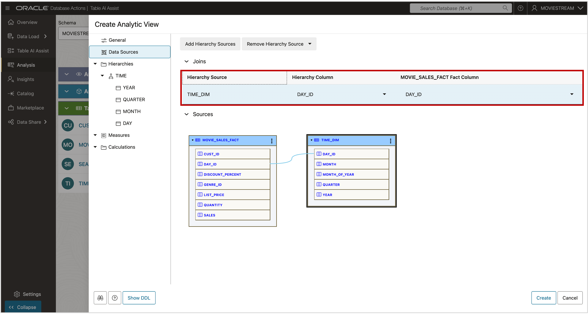

# Define Joins

## Introduction

You're more than halfway to building your first Analytic View.  
You’ve created a fact table and a hierarchy. Now you’ll join them and add a measure.

**Estimated Time: Less than 5 minutes**

### Objectives

You will:

- Join the hierarchy to the fact table.

### Prerequisites

- Complete the previous lab.

## Task 1 - View the DDL

Click the **Show DDL** button.  
You’ll see a message that a join is missing.

## Task 2 - Specify the Join

When a hierarchy comes from a separate table, it must be joined to the fact table—just like a regular SQL join between a dimension and a fact table.

Analytic Views manage these joins in metadata. This means:

- You only define the join once.
- Queries on the Analytic View do **not** require JOIN clauses.

To define the join:

1. Go to **Data Sources**.
2. Set **Hierarchy Column** to `DAY_ID`.
3. Set **Fact Column** (from `MOVIE_SALES_FACT`) to `DAY_ID`.

You may now **proceed to the next lab**

## Acknowledgements

- **Created By** - William (Bud) Endress, Product Manager, Autonomous Database, February 2023  
- **Last Updated By** - William (Bud) Endress, June 2025

Data about movies in this workshop were sourced from **Wikipedia**.

Copyright (C) Oracle Corporation.

Permission is granted to copy, distribute and/or modify this document under the terms of the GNU Free Documentation License, Version 1.3 or any later version published by the Free Software Foundation;  with no Invariant Sections, no Front-Cover Texts, and no Back-Cover Texts.  A copy of the license is included in the section entitled [GNU Free Documentation License](files/gnu-free-documentation-license.txt)
