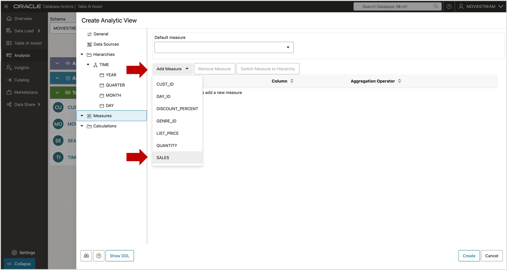

# Create Measures

## Introduction

You're almost ready to create the Analytic View.  
Every Analytic View must have at least one measure.

**Estimated Time: 10 minutes**

### Objectives

You will:

- Create measures for the Analytic View.

### Prerequisites

- Complete the previous lab.

## Task 1 - Create a Fact Measure

Measures are created from the fact table.

1. Go to **Measures**.
2. Click **Add Measures**.
3. Select the **SALES** column.

   

The **SALES** measure is now added to the Analytic View.

   

## Task 2 - Create Additional Fact Measures

Add more measures:

1. Close the DDL dialog.
2. Add **QUANTITY**.
3. Add **DISCOUNT_PERCENT**.

By default, all measures use **SUM** as the aggregation method, which is usually correct for quantities and sales.

   

## Task 3 - Change Aggregation Method of Discount Percent

Summing percentages rarely makes sense. For `DISCOUNT_PERCENT`, use **AVG** instead.

1. Select the **DISCOUNT_PERCENT** measure.
2. Change the **Expression** to `AVG`.

   

**Pro-tip:** Don’t use `SUM` for ratios like percentages or percent changes.  
Instead, calculate the ratio at the same aggregation level as the report.  
In this dataset, each row represents a single sale (quantity = 1), so **AVG** works.  
If the quantity were greater than 1, you might need a **weighted average**.

See:  
[Live SQL Tutorial - Aggregating Data using Weighted Averages in Analytic Views](https://livesql.oracle.com/apex/livesql/file/tutorial_G4EG6JY9E0U6TFT2RCCLT3F1V.html)

You may now **proceed to the next lab**

## Acknowledgements

- **Created By** - William (Bud) Endress, Product Manager, Autonomous Database, February 2023  
- **Last Updated By** - William (Bud) Endress, June 2025

Data about movies in this workshop were sourced from **Wikipedia**.

Copyright (C) Oracle Corporation.

Permission is granted to copy, distribute and/or modify this document under the terms of the GNU Free Documentation License, Version 1.3 or any later version published by the Free Software Foundation;  with no Invariant Sections, no Front-Cover Texts, and no Back-Cover Texts.  A copy of the license is included in the section entitled [GNU Free Documentation License](files/gnu-free-documentation-license.txt)
