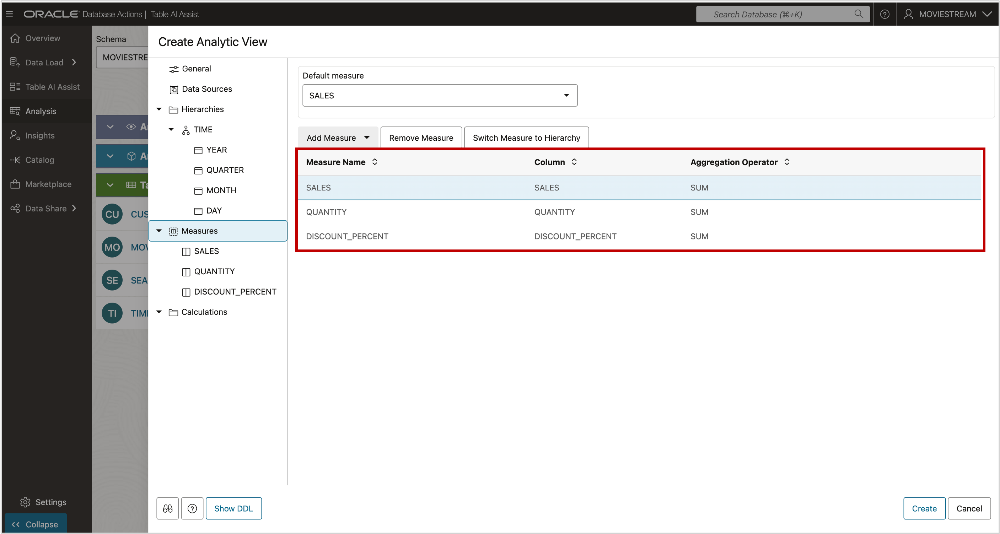
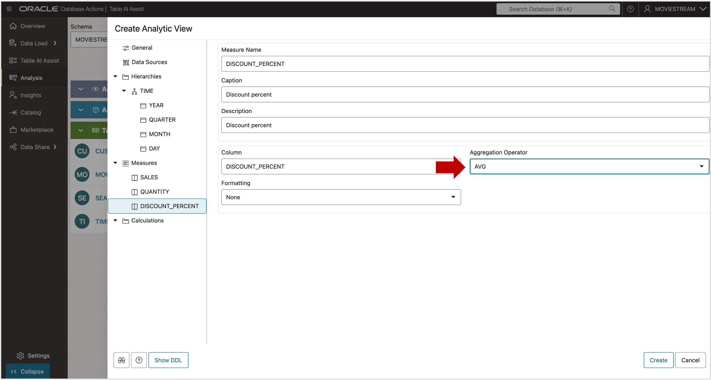

# Create Measures

## Introduction

You are almost ready to create the Analytic View! However, at least one measure is required.

Estimated Time:  10 minutes.

### Objectives

In this lab you will:

- Create a measure in the Analytic View

### Prerequisites:

- Create the hierarchy in the Analytic View in the previous labs

## Task 1 - Create a Fact Measure

Measures come from the fact table.

1. Right-click **Measures** in the tree view
2. Choose **Add Measures**
3. Select **SALES**

The analytic view now has a measure.

4. Press the Show DDL button.

The tool can generate all the SQL DDL needed to create the Attribute Dimension Hierarchy and Analytic View. Aren’t you happy that you don’t have to type that yourself?

## Task 2 - Create Additional Fact Measures

Before creating the analytic view, add some additional measures.  Repeating the same steps as you did with SALES, close the Show DDL dialog and:

1. Add measure QUANTITY
2. Add measure DISCOUNT_PERCENT

Note that by default, the aggregation expression is SUM. For measures such as SALES and QUANTITY, it makes sense that those measures would be aggregated by SUM.

## Task 3 - Change Aggregation Method of Discount Percent

Does it make sense to aggregate DISCOUNT\_PERCENT by SUM? Probably not. It rarely makes sense to aggregate percentages by SUM because ratios usually need to be calculated at the level of aggregation that is being reported on.  In this case, we can aggregate DISCOUNT_PERCENT using AVERAGE.

1. Select the DISCOUNT_PERCENT MEASURE in the tree control.
2. Change the Aggregation Operator for DISCOUNT_PERCENT to AVG.

**Pro-tip:**  It rarely makes sense to SUM ratios such as percentages. For example, you would not SUM the percent change in sales from a prior period.  Most ratios should be calculated at the same level of aggregation as being reporting on. For example, the percent change in sales for the current year as compared to the prior year should be calculated using year-level sales values.  That is SUM(sales) / SUM(sales prior period).

In the case of the Discount Percent measure, we can average because each row represents a single sale (quantity = 1).  We also need to consider the meaning of 0 and null values.  In this data set, there are null values where there is no discount. Therefore, the average of Discount Percent is the average of when a discount was given.  If the quantity was anything other than 1, a weighted average would probably be needed.  See [Live SQL tutorial Aggregating Data using Weighted Averages in Analytic Views](https://livesql.oracle.com/apex/livesql/file/tutorial_G4EG6JY9E0U6TFT2RCCLT3F1V.html)

The bottom line is that you must be thoughtful when aggregating rations using averages.

You may now **proceed to the next lab**

## Acknowledgements

- Created By/Date - William (Bud) Endress, Product Manager, Autonomous AI Database, February 2023
- Last Updated By - Mike Matthews, November 2025

Data about movies in this workshop were sourced from **Wikipedia**.

Copyright (C)  Oracle Corporation.

Permission is granted to copy, distribute and/or modify this document
under the terms of the GNU Free Documentation License, Version 1.3
or any later version published by the Free Software Foundation;
with no Invariant Sections, no Front-Cover Texts, and no Back-Cover Texts.
A copy of the license is included in the section entitled [GNU Free Documentation License](files/gnu-free-documentation-license.txt)
