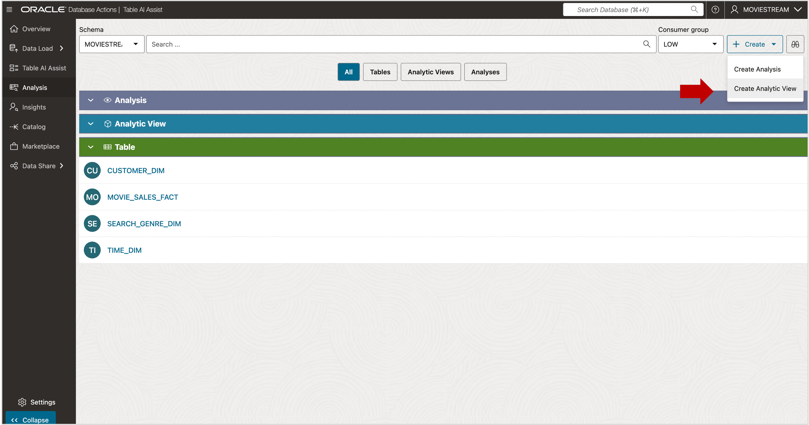
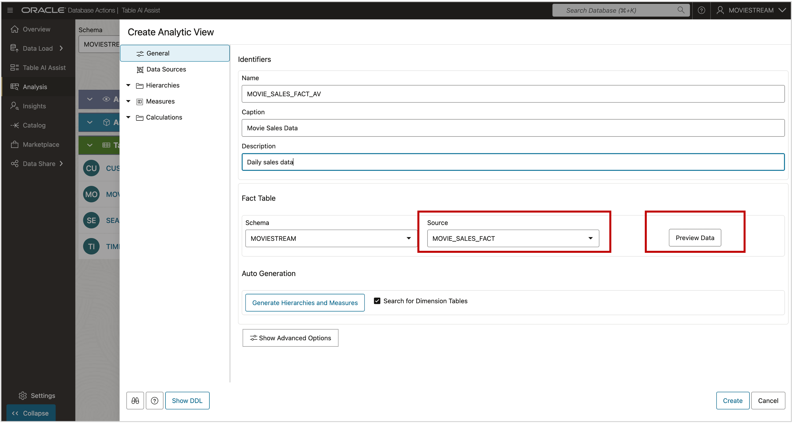
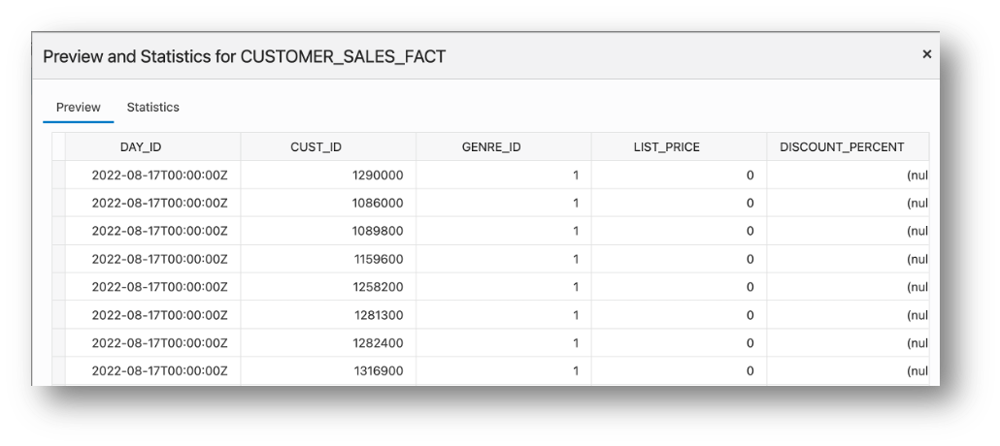
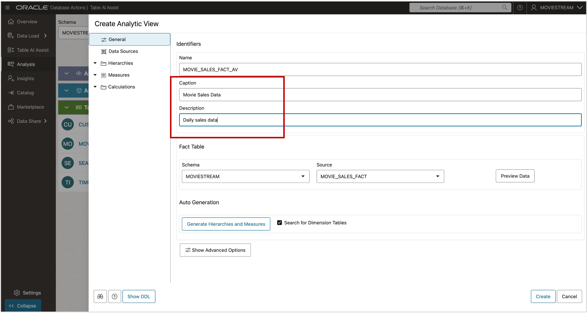

# Create a New Analytic View

## Introduction

Analytic Views organize data into a business model that can be queried using SQL. They consist of:

- **Attribute Dimensions** – define metadata with attributes and levels.
- **Hierarchies** – organize attributes and levels for filtering, aggregation, and drill-down.
- **Analytic View** – combines fact tables, measures, and hierarchies into one queryable view.

In this lab, you will use the Data Studio Data Analysis tool to create all necessary objects automatically. You don’t need to write SQL DDL, but you can view the generated SQL if desired.

Steps to create an Analytic View:

- Identify the source tables (fact and dimension).
- Create hierarchies (the tool will create Attribute Dimensions and Hierarchy Views).
- Define fact and calculated measures (the tool will create the Analytic View).

**Estimated Time: 5 minutes**

### Objectives

You will:

- Create a new Analytic View.

### Prerequisites

- Complete the previous lab.

## Task 1 - Create a New Analytic View

Begin by creating a new Analytic View.

1. Click the **Create** button or choose **Create Analytic View** from the menu.

   

2. Select the fact table. For this lab, choose MOVIE\_SALES\_FACT.

3. Click **Preview Data** to view the contents of the MOVIE\_SALES\_FACT table.

4. After previewing, click **Close**.

5. Enter a friendly name in the **Caption** field (e.g., Movie Sales Data).

6. Enter a description (e.g., Daily sales data by customer and search genre).

7. **Turn off** Search for Dimension Tables.

**Do not press the Create button yet.**  
You will first define hierarchies and measures.

**Do not press the Generate Hierarchies and Measures button.**  
This feature auto-generates structures but is skipped in this lab so you can learn to create them manually. Knowing your data and business needs helps you build the best model.

Use the **Caption** and **Description** fields to give user-friendly names and explanations for the Analytic View objects. These names may appear in applications.

   

You’re now ready to build the model!

You may now **proceed to the next lab**

## Acknowledgements

- **Created By** - William (Bud) Endress, Product Manager, Autonomous Database, February 2023  
- **Last Updated By** - William (Bud) Endress, June 2025

Data about movies in this workshop were sourced from **Wikipedia**.

Copyright (C) Oracle Corporation.

Permission is granted to copy, distribute and/or modify this document under the terms of the GNU Free Documentation License, Version 1.3 or any later version published by the Free Software Foundation;  with no Invariant Sections, no Front-Cover Texts, and no Back-Cover Texts.  A copy of the license is included in the section entitled [GNU Free Documentation License](files/gnu-free-documentation-license.txt)
