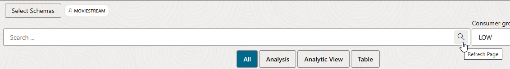
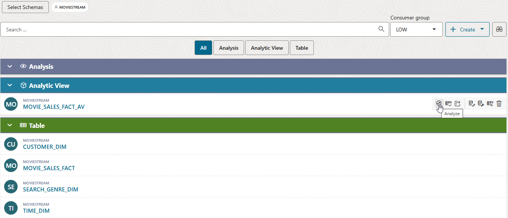
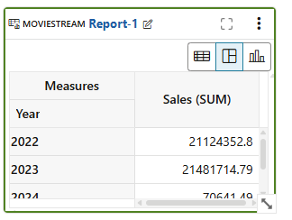
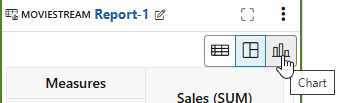
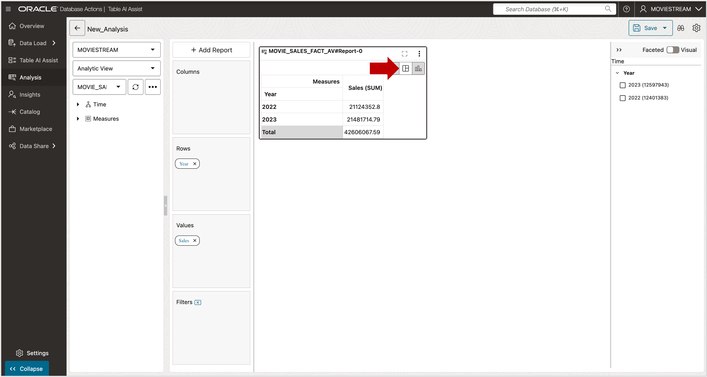
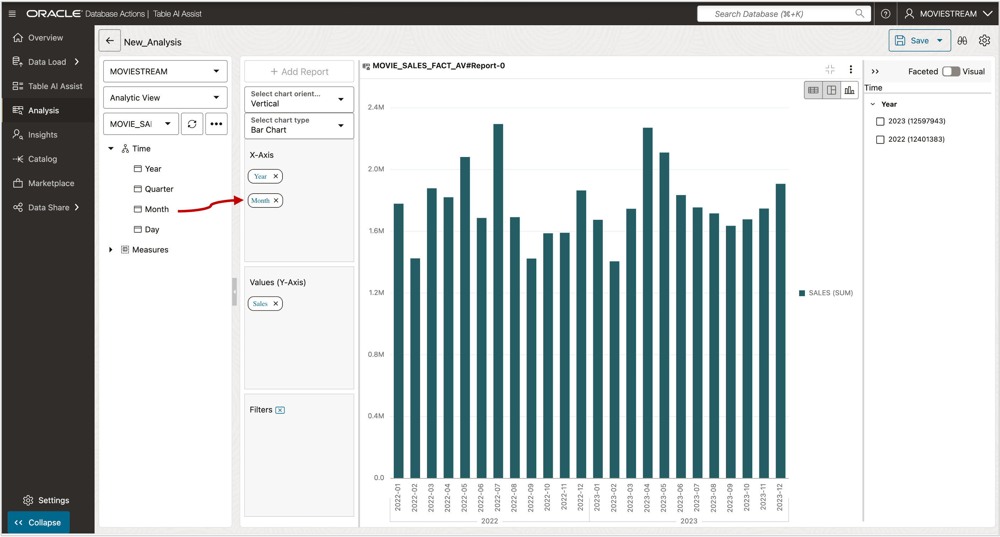
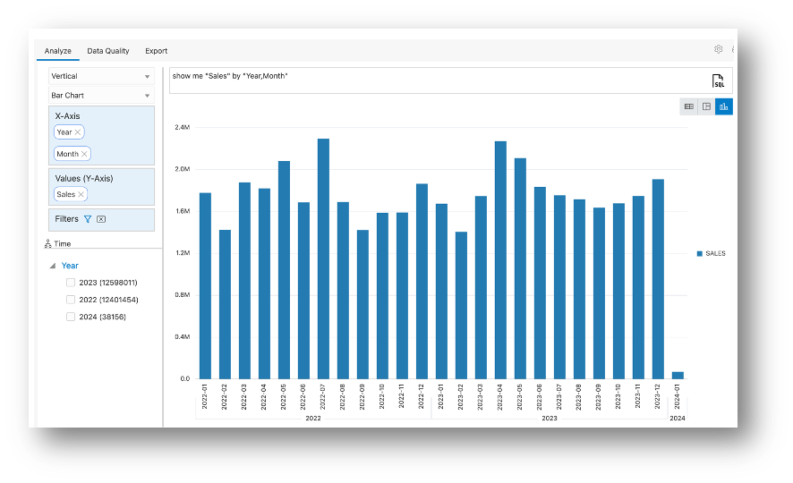

# Deploy the Analytic View

## Introduction

Your Analytic View definition now includes one hierarchy, joined to the fact table, and a measure. The Analytic View can be created in the database and you can view data through the Analytic View.

Estimated Time:  Less than 10 minutes.

### Objectives

In this lab you will:

- Create the Analytic View objects in the Database.

### Prerequisites:

- Complete the previous lab.

## Task 1 - Creating the Analytic View Database Object

You've worked hard to define your first analytic view (well, not really, because the tool makes it easy).  Give that Create button a good smash!

1. Press the **Create** button and click OK to confirm.

Congratulations, you now have an analytic view deployed in the database! There is also an Attribute Dimension and Hierarchy.

To see the Analytic View, refresh the Analysis application by clicking the magnifying glass in the search bar at the top of the screen:

You will then see the Analytic View below. If you hover over the Analytic View, you will see a range of available options, as follows:

 - Analyze - analyze the data using the analytic view
 - Data Quality - check that there are no data quality errors that may affect reporting
 - Export - export the analytic view to Tableau or Power BI
 - Edit Analytic View - edit the analytic view, for example to add new data source, hierarchies, or measures
 - Compile Anaytic View - compile the analytic view to ensure it is valid
 - Show DDL - show the DDL of the analytic view
 - Delete Analytic View - delete (drop) the analytic view

 

## Task 2 - Review Data in the Analytic View

To view the data in the Analytic View, select the Analyze option. We can then define a query in a report or graph.

The application chooses a level (Year in this case) and a measure (Sales) and displays a default report.

1. Switch to a chart by pressing the **bar chart** button in the upper, right corner of the report.

The report now summarizes sales per year in a visual format:

It could be useful to get more details. We can Add **Months** to the Chart:

2.	Expand the **Time** hierarchy, select **Month**, and drag it under **Year** in the **X-Axis** position.

The chart now displays Month within Year. Expand the chart using the control on the bottom right to show sales by year and month in a readable way:

You may now **proceed to the next lab**

## Acknowledgements

- Created By/Date - William (Bud) Endress, Product Manager, Autonomous AI Database, February 2023
- Last Updated By - Mike Matthews, November 2025

Data about movies in this workshop were sourced from **Wikipedia**.

Copyright (C)  Oracle Corporation.

Permission is granted to copy, distribute and/or modify this document
under the terms of the GNU Free Documentation License, Version 1.3
or any later version published by the Free Software Foundation;
with no Invariant Sections, no Front-Cover Texts, and no Back-Cover Texts.
A copy of the license is included in the section entitled [GNU Free Documentation License](files/gnu-free-documentation-license.txt)
