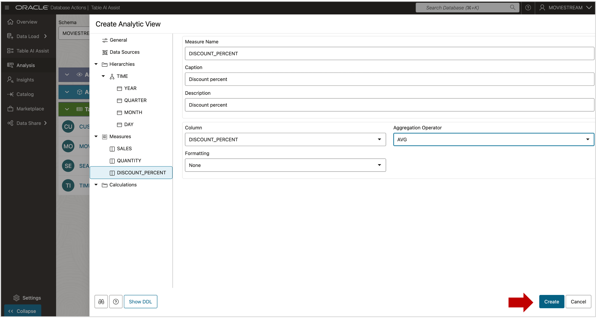
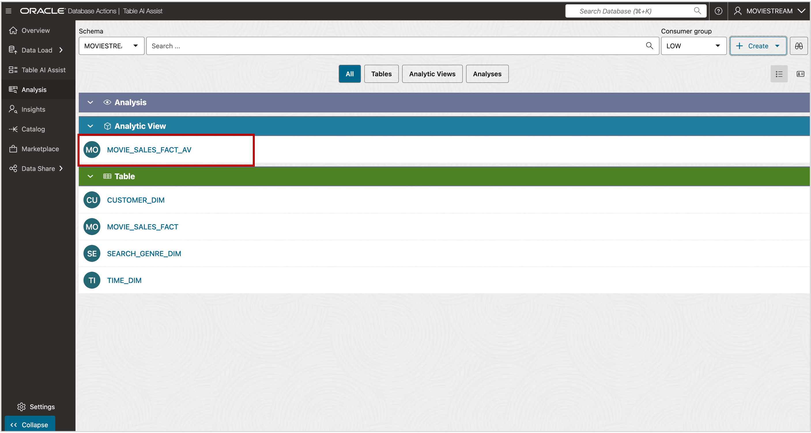
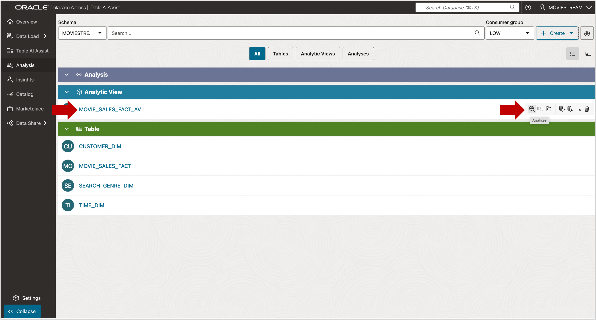
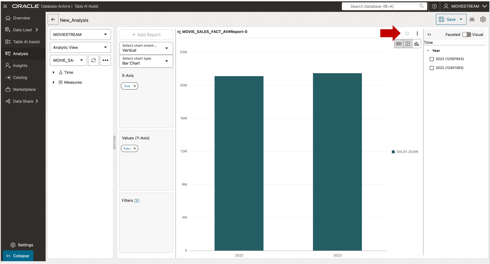

# Deploy the Analytic View

## Introduction

Your Analytic View now includes a hierarchy, join, and measures.  
You’re ready to create the database objects and start analyzing data.

**Estimated Time: Less than 10 minutes**

### Objectives

You will:

- Create the Analytic View objects in the Database.

### Prerequisites

- Complete the previous lab.

## Task 1 - Create the Analytic View

Now it’s time to deploy your Analytic View.

1. Click the **Create** button.

The Analytic View, along with its Attribute Dimension and Hierarchy, is now created in the database.

## Task 2 - Review Data in the Analytic View

1. Click on the analytic view name or press the **Analyze** button.

The tool will auto-generate a simple report using the **Year** level and the **Sales** measure.

   

2. Click the **Bar Chart** icon in the upper-right corner to switch to chart view.

   

3. Click thew **Expand** icon to enlarge the chart.   

   

3. To view **Months** within **Years**:
   - Expand the **Time** hierarchy.
   - Drag **Month** below **Year** on the X-axis.

   

The chart now shows Sales by Month within Year.

You may now **proceed to the next lab**

## Acknowledgements

- **Created By** - William (Bud) Endress, Product Manager, Autonomous Database, February 2023  
- **Last Updated By** - William (Bud) Endress, June 20252025

Data about movies in this workshop were sourced from **Wikipedia**.

Copyright (C) Oracle Corporation.

Permission is granted to copy, distribute and/or modify this document under the terms of the GNU Free Documentation License, Version 1.3 or any later version published by the Free Software Foundation;  with no Invariant Sections, no Front-Cover Texts, and no Back-Cover Texts.  A copy of the license is included in the section entitled [GNU Free Documentation License](files/gnu-free-documentation-license.txt)
