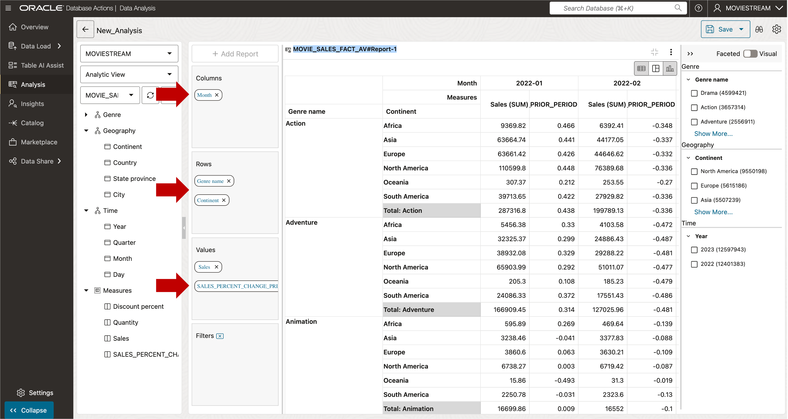

# Explore Data

## Introduction

Your Analytic View now includes multiple hierarchies and a time-based calculation.  
It’s ready for deeper analysis.

**Estimated Time: 5 minutes**

### Objectives

You will:

- Explore data using the Analysis Viewer tool.

### Prerequisites

- Complete the previous lab.

## Task 1 - Create a New Report

After updating the Analytic View, the tool returns to the **Analysis Viewer**.  

1. Click the **Add Report** button.

   

2. Click the **Expand** icon.

   

   The expanded report.

   

3. Expand the **Time** hierarchy. Drag **MONTH** to the **Columns** section. 
4. Expand the **Geography** hierarchy.  Drag **Continent** to **Rows** under **Genre Name**. 
4. Expand **Measures**. Drag **SALES\_PCT\_CHG\_PRIOR\_PERIOD** to **Values**.  

The first month has no prior period data, so values are null.  
Scroll right to view later months.

   

6. Format SALES\_PERCENT\_CHANGE\_PRIOR\_PERIOD as a percentage.

   - Double-click **SALES\_PERCENT\_CHANGE\_PRIOR\_PERIOD**.
   - Set **Format Type** to **Percentage**.
   - Press **Save**.

   

The report is complete.

   

## Task 2 - Explore On Your Own

You can now:

- Add more calculations  
- Explore the data using different views  

This is a great way to understand how your analytic model performs.

You may now **proceed to the next lab**

## Acknowledgements

- **Created By** - William (Bud) Endress, Product Manager, Autonomous Database, February 2023  
- **Last Updated By** - William (Bud) Endress, June 2025

Data about movies in this workshop were sourced from **Wikipedia**.

Copyright (C) Oracle Corporation.

Permission is granted to copy, distribute and/or modify this document under the terms of the GNU Free Documentation License, Version 1.3 or any later version published by the Free Software Foundation;  with no Invariant Sections, no Front-Cover Texts, and no Back-Cover Texts.  A copy of the license is included in the section entitled [GNU Free Documentation License](files/gnu-free-documentation-license.txt)
