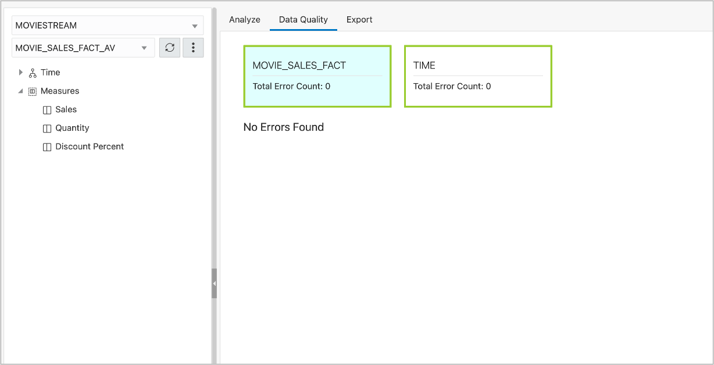
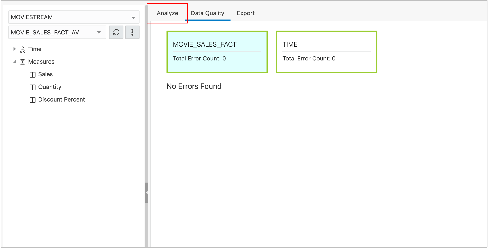
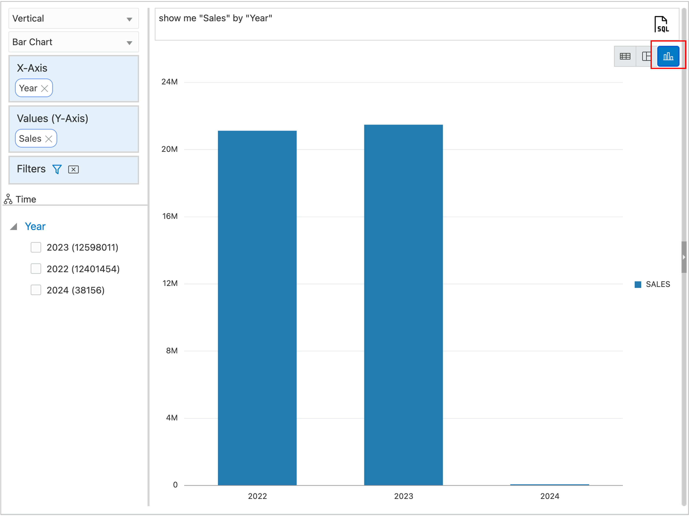

# Deploy the Analytic View

## Introduction

Your Analytic View definition now includes one hierarchy, joined to the fact table, and a measure. The Analytic View can be created in the database and you can view data through the Analytic View.

Estimated Time:  Less than 10 minutes.

### Objectives

In this lab you will:

- Create the Analytic View objects in the Database.

### Prerequisites:

- Complete the previous lab.

## Task 1 - Creating the Analytic View Database Object

You've worked hard to define your first analytic view (well, not really, because the tool makes it easy).  Give that Create button a good smash!

1. Press the **Create** button.

Congratulations, you now have an analytic view deployed in the database! There is also an Attribute Dimension and Hierarchy.

The Analysis tool will automatically switch out of the Analytic View design to the Data Quality tab.  This tab will let you know if there are certain types of errors found in the tables.  Since this is a Live Lab, there are no errors!

## Task 2 - Review Data in the Analytic View

To view the data in the Analytic View, choose the Analyze tab and define a query in a report or graph.

1. Choose the **Analyze** tab.

The application chooses a level (Year in this case) and a measure (Sales) and displays a report.

2. Switch to a chart by pressing the **bar chart** button in the upper, right corner of the application.

A bar chart with Years is displayed. Add **Months** to the Chart.

3.	Expand the **Time** hierarchy, select **Month**, and drag it under **Year** in the **X-Axis** position.

The chart now displays Month within Year.

You may now **proceed to the next lab**

## Acknowledgements

- Created By/Date - William (Bud) Endress, Product Manager, Autonomous Database, February 2023
- Last Updated By - William (Bud) Endress, February 2023

Data about movies in this workshop were sourced from **Wikipedia**.

Copyright (C)  Oracle Corporation.

Permission is granted to copy, distribute and/or modify this document
under the terms of the GNU Free Documentation License, Version 1.3
or any later version published by the Free Software Foundation;
with no Invariant Sections, no Front-Cover Texts, and no Back-Cover Texts.
A copy of the license is included in the section entitled [GNU Free Documentation License](files/gnu-free-documentation-license.txt)
