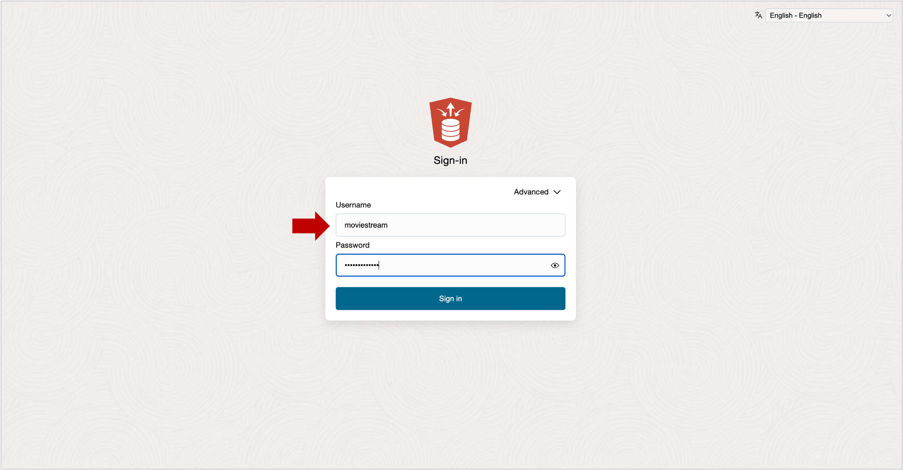
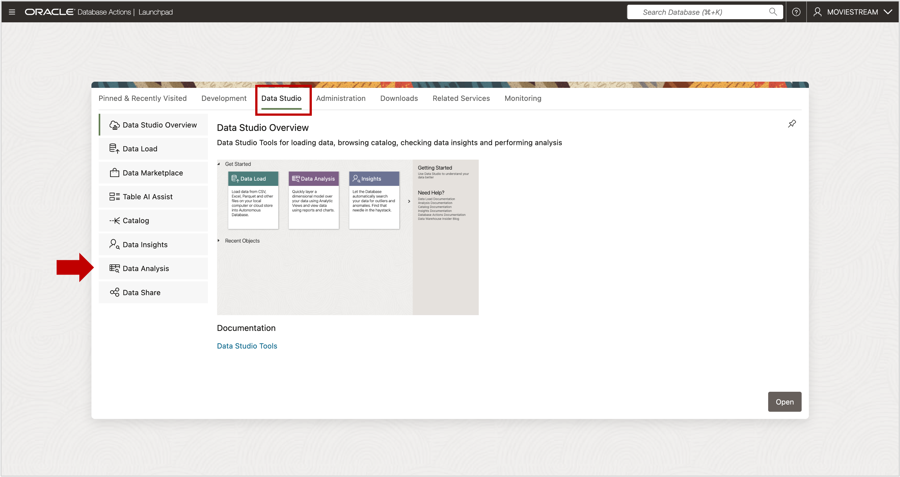

# Launch the Data Studio Analysis Tool

## Introduction

Use the Database Actions Data Studio Analysis tool to design the Analytic View.  
**Estimated time: Less than 5 minutes**

### Objectives

You will:

- Launch the Data Studio Analysis tool.

### Prerequisites

- Complete the previous lab.

## Task 1 - Access Database Actions

If you are still logged in as the **ADMIN** user, log out and log back in as the **MOVIESTREAM** user and proceed to Step 4.  

Othewise, you can access **Database Actions** using the URL of your Autonomous Database instance.  The URL will look similar to this:

   https://xcsvfpwxb7cd9bvet-adppm.adb.uk-london-1.oraclecloudapps.com/

Follow these steps:

1. Access your Autonomous Database using the URL.

   

2. Sign in with your database user (e.g., **MOVIESTREAM**).

   

4. Go to the Data Studio tab and launch the **Data Analysis** application.

      

   On first launch, you may see introductory cards. You can review or close them.

You may now **proceed to the next lab**

## Acknowledgements

- **Created By** - William (Bud) Endress, Product Manager, Autonomous Database, February 2023  
- **Last Updated By** - William (Bud) Endress, June 2025

Data about movies in this workshop were sourced from **Wikipedia**.

Copyright (C) Oracle Corporation.

Permission is granted to copy, distribute and/or modify this document under the terms of the GNU Free Documentation License, Version 1.3 or any later version published by the Free Software Foundation;  with no Invariant Sections, no Front-Cover Texts, and no Back-Cover Texts.  A copy of the license is included in the section entitled [GNU Free Documentation License](files/gnu-free-documentation-license.txt)
