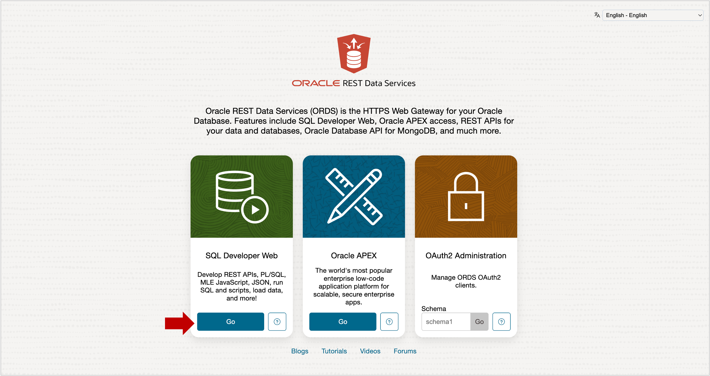
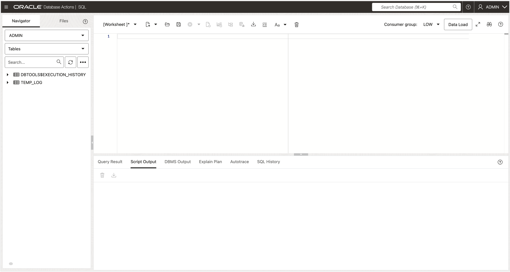

# Open SQL Worksheet

## Introduction

To complete this lab, you’ll connect to Oracle Autonomous Database and run SQL commands to create a user and load sample data. These steps use the browser-based **SQL Worksheet**. If you prefer, you may use a different tool like **SQL Developer**.

**Estimated Time:** Less than 5 minutes

### Objectives

- Open and access SQL Worksheet

### Prerequisites

- Access to your Autonomous Database using the database URL as the **ADMIN** user.  The URL will look similar to this:

   https://xcsvfpwxb7cd9bvet-adppm.adb.uk-london-1.oraclecloudapps.com/

## Task 1 – Login to Autonomous Database

Follow these steps:

1. Access your Autonomous Database using the URL.

1. Login as the **ADMIN** user.

   

## Task 2 – Open SQL Worksheet

You will use SQL Worksheet to run SQL commands needed for the workshop.

1. Select the **Development** tab and click the **SQL** button.

   

SQL Worksheet will look like this:

You’re now ready to **proceed to the next lab**.

---

## Acknowledgements

- **Created By** - William (Bud) Endress, Product Manager, Autonomous Database, February 2023  
- **Last Updated By** - William (Bud) Endress, June 2025

Movie data in this lab is sourced from **Wikipedia**.

© Oracle Corporation. This content is licensed under the **GNU Free Documentation License v1.3 or later**.  
See [GNU Free Documentation License](files/gnu-free-documentation-license.txt) for details.
