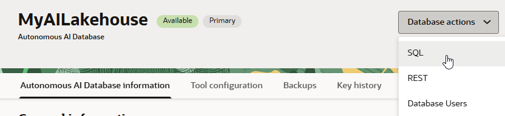
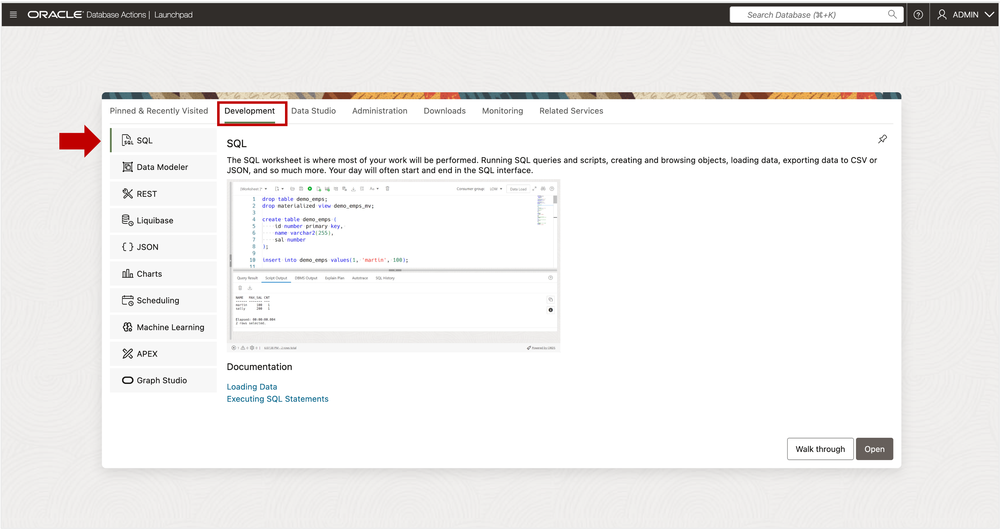

# Open SQL Worksheet

## Introduction

You will need to connect to Autonomous AI Database and run SQL commands to create a user, add workshop utilities, and load sample data.  This lab provides instructions for connecting to SQL Worksheet using your browser. If you use a different tool such as SQL Developer desktop, you can use that tool.

Estimated Time:  Less than 5 minutes.

### Objectives

In this lab you will:

- Open SQL Worksheet.

### Prerequisites:

- Access to the Autonomous AI Database Console or a URL to Autonomous AI Database Actions.

## Task 1 - Connect to the Database Actions Tool Set

You will use the Data Studio Analysis tool to create your Analytic View.  Data Studio is part of the Database Actions tool set, which contains many different types of tools.

You can connect to Database Actions using the Autonomous AI Database Service Console or using a URL provided by your Autonomous AI Database administrator.

1. If you are connecting via the Autonomous AI Database Service Console, click the Database Actions button, and select SQL.

SQL Worksheet allows you to run SQL commands in the Oracle Database. You will run SQL commands to create a database user and load sample data.

If you have been given a URL for Database Actions by your Administrator, log in, and then select the SQL button from the Development section.

You may now **proceed to the next lab**

## Acknowledgements

- Created By/Date - William (Bud) Endress, Product Manager, Autonomous AI Database, February 2023
- Last Updated By - Mike Matthews, November 2025

Data about movies in this workshop were sourced from **Wikipedia**.

Copyright (C)  Oracle Corporation.

Permission is granted to copy, distribute and/or modify this document
under the terms of the GNU Free Documentation License, Version 1.3
or any later version published by the Free Software Foundation;
with no Invariant Sections, no Front-Cover Texts, and no Back-Cover Texts.
A copy of the license is included in the section entitled [GNU Free Documentation License](files/gnu-free-documentation-license.txt)