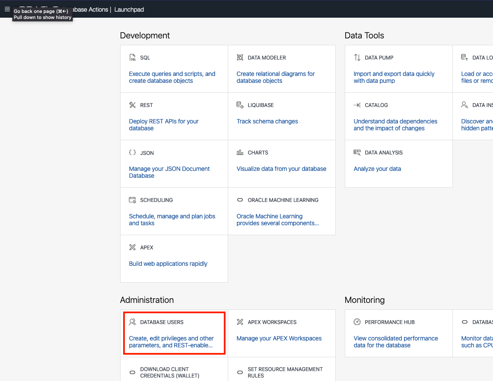
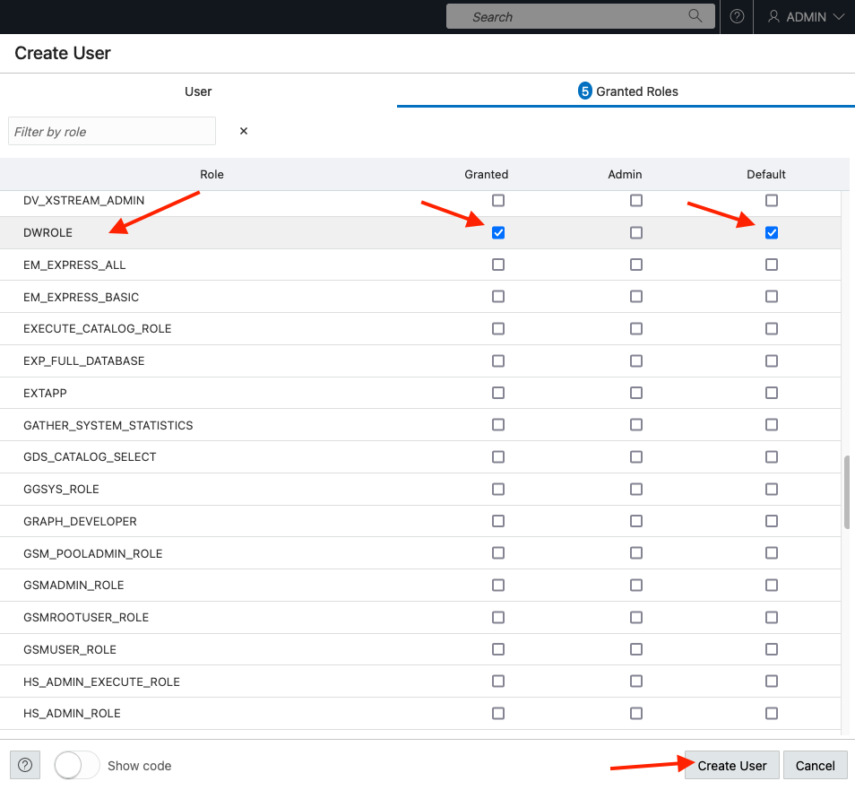
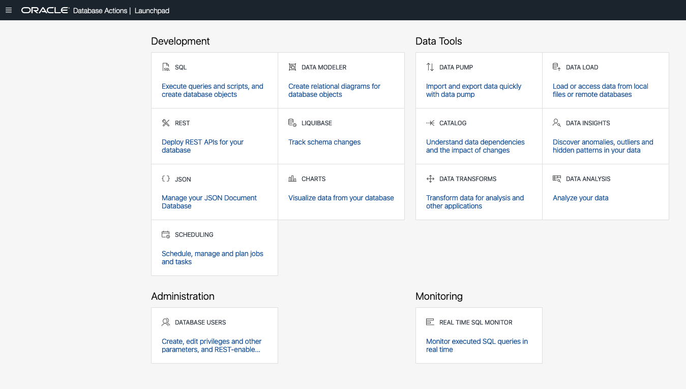

# Create a Database User

## Introduction

In this lab, you will create a database user.

Estimated Time: 10 minutes

Watch the video below for a quick walk through of the lab.

[](youtube:het5eBAOa3E)

### Objectives

In this lab, you will:

- Create the database user that you will use in the next lab
- Update the user's profile to grant access to load and store data
- Log in as the user

### Prerequisites

To complete this lab, you need to have the following:

- All previous labs successfully completed

## Task 1: Create New Database Users

When you create a new data warehouse, you automatically get an account called ADMIN that is your super administrator user. In the real world, you will definitely want to keep your data warehouse data completely separate from the administration processes. Therefore, you will need to know how to create separate new users and grant them access to your data warehouse. This section will guide you through this process using the "New User" wizard within the SQL Worksheet (one of the built-in tools in Autonomous Data Warehouse).

For this workshop, we need to create one new user.

1. Navigate to the **Details** page of the Autonomous Database you provisioned in the "Provision an ADB Instance" lab. In this example, the database is named "ADW Finance Mart." Click the **Database Actions** button.

  

2. This will take you to the Database Actions page, logged in as the ADMIN user.

  <if type="BETA">
3. On the Database Actions launchpad page, under Development, click the **SQL** card.
  

4. Paste the following SQL statement and execute it.
    ````
    <copy>
    CREATE ROLE ADPBETA;
    </copy>
    ````
  
  </if>

3. On the Database Actions launchpad page, under Administration, click the **Database Users** card.
  

4.  You can see that your ADMIN user is listed as the current user.  On the right-hand side, click the "+ **Create User**" button.

  

5. The **Create User** form will appear on the right-hand side of your browser window. Use the settings below to complete the form:

 - User Name: **QTEAM**
 - Password: make up your own suitably strong password.

    > **Note:** Rules for User Passwords - Autonomous Data Warehouse requires strong passwords. User passwords must meet the following default password complexity rules:

    - Password must be between 12 and 30 characters long

    - Must include at least one uppercase letter, one lowercase letter, and one numeric character

    - Limit passwords to a maximum of 30 characters

    - Cannot contain the username

    - Cannot be one of the last four passwords used for the same username

    - Cannot contain the double quote (") character

    There is more information available in the documentation about password rules and how to create your own password rules. See here: [Create Users on Autonomous Database](https://docs.oracle.com/en/cloud/paas/autonomous-database/adbsa/manage-users-create.html#GUID-B5846072-995B-4B81-BDCB-AF530BC42847)

  - Leave the Graph button turned off.
  - Toggle the **Web Access** button to **On** and expand **Web access advanced features**.
  - Leave the **Authorization required** toggle button as on/blue.
  - Accept the default alias which is automatically set to qteam - this allows the user access to our new data warehouse using the Database Actions tools.
  - Select **UNLIMITED** from the drop down menu for Quota on tablespace DATA
  - Leave the **Password Expired** toggle button as off (note this controls whether the user will be prompted to change their password when they next login).
  - Leave the **Account is Locked** toggle button as off. 

  Next you will examine the form.

6. When you examine the form, it should look like this:

  

7.  Click on the **Granted Roles** banner at the top of the form and add the following roles by checking the boxes in the first and third columns:
    1. **DWROLE**
    2. **DATA\_TRANSFORM\_USER**
    <if type="BETA">
    3. **ADPBETA**
    </if>

  

  Notice that two additional roles have already been automatically assigned: **CONNECT** and **RESOURCE**.  

8.  Finally, click the **Create User** button at the bottom of the form.

## Task 2: Login as User QTEAM

Now you need to switch to working as the user QTEAM, so you can start the next lab on data loading.

1. Find the card for the user QTEAM and click on the box with the upward pointing arrow at the bottom of the card.

  

2. Enter the username QTEAM and the password you defined in Task 1 when you created this user.

  

3. This will launch the Database Actions Launchpad page.

  


Now you have connected to your Autonomous Data Warehouse with your new user. You are ready to go to the next lab!

## Learn More

See the documentation on [Managing Users on Autonomous Database](https://docs.oracle.com/en/cloud/paas/autonomous-database/adbsa/manage.html#GUID-AD7ACC07-AAF7-482A-8845-9C726B1BA86D). This topic describes administration tasks for managing users on Autonomous Database.

## Acknowledgements

- Created By/Date - Keith Laker, Product Manager, Autonomous Database, March 2021
- Contributors - Nilay Panchal, Rick Green, Patrick Wheeler, Marty Gubar, Bud Endress, Jayant Mahto, Mike Matthews, Ashish Jain
- Last Updated By - Ashish Jain, Rick Green, August 2022
