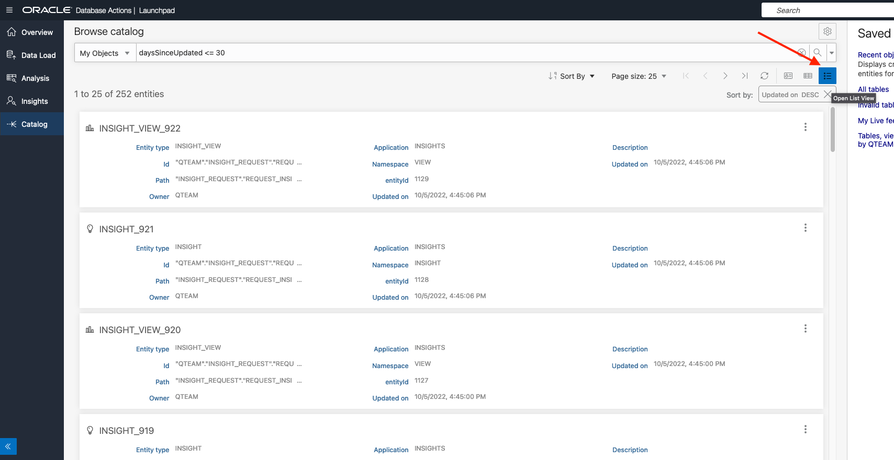

# Use Autonomous Database Tools

## Introduction
This lab introduces the suite of data tools built into the Oracle Autonomous Data Warehouse.

Estimated Time: 1 hour, 15 minutes

Watch the video below for a quick walk through of the lab.

[](youtube:OL_zq2UqYSI)

### Objectives
In this lab, you will:
- Familiarize with the suite of built-in database tools of the Oracle Autonomous Data Warehouse
- Load data
- Learn how to use the Data Transforms tool to correct data errors
- Create an analytic view
- Generate data insights
- Use the Catalog tool

### Prerequisites

To complete this lab, you need to have the following:

- All previous labs successfully completed

## Task 1: Overview of Built-In Data Tools Suite

<p style="text-align: left;">**PREPARING QUARTERLY SALES ANALYSIS**

  

### MovieStream Critics Corner: Introduction

*Fans of the Space genre on MovieStream will be familiar with that spine-tingling feeling of excitement that comes with the count-down: “11, 10, 9, (ignition sequence starts), 6, 5, 4, 3, 2, 1, 0... Lift-off! We have a lift-off!” All the money you spent on that sub-woofer is justified by the rumble of those rocket motors driving out 7.8 million pounds of thrust. We’re at that stage of the workshop. This is the launch, so strap in, this is going to be an exciting journey!*

### Introduction

Autonomous Data Warehouse comes with a built-in suite of tools that can help you with many of the typical data warehouse tasks. This tool suite is complementary to various capabilities accessible via the SQL command line, which themselves are covered by other workshops.  To explore how these new built-in tools can make you work smarter and faster, you will take on the role of a departmental analyst at MovieStream. As a **departmental analyst**, you have been assigned the task of reviewing the sales data from Q2 of fiscal year 2020 and making recommendations for a marketing campaign based on this analysis.

  > **Note:** MovieStream's financial year is aligned with the calendar year, so FYQ2 is April-June.

In this section of the workshop, you are going to work through some common data warehouse requirements and scenarios that you will frequently run into when working on your own projects:

1. Load and inspect data to see if there are any obvious errors
2. Transform data to correct errors in the original data set
3. Create an analytic view (also known as a semantic model) over your data set
4. Run the Data Insights tool to identify anomalies and outliers in your data set
5. Use the built-in Catalog to understand the origins of the data within your data warehouse (this is called  ***Data Lineage***)
6. Use the built-in Catalog to understand the impact of making changes to your data model (this is called  ***Impact Analysis***)

**Let's get started!**

### Access Autonomous Database Built-In Tool Suite

In the previous lab, you created the database user **QTEAM**, and you should still be connected as user QTEAM.

There are two ways to access the Autonomous Database built-in tool suite:

1. Via the Autonomous Database console page
2. Directly via URL

> **Note:** If you are already in Database Actions home page, you may go directly to Step 3.

### Access Autonomous Database Tools via the ADW Console

On the Autonomous Database Details page, click the **Database Actions** button:

  

### Access Autonomous Database Tools Directly via URI

When user QTEAM was created (in a previous step), a card appeared on the Database Users screen, similar to what is shown below. Notice the URI at the bottom of the card.

1. Click the **Copy to clipboard** icon to copy this to your clipboard. This URI may be used to access the Database Actions page of Autonomous Database Tools directly, without needing to use the OCI Console.

  

2. In the dialog that appears, sign in as user QTEAM, with the password assigned previously, and click **Sign In**.

  

3. This will take you to the Autonomous Data Warehouse **Database Actions Launchpad** page (shown below). This page has a card for each of the most common tasks that the data warehouse user would want to perform. The cards are grouped by theme. There are groups for Development, Data Tools, Administration, and Monitoring. Each card has a title and description.  

  

4. If you want more information about each of the tasks related to each card, then you can access the online help by clicking the **Question Mark** in the title bar, as indicated in the image below:

  

5. This will pop out a tray containing links to the relevant topics in the Autonomous Data Warehouse documentation. To close the help tray, simply click the  **X**.

  

### RECAP

In this section of the workshop, you are playing the role of a different user of your Autonomous Data Warehouse: a departmental analyst whose database username is **QTEAM**. 

You have seen two different ways of navigating to the Database Actions home page, which is the launching pad for the various built-in tools:

- Navigating to **Database Actions** from the ADW console
- Using a URL (which can be copied from the ADW console) to access **Database Actions** directly

You've taken a brief tour of the **Database Actions** home page, with its card interface and ready access to documentation and other useful resources. The next task is to use the data loading tools to help you create your quarterly sales reports.

## Task 2: Load Data

### MovieStream Critics Corner: Data Load

*In Analytics, just as in the streaming movie business, a good start is essential. The analysts at MovieStream pay careful attention to how commonly customers give up on a movie after just a few minutes, presumably because of a bad start. Similarly, we at Oracle Autonomous Database know that Data Load is the start of your Analytics work, and our Data Load tool is built to ensure you get off to a great start.*

### Overview

In this section, you are going to explore how to load spreadsheets stored on your local computer and combine that data with another data set which is stored in the Oracle Object Store. As you load these various data files, you are going to discover that some of your data is not correctly formatted. Sometimes it can be very hard to spot issues hidden within a data set, but as you will see, Autonomous Data Warehouse has unique tools to help you spot the typical data errors you find in most data warehouse projects.

#### Video Preview

Watch a video demonstration of the Data Load tool of Autonomous Database:

[] (youtube:SJUw4wIvkS4)
> **Note:** Interfaces in this video may look different from the interfaces you will see.

### Launch Your Data Load Workflow

1. Click the **Data Load** card on the **Database Actions Launchpad** page.

  

2. This will take you to the screen shown below which controls the data loading process - dividing it up in a series of simple questions:

  

  The layout of the cards on the above page is organized into three rows:  

    **row 1** - identifies how you are going to get to your source data: load it, link to it, or use a trickle feed data

    **row 2** - covers where your data is stored: local file, another database, or in a cloud object storage

    **row 3** - allows you to explore your data and manage your connections to the various cloud objects stores such as Oracle Object Store, Amazon's S3, Microsoft's Azure Blob Storage, and Google's Object Store. 

### About Data Loading In This Part Of The Workshop

The first step in data analysis is to load data, which may come from a wide variety of sources. Autonomous Data Warehouse supports data load from a very wide range of sources. In this workshop, you explore loading data from two prominent data sources – files on a local disk, and files in object store. All the files to be loaded into your ADW are in OCI Cloud Storage. The next section, *Loading Data from Local Files*, starts by having you download some of these files to your local disk. Of course, this simulates the real-world situation where some of the data you have to analyze might be downloaded from a website, or may have arrived via an email as an attachment. However, it may be that the environment you are using to run your workshop may not allow you to download files to your local computer. Therefore, these workshop notes include an alternative approach for loading the data you need, which is to use data files stored in the Oracle Object Store. This will all become clear as you go through the next series of steps in this workshop. 

  > **Note:** This workshop focuses on just two ways to load data. Within this workshop, it would be impractical and unrealistic to include data loading scenarios from all supported sources. Loading data from applications and databases are both supported by Autonomous Data Warehouse but are outside the scope of this workshop. For more information about data loading, see the documentation,  **[click here](https://docs.oracle.com/en/database/oracle/sql-developer-web/sdwad/load-data.html#GUID-E810061A-42B3-485F-92B8-3B872D790D85)**.

### Load Data from Local Files

   **Important: **  Your computer may not support downloading files to your local disk. If you are in this situation, please skip forward to next main section **Load Data from Object Store.**

### Preparation

For these purposes, you have been given an extract of data by your IT team, and it has been delivered as a .CSV file. The file has been placed in a bucket in the Oracle Object Store. As part of this project, you are going to also reuse some data files from previous assignments that you have done in the past for the same team in the marketing department. These additional data files need to be moved to your computer so you can load them into your data warehouse.

Below are the four files that you will be using during this part of the workshop. Before you can begin, you need to download three files to your local computer and make a note of where they are stored, because you will need to use them later in this section. Click each of the three links below to download the two spreadsheet files and the csv-text file.

- **Movie\_Sales\_2020.csv**  This CSV file is stored in an Object Storage public bucket. This will be loaded in a separate step.
- Click **[here](https://objectstorage.us-phoenix-1.oraclecloud.com/n/dwcsprod/b/MovieStream-QTEAM-Download/o/Days_Months.xlsx)** to download the **Days\_Months.xlsx** Excel file to your local computer.
- Click **[here](https://objectstorage.us-phoenix-1.oraclecloud.com/n/dwcsprod/b/MovieStream-QTEAM-Download/o/Devices.xlsx)** to download the **Devices.xlsx** Excel file to your local computer.
- Click **[here](https://objectstorage.us-phoenix-1.oraclecloud.com/n/dwcsprod/b/MovieStream-QTEAM-Download/o/Countries.csv)** to download the **Countries.csv** CSV file to your local computer.

    > **Note:** This file might just appear as new tab in your browser rather than just simply downloading. Please use the Save or Save As feature in your browser's File menu to save the file as **Countries.csv**, and *make a note of where you saved it*!

**Before you proceed -**  be sure to take note of the location of the three files that you downloaded earlier to your local computer.

3. To load the files from your local computer, you need to click on the first card in each of the first two rows of cards (in row one - **LOAD DATA** and row two - **LOCAL FILE** ) which will mark each box with a blue tick in the bottom right corner. To move forward to the next step in this process, simply click the blue **Next** button.
  
4. This is where you need to locate the three files (Countries.csv, Days_Months.xlsx and Devices.xlsx) that you downloaded earlier! If they are easily accessible, then you can simply drag **ALL THREE** files at one time, and drop them onto to canvas as stated in the text on the screen.
  
5. An alternative approach is to click **Select Files** button in the middle of the screen, which will open the file explorer on your local computer where you can locate your data files: Countries.csv, Days\_Months.xlsx, and Devices.xlsx.
    >**Note:** Even though you only picked three files, four cards will appear for the data TARGETS to be loaded.

  
  Why do you have  ***four***  cards listed on the data loading screen? This is because your spreadsheet file **Days\_Months.xlsx** contains two worksheets: one for Days and one for Months. The data loading wizard automatically parsed your spreadsheet and created a separate data loading card for each worksheet. 
  

6. Before you load any data, let's review what the data loading wizard has discovered about the data within your data files. Let's focus on the **Countries.csv** file. Click the **pencil icon** on the right side of the card to inspect the data loading properties:
  
7. In the bar on the left, there are links for Settings, File, Table, and an Error Log. This screenshot shows the **Settings** page. Observe that this shows the structural information and intelligent default values that data wizard has created from simply looking at the file.
  
8. How does it do this? Most csv files contain structural information about the data within the file in the first row. Notice that there is a tick box selected, **Get from file header**. 
  
9. This has allowed the data loading wizard to discover that your data file contains two columns of data: **COUNTRY** and **CONTINENT**. The default table name has based derived from the filename. Click the drop-down menu under **Option.**
  
10. Notice that various operations are supported. For this part of the lab, accept the default option,  **Create Table**. 
  > **Note:**  If you look back at the previous section where you loaded the movie sales data for 2020, you will remember that you had to create your movie\_sales\_fact table before you could load your data files. This wizard creates the table for you during the data load process! Notice also that the wizard has automatically mapped the columns. Column mapping looks sensible, both in terms of column names and data types.

11. Click **Close**  in the bottom right to return to the Data Load card and then click the **green button** in the menu panel to start the Data Load job.
  
  The time taken to load each file depends on factors including file size and network speed. The progress of the job can be monitored from the status bar and the ring to the left of each job card. When the ring is complete, the file has uploaded successfully. 
  


Now let's inspect the tables that were automatically created during the data load process.

### Inspect Your New Data

12. To access the data explorer tool, click the **Data Load** breadcrumb at the upper left of your screen:
  
13. Then click the **EXPLORE** card on the main data loading page.
  
14. This brings up a list of the Tables and Views in this schema of the Autonomous Database. At this stage, all you see are the four tables you just loaded.
  
15. Click the table **COUNTRIES** and a data preview panel will appear that will allow you to review the data you just loaded. Note that this is a relatively simple table containing a list countries and their continents. 

16. Click the **Close** button in the bottom right corner.

### RECAP: Loading Data from Local Files

In this part of the workshop, you used the new data loading tool to quickly load data into your data warehouse from three local data files simply by dragging and dropping them onto the Data Load canvas. One file was in CSV format and the other two were Excel spreadsheets. One of the spreadsheets contained two worksheets and each one was loaded into its own table. The data loading process automatically created a target table containing the appropriate column structures based on the data within each file.

In a few clicks, you were able to define and load data into four new tables without having to write any SQL code. It was all done with a few mouse clicks.

### Load Data from Object Store

In the previous exercise, you loaded data from files that you located on your local computer. In this part of the lab, you are going to load some more data, but this time using a file which is in the Oracle Object Store. There are two parts to this process, and the first part only needs to be performed once. The two parts are:

1. Set up connection to the Oracle Object Store.
2. Load the file.

### Set Up Cloud Location

17. To begin this process, you need to navigate back to the **Data Load** page. From the **Explore** page, click the **Data Load** breadcrumb at the top left corner of the page:
  
18. On the **Data Load** main page, click the **Cloud Locations** card so you can define a new connection to your object store.
  
19. Click the **Add Cloud Storage** button on the upper right and define a Cloud Storage location as follows:

    <table class="wrapped relative-table confluenceTable" style="width: 100.0%;"><colgroup> <col style="width: 9.19509%;"/> <col style="width: 12.019421%;"/> <col style="width: 45.07344%;"/> <col style="width: 33.71451%;"/> </colgroup><tbody><tr><th colspan="1" class="confluenceTh">Field</th><th colspan="1" class="confluenceTh">Your Region</th><th colspan="1" class="confluenceTh">Value</th><th colspan="1" class="confluenceTh">Notes</th></tr><tr><td class="confluenceTd">Name</td><td colspan="1" class="confluenceTd"></td><td class="confluenceTd">MOVIE_SALES</td><td colspan="1" class="confluenceTd">Lower case names not currently supported</td></tr><tr><td class="confluenceTd">Description</td><td colspan="1" class="confluenceTd"></td><td class="confluenceTd">Movie Sales</td><td colspan="1" class="confluenceTd"></td></tr><tr><td rowspan="4" class="confluenceTd">URI + Bucket</td><td colspan="1" class="confluenceTd">Europe, Middle East, Africa</td><td class="confluenceTd">https://objectstorage.uk-london-1.oraclecloud.com/n/dwcsprod/b/MovieStream/o/</td><td rowspan="4" class="confluenceTd">Choose the closest location </td></tr><tr><td colspan="1" class="confluenceTd">Americas</td><td colspan="1" class="confluenceTd">https://objectstorage.us-phoenix-1.oraclecloud.com/n/dwcsprod/b/MovieStream/o/</td></tr><tr><td colspan="1" class="confluenceTd">Japan</td><td colspan="1" class="confluenceTd">https://objectstorage.ap-tokyo-1.oraclecloud.com/n/dwcsprod/b/MovieStream/o/</td></tr><tr><td colspan="1" class="confluenceTd">Asia &amp; Oceania</td><td colspan="1" class="confluenceTd">https://objectstorage.ap-mumbai-1.oraclecloud.com/n/dwcsprod/b/MovieStream/o/</td></tr><tr><td class="confluenceTd">Credential</td><td colspan="1" class="confluenceTd"></td><td class="confluenceTd">No credential</td><td colspan="1" class="confluenceTd">Make sure the radio button is switched on to indicate the no credential is needed</td></tr></tbody>
    </table>

    

  Your completed form should look like the one above. When you have completed these details, click **Create**.

### Load Data Files from A Cloud Storage Location

20. Navigate back to the main Data Load page again using the breadcrumb link. Click the two cards for  **Load Data**  from  **Cloud Storage **and then click the blue **Next** button. 
  
21. Now you see a file browser-like view of your Object Store. Locate the file **Movie\_Sales\_2020.csv** in the left part of the screen. Click and drag this file onto the canvas on the right. 
  
22. As before, you can edit the properties of your new data load job by clicking the **pencil** button on the right-hand side of the card. 
  
23. You can use this page to quickly review the properties sheet and make any changes to column names or data types. As soon as you are satisfied with the format, you can close the form and then click the **green arrow** button to start your data load job. 
  

### Inspect Data In Table MOVIE\_SALES\_2020

24. Navigate to the **Data Load** main page and click the **Explore** card. You'll now see table MOVIE\_SALES\_2020 has been loaded into your Autonomous Data Warehouse.
25. Click this table and then click **Source Statistics** on the panel to the left of the screen. Statistics help you quickly understand the structure and content of the table. In this case, this data presents a nice simple way to characterize the data you've just loaded. 
  

### Identify Data Problems

26. Click on the word **DAY** in the first column. You can see that there are 14 distinct values - which looks odd. The low value is **FRIDAY** (i.e. it's all uppercase) and the high value is **Wednesday**, which is in title case. The distribution of these values is shown in the bar chart at the bottom of the form (see the image above). As you move your mouse across these bars, you can see there are two separate bars for each day: one in uppercase and the other in title case.
27. You can also see that you have data for twelve months. This should not be a surprise, since the data extract you loaded in the previous step was for 2020. However, for your quarterly reporting project, it's obvious that you have too many months: your mission here is to analyze data only for Q2. 
28. Right now, simply take a note of these issues. You will address these issues in a later stage of the workshop. 

### Load Reference Data from Object Store

 **Important**: If you succeeded in loading the four reference tables, COUNTRIES, DAYS, DEVICES and MONTHS from local disk, you should skip ahead to **RECAP**.

This section is provided in case your workshop environment does not allow you to download files to your local machine. If you're unable to do this, of course you will have been unable to complete the previous section, **Load Data from Local Files**. You still need the reference data for subsequent tasks of the lab, and if you are in this situation, you should complete the following steps.

29. To load the reference tables from object storage, navigate to the **Data Load** main page. Select the cards for **Load Data** from **Cloud Storage** and click **Next**.
  
30. Select the four files: **Countries.csv**, **Days.csv**, **Devices.csv** and **Months.csv**. Drag-and-drop them on the **Data Loading** area, as shown below.
  
31. Four cards will appear on the data loading area: one for each source file / target table combination. Click the green **Start** button. 
  
32. Then click **Run** in the dialog that appears.
  
33. When the job has completed, you'll see check marks on the left of each card to indicate that the data has loaded successfully.
  

### **Notes**:

1. Autonomous Database supports uploading of .xlsx files from local disk, but not from Object Stores. Only .csv files are currently supported.
2. Autonomous Database does not currently support loading files from sub-folders in Object Stores.

### Clean Up Data Load Log Tables

During data load from Object Storage, Autonomous Data Warehouse creates a number of ancillary tables for logging purposes.

34. Following data load from Object Storage, if you click the **Explore** card on the **Data Load** main page, it may look like this: 
  
35. Three such logging tables are highlighted above. There may be more than one table with names beginning with COPY$. Following the successful load operations, these tables are no longer required, and can safely be dropped. You'll do this using a SQL Worksheet. Navigate to this tool directly from the hamburger menu at the top left, open the Development menu if necessary, and press **SQL**.
  
36. Drop the tables as follows:

    a. Click the **refresh** button (circular arrows) to see the full list of tables in the schema and identify the logging tables.

    b. For each table type, drop table {TABLE NAME} in the SQL Worksheet.

    c. Click the green **Run** button.

    d. Confirm the successful deletion in the Script Output pane.
  

### RECAP

In this section, you loaded data into your ADB from files both on your local computer and in the object store. In both cases, this was simply a matter of dragging and dropping. Inspection of the data in table MOVIE\_SALES\_2020 identified two problems:

- You have too much data: Movie consumption for all of 2020, whereas you only want data for Q2.
- Column DAY contains values that are both in upper case and title case. 

You will correct these data problems in the next task of the workshop. 

## Task 3: Use Data Transforms

### MovieStream Critics Corner: Data Transforms

*Just as the good folks at MovieStream are very proud of the SciFi lineup, we in the Autonomous Database team are very proud of our Data Transforms tool. There’s an eponymous movie series in the SciFi genre and fans of that will truly appreciate the value of a tool that can transform, perhaps a third normal form application schema into a star schema suitable for analysis. Even if it’s only a quick clean up of source data, you’ll be glad to have the Data Transforms tool at your fingertips.*

### Overview

In this section of the lab, you'll correct the data errors identified in the previous section of the lab. In a future version of this lab, we’ll show you how to do this using drag-and-drop techniques via the Data Transforms Tool.

#### Video Preview

Watch a video demonstration of the Data Transforms tool of Autonomous Database:

[] (youtube:Xg5VK_R4-IM)
> **Note:** Interfaces in this video may look different from the interfaces you will see.

That’s something to look forward to, but is not currently covered in this lab.

### Use SQL 

As an alternative to using the Data Transforms Tool, you can perform the necessary fixes to the data set using SQL. This is covered here. 

1. From the Autonomous Database **Tools** home page, access a SQL worksheet by clicking the **SQL** card on the **Database Actions** page. Copy and paste the following SQL statement into the Worksheet.

    ````
    <copy>
    create table MOVIE_SALES_2020Q2 as
    select COUNTRY
    , initcap(DAY) as DAY -- Use title case for days
    , MONTH
    , GENRE
    , CUSTOMER_SEGMENT
    , DEVICE
    , SALES
    , PURCHASES
    FROM MOVIE_SALES_2020
    where month in ('April','May','June'); -- only want data from Q2
    exec dbms_stats.gather_table_stats(user, 'MOVIE_SALES_2020Q2');
    </copy>
    ````

2. Select the entire text in the Worksheet and press the **green** button to run these two statements. You should see that both statements have executed successfully. Having completed this step you now have a table MOVIE\_SALES\_2020Q2, with data for just April, May, and June. The days have all been changed to title case. Refresh to see the new table created.


## Task 4: Analyze Data

### MovieStream Critics Corner: Analytic View

*You know that frustrating feeling of joining your friends and family who are half way through watching a movie? Having missed out on the introduction, much of what you see makes no sense to you. Often that’s what it’s like looking at a bunch of data that does not have a good semantic model. That’s where Autonomous Database’s Data Analysis tool comes in. Hierarchies, dimensions, and measures are automatically detected to give you a head start. The analytic view is built into the database itself, so that it is accessible to all users of the database, regardless of which tool they use to access the data. An analytic view allows users to model business dimensions, hierarchies and measures on top of database tables.*

### Overview

You can only go so far looking at raw data. Before long you want a semantic model on top of it. That's where our Data Analysis tool comes in. We've made it simple to build sophisticated models on your data, by identifying dimensions, hierarchies, and measures - with a nice clean way of saying how to aggregate - sum, average, or whatever. But wait, there's more. We make it fast, too! Simple SQL written against the analytic view is re-written to ensure optimal data access, and because we know about the hierarchical structure of the data, we can pre-aggregate the totals and sub-totals you want, before you've even told us you want them! In addition, we provide tools to easily Analyze data using visual tools like pivot tables and charts.

In this section of the workshop, you'll create an analytic view over the table MOVIE\_SALES\_2020Q2.

1. Start by clicking the **Data Analysis** card in the ADB **Database Actions** page. The page on which you'll land has some text explaining the Data Analysis utility in some detail, but let's dive straight in.

2. Click the drop down button on the **Select Schema** selection and choose the **QTEAM** schema.

    > **Hint:** you can search for the schema by typing QTEAM in the search area.

  

3. This launches the Create Analytic View dialog. If **MOVIE\_SALES\_2020Q2** is not already identified as the *Fact Table*, select it from the pick list. (Be sure to select table MOVIE\_SALES\_2020**Q2**, which has just the data for April, May, June, and not table MOVIE\_SALES\_2020, which has data for the full year!)
  

### Create a New Analytic View

4. Now, press **Generate Hierarchies and Measures** to start the *Auto AV* utility. This will take several seconds to complete, after which you'll see a dialog such as this.
  

### Expand Data Sources

5. Press **Close** and select **Data Sources** from the panel at the left of the screen. You'll see that a star schema has been identified, based on the tables that you loaded in previous steps of this lab. All columns of the Fact Table, MOVIE\_SALES\_2020Q2, are already shown.

6. Press the **three dots** to the right of the table **DAYS** and select **Expand**. Repeat this for the other three dimension tables. Also, the tool has identified hierarchies and measures out of the box which can then be modified as per your needs. You should see the star schema laid out as follows:
  

### Refine Your Hierarchies

7. Select the **COUNTRIES** hierarchy from the list of hierarchies on the left of the screen. Notice that the data analysis tool has detected a hierarchy of Countries within Continents, based on the structure and contents of the tables in the Autonomous Data Warehouse. Notice also that this hierarchy is created from the COUNTRIES table which is related to the fact table we selected viz. MOVIE\_SALES\_2020Q2. 
  

8. This is a great head start, but a better term to use for this hierarchy would be geography. Override the default *Hierarchy Name* with **GEOGRAPHY**.
  

9. Clean up the hierarchy **DAYS**:

    - Select the **Days** hierarchy on the left hand navigation bar under **Hierarchies**. 
    - Change *Hierarchy Name* to **DAY**.

  

10. This is simply a day-of-week hierarchy, but now you'll see the value of the table that the sales analyst had set up in a previous analysis. Sorting days alphabetically is not particularly helpful. What's preferable is to sort by the day number of week. Conventions for day numbers vary across the world and the **DAYS** table supports both the European and the North American conventions. You'll use the North American convention for this exercise. 

11. Expand the **DAY** hierarchy on the left hand navigation pane and select the **DAY** level. Change the *Sort By* to **DAY\_NUM\_USA**. Then click **Save**. 
  

12. Similarly, change the MONTHS dimension as follows:
  

### Work With Measures

13. Now expand **Measures**, from the list on the left of the screen. Notice that Auto-AV tool has identified SALES and PURCHASES as candidate Measures from the Fact Table (because these are numeric columns).

    a. Measure SALES is a dollar amount.

    b. Measure PURCHASES is a tally of the number of purchases made.

14. The default aggregation expression for the measures is **SUM**. Other expressions could be selected, but for the purposes of this workshop, SUM is the appropriate value to select in both cases.

15. You can change the aggregate expression by selecting the measure **SALES** and change the *Expression* on the right.
  

16. Press **Create** and then **Yes** in the confirmation dialog. After a few seconds, the Analytic View is successfully created. The Analytic View is now selected in the Data Analysis tool and hierarchies are visible on the left.

17. It's nice to know that you didn't have to type any of that DDL to create the Analytic View! Notice, a validation is also performed on the Analytic View to indicate if there are any errors on each of the hierarchies created. This is indicated in the **Data Quality** tab of the Analysis tool.
  

18. Select the **Analyze** tab. You should see a data summary similar to one shown below. Note: wait a few seconds for the **Related Insights** on the right of the screen.

  

19. You can change the visualization by clicking the bar-chart icon.
  

20. You can also view the related insights to the **SALES** measure on the right. You can double click any visualization to get more details. Double click the first insight graph.
  

21. Click the **Data Analysis** breadcrumb on the top of this insight view to go back to he Data Analysis tool.

22. Select the pivot table view.
  

23. Notice the section in the middle that allows users to choose where levels of the hierarchy are shown (**Columns or Rows**). Measures can be included in the **Values** section. Perform the following:

  - Drag the *CUSTOMER_SEGMENT* to **Columns**.
  - Expand *DEVICES* hierarchy on the left and drag the *FORM_FACTOR* level to the **Rows**.
  - Click the “X” icon next to *SALES* in the **Values** section.
  - Expand *Measures* on the left and drag the *PURCHASES* to the **Value section**.
  - Click **Save** to choose default formatting for this measure.
  > **Hint**: You can collapse the left navigate pane to get a better view of the pivot table report.

24. You should see a data summary like this:
  

25. You can add filters. Perform the following:

    - Expand the *MONTHS* hierarchy and drag the *MONTH* level to the **Filters** section.
    - Select *April* by clicking it.
    - Click the “X” icon on the filter pop-up menu.

  

    Notice that now, data is shown only for the month of April.

26. Having completed this step, you now have an analytic view over the table **MOVIE\_SALES\_2020Q2**. This features hierarchies, measures (including aggregation expressions), and provides a preview pane in which to view the data and do some analysis. Now, let's explore some of the various navigation techniques available throughout the tool suite.

27. There are 2 options to navigate to **Data Insights** and **Catalog**.

  - Option 1: From the **hamburger menu** on the top left of the screen, you can navigate directly to any of the Built-In tools.
  - Option 2: Alternatively, from the **hamburger menu**, you can return to the **Database Actions** menu, also known as the home page of the **Built-In Tool Suite**.

  

## Task 5: Generate Data Insights 

### MovieStream Critics Corner: Data Insights

*If Sherlock Holmes is your hero, MovieStream has hundreds of movies in the detective genre for you to enjoy. You’ll enjoy the Data Insights tool of Autonomous Database, too. Just as Dr. Watson marvels at Holmes’s perspicacity, you’ll marvel as Data Insights scours thoroughly through the data to find all the essential clues, as if to say, “It’s elementary, my dear Watson.”*

### Overview

If the sales analyst's job can be likened to looking for a needle in a haystack, the Data Insights tool can be thought of as an electromagnet. Swing it over the haystack and turn on the power. Anything made of ferrous metals will be pulled on to the electromagnet. There may be all sorts of junk here -  rusty old nails and screws and nuts and bolts - but there are going to be a few needles as well. It's far easier to pick the needles out of these few bits of metal than go rummaging around in all that hay - especially if you have hay fever! That's more or less how our Insights tool works, as you shall see in this section of the workshop.

#### Video Preview

Watch a video demonstration of the Data Insights tool of Autonomous Database:

[] (youtube:pLaZnCQk3Vs)
> **Note:** Interfaces in this video may look different from the interfaces you will see.

### Generate New Insights

1. From the Autonomous Database **Tools** home page, click the **Data Insights** card. If this is the first time you've accessed this tool (or any other in the Built-In Tool Suite), you'll see a series of tool tips to show you how to use it.

2. If the tool tips do not appear, they can be accessed by clicking the binoculars icon on the upper-right of the screen (under your username). Click **Next** repeatedly to browse through the tool tips for the Data Insights module. (To exit at any time, press X in the upper right of the tool tip.)
  

3. In this exercise, you're going to follow a procedure exactly as laid out in these tool tips, thus:

    a. Under *Analytic View/Table*, select Analytic View **MOVIE\_SALES\_2020Q2\_MODEL\_AV** (which is the basis for the Analytic View you created in Task 4). 

    b. Under *Column*, select **PURCHASES**.

    c. Press **Search**.

    The Data Insights tool is now scouring through the data in your business model, looking for hidden patterns, anomalies, and outliers in the data set. You may be interested to know that these queries employ many of the built-in analytical capabilities of Oracle Database. A typical example is **Regression Slope**. Note that this process can take several minutes to complete, since a very large number of queries are being executed. This might be a good time to stretch, get a refreshment, and let Autonomous Database do the hard work for you! You can monitor the progress bar towards the upper left of the screen. While it is processing, the screen will refresh automatically as various insights appear on the screen. At any point, it is possible to disable auto-refresh to freeze a particular set of "gauges on the dashboard". This technique allows you to drill into a specific insight, while processing continues. You'll notice that it's possible to toggle between these two modes of *Enable Auto Refresh* and *Disable Auto Refresh*. When the search has completed, you'll see a dashboard with a bar chart (gauge) for each of the top twenty insights, as defined by the data patterns found to be most anomalous in the data set.
  

  > **Note:** Searching for Data Insights is CPU-intensive, and the time to complete the process is dependent in part on the CPU count of your Autonomous Database. If you use the always-free tier, which is limited to a single OCPU, the search may take 10 minutes or more. The time to complete the search for Data Insights can be dramatically reduced if you run with a higher CPU count, preferably with auto-scale enabled.

4. Scroll down if necessary, click on one of these, such as the bar chart for "GENRE in June" (fifth item on the third row in the above screenshot). This drills down into a detailed view of this Insight, similar to this:
  
  This chart shows actual purchases (blue bars) vs expected purchases (green lines) of various movie genres in the month of June. Three segments have bold black borders. These indicate the most anomalous values, showing that the consumption of:

    a. Comedies and Romances is higher than expected, and

    b. Sci-Fi is lower than expected.

5. The actual and expected values are shown for the highlighted bar (Romance in this screenshot). The way to read this is, "compared to the other months in the quarter – April and May – in June there was a lower than expected consumption of Sci-Fi movies, and a higher than expected consumption of Comedies and Romances." Perhaps what the data is showing you is that as we enter the summer months, people are feeling more light-hearted and romantic, and need correspondingly less escapism in their movie choices. **This is indeed quite an actionable insight, and it's far from an obvious one**. Based on this anomalous pattern, which Data Insights found in the data without the need for any painstaking slicing and dicing, the sales analyst may now be able to propose a marketing campaign for next Q2, making movie recommendations to customers based on a seasonal shift in taste for genres. 

6. Click the **Back** button on the top left of the screen to return to the **Insights** dashboard. You may wish to browse through some of the other Insights shown. Several of these represent other valuable information for your sales analyst. Others may be less interesting – at least for the current purposes of your sales analyst. Returning to the analogy of the needle in the haystack, these might be considered the rusty nails pulled out by the electromagnet. 

### Retrieve Insights

In this exercise, you have run the Data Insights tool for what may be the first time. Over time it's likely that Data Insights will be run repeatedly over various data sets. You've also seen that, because of the vast number of queries that are involved in running the Data Insights tool, it can take some time to complete searching for Insights on a new data set. For these reasons, it can be very useful to be able to retrieve insights that have already been run. You'll walk through this process now in the following steps:

7. Return to the home page, by clicking **Database Actions**.
8. Click the **Data Insights** card to return to the Data Insights screen.
9. The most recent search will show up.
10. If it does not show up, or if you want to retrieve other recent searches, you can click the three-bar menu to the upper right to open the list of **Recent Searches**. 
11. Select the appropriate search from the list that appears. (There's only one in this example.) The data for this search will be retrieved. 
  

### Run Insights against Tables

It's also worth noting that Data Insights can be run directly against a table, and it is certainly not wrong to do so. In many cases, this can be a useful technique to use for data profiling. It can often identify data anomalies that represent data items that need to be addressed with further data preparation. (Typical examples include unwanted sub-totals, or perhaps multiple values for a single logical category - which suggest the need for filtering and data cleansing. The built-in Transforms tool is ideal for addressing these requirements.)

### RECAP

Historically, data analysts would pore over data sets, slicing and dicing, looking for hidden patterns or outliers in the data. With Autonomous Database, the data analyst is now armed with the automatic Data Insights tool, which performs the same operations unattended. This gives the analyst a significant head start in understanding what's really important about their data set.

## Task 6: Use Autonomous Database Catalog

### MovieStream Critics Corner: Catalog

*True fans of period dramas on MovieStream study [Burke’s Peerage](https://www.burkespeerage.com/) in their spare time. They know that impeccable lineage is a non-negotiable quality in a suitable love-match for an aristocrat. They are just as keenly aware that a clear line of succession is an essential consideration. The untimely demise of a principal character could have profound implications for the continuity of a great family’s line. These people will have an instinctive appreciation for Autonomous Database’s Catalog tool, which shows both Lineage and Impact Analysis clearly for any entity in the system, be it a table, view, business model, or whatever.*

#### Video Preview

Watch a video demonstration of the Catalog tool of Autonomous Database:

[] (youtube:qi7HxiVyfOc)
> **Note:** Interfaces in this video may look different from the interfaces you will see.

Data is capital and the built-in Catalog tool allows you to maximize its value. Data Lineage and Impact Analysis are now at your fingertips in this integrated tool, which you explore in this part of the workshop.

1. From the **Database Actions** page, select the **Catalog** card. You'll land on a page looking like this. 
  
2. To understand this screen, glance at the upper left to notice that for the current schema, entities of type **TABLE** are currently shown, with a card for each. On the upper right, you'll notice that the third icon from the right (card view) is selected. Click the button to its right to show the information in grid view:
  
3. Click the icon on the far right for list view:
  
4. Personal preference and different use cases may dictate which viewing option is preferable. For the purposes of this section of the workshop, click the **Card View** icon to return to that layout.

### Search The Catalog

5. The catalog has a browser-like search capability. Click the search bar across the top, choose Entity type as "Table", and enter **movie sales** and click **Enter**.

> **Hint:** To get a list of all Entity types, click the "..." option as shown below:

  

  

6. Only entities matching these criteria will be displayed.
  

### Change the Filter

7. On the search bar, clear the “movie sales” text and click the search bar.
8. Choose the option under the search bar “type: TABLE OR”, then click “...” under Entity Type and select **Analytic View**. Next type “movie sales”. The text on the search bar should be as shown below:
  
9. Notice three cards are displayed. Besides the two tables you saw initially, there is now a card for the Analytic View created in task 3.  
  
10. Clear the text “movie sales” and click the Enter key. Now you see seven cards: six tables and an analytic view.
  

### Understand Data Lineage

An important consideration in understanding the reliability of data is its source, or lineage. This capability is built into the Catalog.

11. Click the three dots on the upper right of the card for table **DEVICES**, and select **View Details**. On the left of the panel that appears, you'll see tabs for *Preview, Lineage, Impact, Statistics* and *Data Definition*. Here you'll notice the consistency of the widgets used between the various tools that you've explored in this lab. Preview is the default selection. You've seen Statistics and Data Definition elsewhere in this workshop.
12. For this exercise, click **Lineage**. Various different levels of information are accessible by expanding the various cards as required. To do this, click the three dots to the right of the card and select **Expand***.* Even more information is visible by hovering the mouse pointer over specific areas of the screen. An example is shown below. 
  
13. Click **Close** in the lower right of the screen (or click the **Esc** button on your keyboard) to return to the main catalog view. 

### Impact Analysis

You may think of impact analysis as the inverse of lineage. It shows which other entities are dependent on a specific entity. In this exercise, you'll look at the Impact Analysis for table **MOVIE\_SALES\_2020Q2**.

14. Click the three dots for that card, select **View Details** and then select the **Impact** tab on the left of the screen that appears. You should spend some time exploring the Impact Analysis for this table. Depending on how you drill down (Expand), you may see a screen like this.
  It's worth pausing here to reflect on quite how extensive the impact analysis is for this simple exercise. Here you have a single table, on which you built a business model. This is implemented as an analytic view, including a number of Attribute Dimensions. Against this, you ran an Data Insights job, which resulted in a large number of Insights queries.
15. If you **Expand** on **REQUEST\_INSIGHT_1** (on the right of the screen), you'll see some of the many queries that were executed as part of the Data Insights job, perhaps while you were sipping your coffee! Tip: You can return to a lower-resolution of data by selecting *Collapse* for an entity that had previously been *Expand*ed. 
16. **RECAP** - This concludes the brief guided tour of the **Catalog** tool. In this section, you have seen:

    a. How to view data in card view, grid view, and list view

    b. How to use the browser-like search capability

    c. How to change the filter

    d. How to view Lineage

    e. How to view Impact Analysis

17. Feel free to explore more of its capabilities, or else click **Close** and return to the Autonomous Database Actions Home Page from the hamburger menu at the top left of your screen.

## Want To Learn More

See the documentation on [Database Actions](https://docs.oracle.com/en/database/oracle/sql-developer-web/sdwad/about-sdw.html#GUID-AF7601F9-7713-4ECC-8EC9-FB0296002C69).

## Acknowledgements

- Created By/Date - Patrick Wheeler, Product Management, Autonomous Database, March 2021
- Contributors - Keith Laker, Ashish Jain, Rick Green, Nilay Panchal, Hermann Baer
- Last Updated By - Ashish Jain, Rick Green, February 2022
