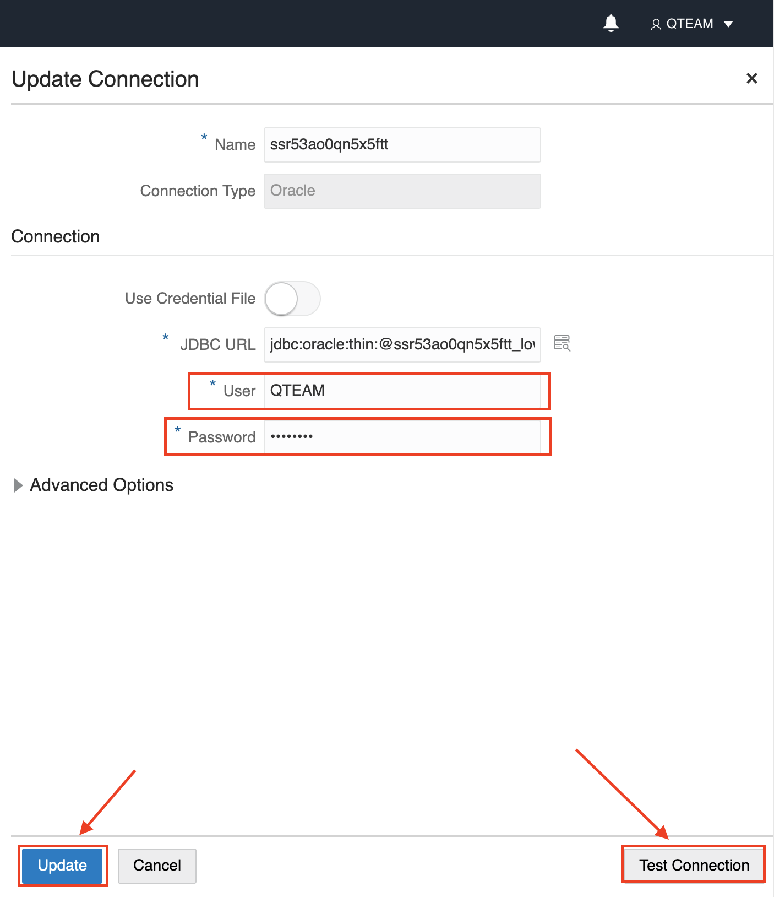

### Use Web based DATA TRANSFORMS

1. Navigate to the **Database Actions** home page by clicking the top link. Under **Data Tools** click the **DATA TRANSFORMS** card.
  

2. On the **SIGN IN** page, provide your credentials, click **Sign In**.
  

3. On the home page click the **Connections** on the left navigation to update the connection to the current user.
  

4. Select the existing connection that defaults to the Autonomous Database we are working on to edit it.
  

5. Update the **User** and **Password** fields with the **QTEAM** user credentials. **Test Connection** and then click **Update**.
  

6. Now we will update the **Data Entities**, to fetch the existing tables in the **QTEAM** schema. Follow the steps below.
    1. Click the **Data Entities** on the left navigation pane.
    2. Click **Import Data Entities** button.
    3. On the **Import Data Entities** pop-up, select the **Connection** you just updated.
    4. Choose the **QTEAM** as the **Schema**
    5. Under **Type** remove the **View** as we do not want to import any database views.
    6. Click **Start**
  

7. A new job is created to import the data entities from **QTEAM** Schema. Click on the link for the job name on the pop-up window, to launch the **Job Details** page.
  

8. On the **Job Details** page, click **refresh** button on the right to check job status. Once the job completes, you should see some details as highlighted below and then click **Home** navigation link on the top left.
 

9. We are now ready to create a **Data Flow**. On the home page, click the **Transform Data** card. This launches the **Create Data Flow** wizard.
    1. Provide **Name** as **loadQ2CleanseDay**
    2. Click the **+** icon next to **Project Name**.
    3. Provide a **Description** as follows: Data Flow to load Q2 data and fix the DAY column.
    4. On the pop-up screen, provide the **Name** as **MOVIE_SALES** and click **Create**.
      
    5. Click **Next**.
    6. Select the **Connection** that was edited in a previous step.
    7. Select the **Schema** as **QTEAM**.
    8. Click **Save**.
      

> **Hint:** Save the data flow from time to time by clicking the **save** button often.

10. This launches the **Data Flow Details** page. Let's reivew this page. The left navigate pane lists the **Data Entities** we are working with. The middle section is the canvas that shows the different transformations used in the data flow. The right pane, provides details of the selected object in the middle section where the properties are shown which can be edited.
 

11. Perform the following steps to setup the data flow to filter data for **Q2**.
    1. Drag the **MOVIE\_SALES\_2020** table from the QTEAM schema on the left navigation pane to the canvas. This is our source table.
    2. Drag the **Filter** transformation from the top of the middle section on the canvas.
    3. Link the **MOVIE\_SALES\_2020** table to the **Filter**.
    4. Select the **Filter** transformation and change the **Name** on the right navigation pane to **filQ2Data**.
    5. Choose the **filQ2Data** properties option
    6. Optionally expand the properties pane.
      
    7. Click on the edit icon to define the filter.
    8. On the **Expression Editor** pop-up, type the following expression:
        ````
        <copy>
        MOVIE_SALES_2020.MONTH IN ('April','May','June')
        </copy>
        ````
    9. Click **OK**.
      
    10. Minimize the filter property pane.

12. Perform the following steps to fix the DAY field:
    1. Click the **DATA PREPARATION** tab on the transforms section in the middle
    2. Drag the **Data Cleanse** transformation on the canvas.
    3. Link the **filQ2Data** output to the input of the **DataCleanse** transformation.
    4. Select the DataCleanse transformation and rename to **fixDAY**.
    5. Add the **Description** as **Fix DAY to be initcap and remove leading and trailing spaces**.
    6. Choose the **fixDAY** properties option
    7. Expand the properties pane
      
    8. On the **fixDAY** transformation properties window, select the **DAY** column from the **MOVIE\_SALES\_2022** source.
    9. In the **Choose the cleansing options** section, select the **Leading and Trailing Whitespace** option under **Remove Unwanted Characters**
    10. For the **Modify Case** choose the option **Title Case**.
    11. Minimize the properties window.
      

13. Perform the following steps to create a new target table **MOVIE\_SALES\_2020Q2**
    1. Select the **fixDAY** transformation.
    2. Click the **Add Target** icon on the top right of the transformation.
      
    3. On the **Add Data Entity** pop-up set **Name** as **MOVIE\_SALES\_2020Q2**, **Schema** as **QTEAM**
    4. Click **Next**
      
    5. select all the columns.
      
    6. Click **Next**
    7. Click **Save**
      

14. The final data flow should look like the following screen.
    1. **Validate** the data flow
    2. **Save** the data flow
    3. **Run** the data flow.
      
    4. On the **Start Data Flow** pop-up, click **Start**.
    5. The data flow execution starts. Click the blue link on the **Start Data Flow** pop-up to track the execution progress.
      

15. After successfull execution, a new table **MOVIE\_SALES\_2020Q2** is created and the details are as shown below. Click **Refresh** icon to update execution status.
  

16. Having completed this step you now have a table **MOVIE\_SALES\_2020Q2**, with data for just April, May, and June. The days have all been changed to title case.

> **Note:** The Web Transforms page does not have the link to the **Database Actions** home page. You can use the URL from the **ADMIN** login to the **QTEAM** users **Database Actions** page.
  

17. From the Autonomous Database **Tools** home page, access a SQL worksheet by clicking the **SQL** card on the **Database Actions** page. Refresh to see the new table created.
  
