#  Autonomous JSON Database & SODA Collections

## Introduction

**Oracle Autonomous JSON Database** is a cloud document database service that makes it easier to develop applications that use JSON documents. It allows using **SODA** (Simple Oracle Document Access) in order to easily build **REST APIs** to manipulate the data. In this lab, you will go through a series of steps to create an Autonomous JSON Database in OCI and import sample JSON files into **SODA Document Collections**. These collections will be later used to build REST APIs using **SODA for NodeJS**.

Estimated Lab Time: 1 hour

### Objectives
In this lab, you will:
* Create Autonomous JSON Database in OCI.
* Upload sample JSON files to Object Storage Bucket.
* Create SODA Document collections based on JSON files from Object Storage.
* Use SODA for PL/SQL to check the data in the collections.

### Prerequisites
To complete this lab, you must have:
* An OCI Account.
* A tenancy where you have the resources available to provision an Autonomous JSON Database and a Standard Object Storage Bucket.
* An existing compartment in which the ADB will reside.
* SQL Developer Installed on your local machine.

## Task 1: Understand the Sample JSON Files
In this step you are going to understand the structure of the two sample JSON files (_sample\_skills.json_ and _sample\_users.json_). However, you should know that you can change these ones in any way, depending on your business need.

1. Download the two sample JSON files [here](https://objectstorage.us-ashburn-1.oraclecloud.com/p/jyHA4nclWcTaekNIdpKPq3u2gsLb00v_1mmRKDIuOEsp--D6GJWS_tMrqGmb85R2/n/c4u04/b/livelabsfiles/o/labfiles/Lab4-Sample_JSON.zip).

2. The first, and the most important one is the _sample\_skills.json_ file. This file represents the main data source for the application that is going to be build in these labs.

    As you can see in the snippet below, the JSON consists of a set of data about employees and their skills, where the employee's **email** address represents the unique key. Each employee has two main areas of development, a **primary** one and a **secondary** one. The **areas** tag represents an array of objects (areas of development). Each area has several skills, and for each of the skills, the **value** tag represents the knowledge level for the employee and takes values from 0 to 5 (where 0 means "no knowledge" and 5 means "expert"). The **oracle_based** tag categorizes each skill in one of the two categories: **Oracle Based Skills** (1) or **Non-Oracle Skills** (0).

    As mentioned before, the keys in this JSON file can be customized in any way. An example would be to keep data regarding a list of products and product specifications.

      ```
      [{
        "product_name": "Smartphone X",
        "brand": "Product Brand",
        "code": "PROD12345",
        "specifications":
          [{
            "spec_category": "Display",
            "characteristics":
              [{
                  "name": "Screen size (in inches)",
                  "value": 7
                },
         ...
      ```

3. The second JSON file (_sample\_users.json_) represents the data regarding some sample users for the application and will be used to emphasize the authorization in the application.

    The users in the application presented will have 3 roles which will be determined based on the **is\_admin** and **is\_mgr** tags, as shown in the table below.

    | ROLE    | VALUE FOR is_admin | VALUE FOR is_mgr |
    |---------|--------------------|------------------|
    | ADMIN   | Y                  | Y or N           |
    | MANAGER | Y or N             | Y                |
    | USER    | N                  | N                |

## Task 2: Create Autonomous JSON Database

In order to create an Autonomous JSON Database you must first login on the OCI Console, then follow the steps, as described below:

1. In the top-left hamburger menu navigate to **Autonomous JSON Database** which can be found under **Oracle Database** category.

  

2. Choose to create a new database by clicking **Create Autonomous Database**.

  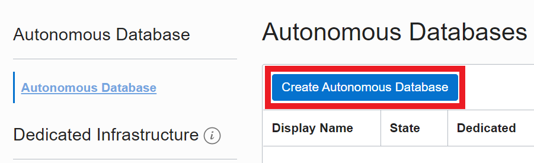

3. Fill in the form by providing basic information for the ADB such as: compartment, display name and database name. For the workload type choose **JSON** and **Shared Infrastructure** for the deployment type.

  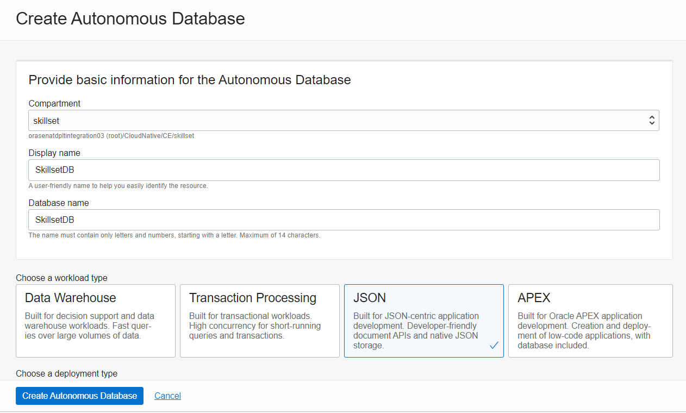

  The database version is 19c with 1 OCPU count and 1TB of storage.

  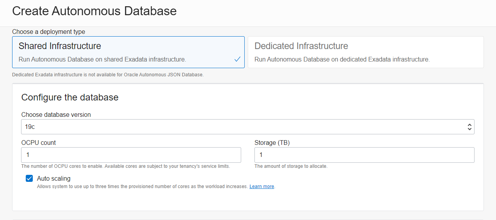

  Choose a password for the ADMIN user of the database and for the network access type select **Allow secure access from everywhere**. Click **Create Autonomous Database**.

  

## Task 3: Download database Wallet & connect to the database

In order to connect to the database using SQL Developer, you must first download the wallet to your local machine.

1. After the database has provisioned, click on the **DB Connection** button in the OCI Console to download the database wallet.

  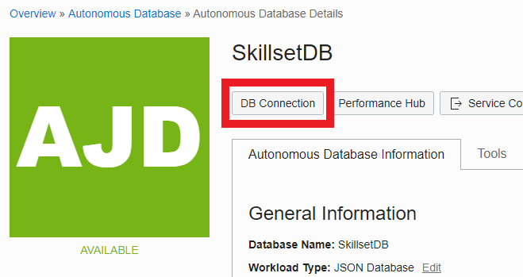

2. Select **Instance Wallet** from the drop-down list, click **Download Wallet** and provide the password that you chose previously for ADMIN.

  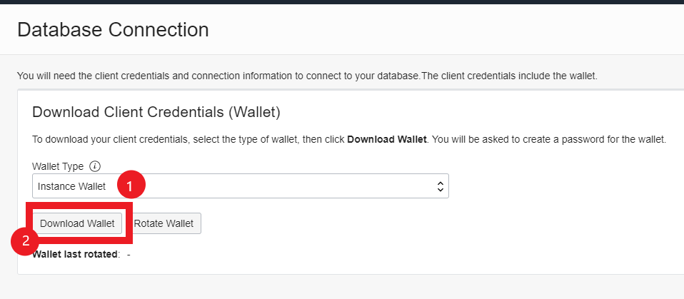

3. Open SQL Developer and from the **Connections** window click on the green **+** sign to add a new connection.

  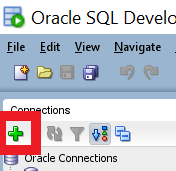

4. Provide a name for the connection (any name can be chosen) as well as the user (_ADMIN_) and the password you've set at **STEP 2: Create Autonomous JSON Database**. For the **Connection Type** choose **Cloud Wallet** from the drop-down list, browse to the location of the wallet zip file and select the desired service (here skillsetdb_high). Test the connection and if the test succeeds you can connect to the database.

  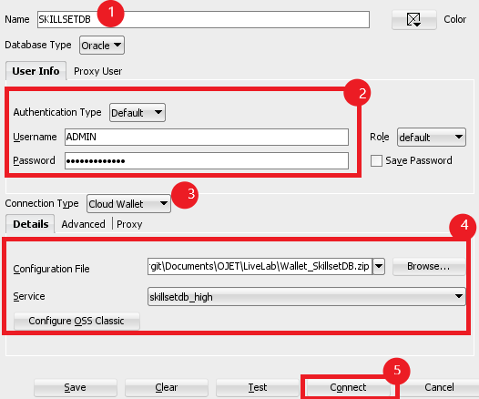

## Task 4: Create New Database User and Grant Needed Roles

Considering the fact that you previously connected to the database using the _ADMIN_ user, you need to run the following commands in order to create a new user _SKILLSET_ which will be used by the application.

1. Create user _SKILLSET_ with a password of your choice (here 'Password12345').
      ```
      <copy>
      CREATE USER skillset IDENTIFIED BY Password12345;
      </copy>
      ```

2. Grant the needed roles for this user.

      ```
      <copy>
      GRANT CONNECT TO skillset;
      GRANT CONNECT, RESOURCE TO skillset;
      GRANT CREATE SESSION TO skillset;
      GRANT UNLIMITED TABLESPACE TO skillset;
      GRANT CREATE VIEW TO skillset;
      GRANT SODA_APP TO skillset;
      GRANT EXECUTE ON DBMS_CLOUD TO skillset;
      GRANT READ, WRITE ON DIRECTORY DATA_PUMP_DIR TO skillset;
      </copy>
      ```

## Task 5: Upload Sample JSON Files in Object Storage & Create PAR URL for Each of Them

In order to be able to create the SODA document collections in the database from the sample JSON files, you must first upload them in a Standard Object Storage Bucket. In this step you will need the two JSON files downloaded at the beginning of this lab (_sample\_skills.json_ and _sample\_users.json_).

1. Log in on the OCI Console and from the top-left hamburger menu choose **Object Storage -> Object Storage**.

  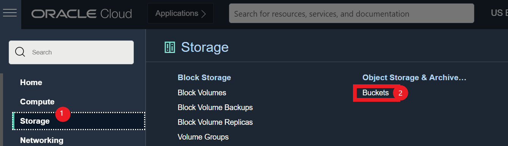

2. Choose the option to **Create Bucket**.

  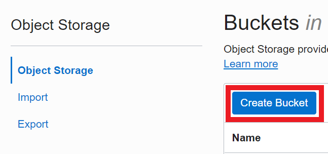

3. Set up a name for the bucket and select **Standard** for the Default Storage Tier field.

  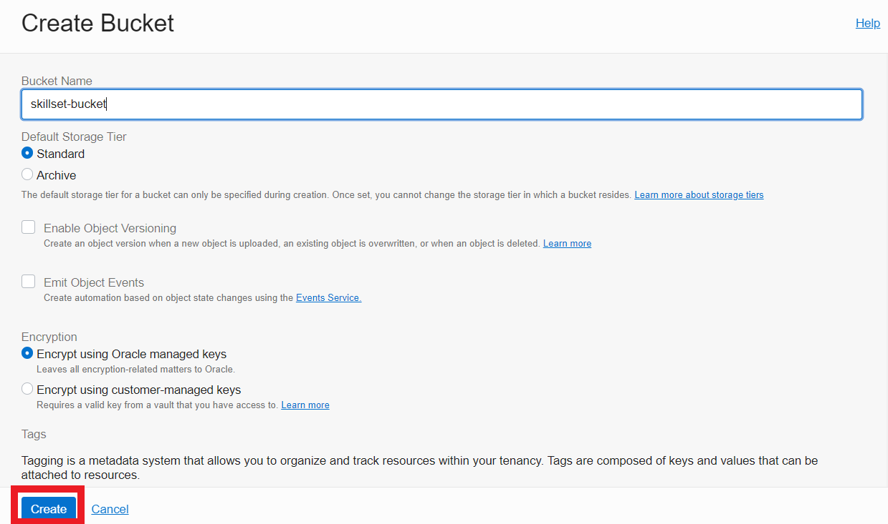

4. After the bucket was created, navigate to **Objects** and click **Upload** then select the files to be uploaded.

  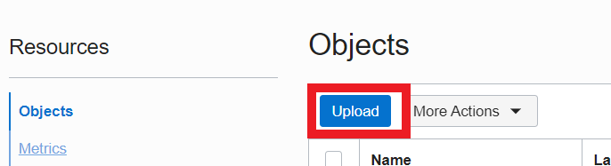

5. Create Pre-Authenticated Requests for each of these files as shown in the images below.

  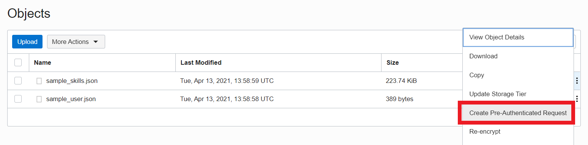
  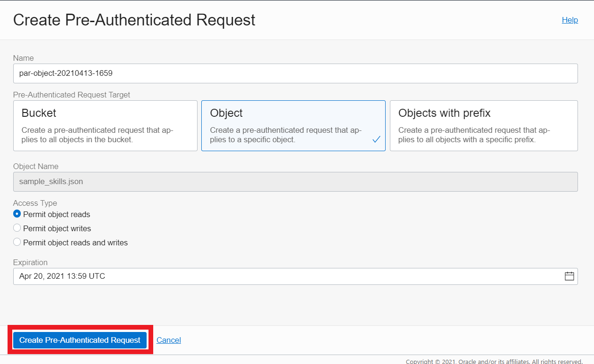

6. Save the PAR URL somewhere. You will need it later and it will not be shown again. You should have two PAR URLs, one for the _sample\_skills.json_ file and one for _sample\_users.json_ file.

  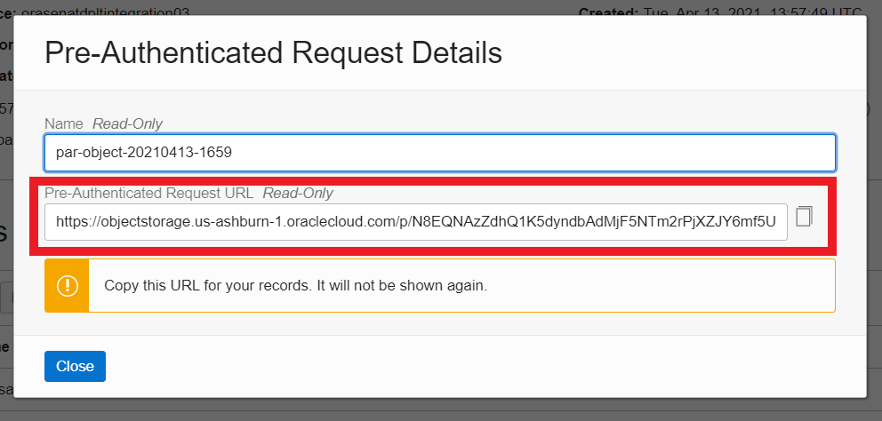

## Task 6: Create SODA Collections

Login in SQL Developer using the _**SKILLSET**_ user created at **STEP 4: Create new database user and grant needed roles** and run the following commands to create the two collections (skills and users), as well as unique indexes for the **email** field in each of them.

1. Create the _skills_ collection. Add in the following code the PAR URL for the _sample\_skills.json_ file.

      ```
      <copy>
      --CREATE SKILLS COLLECTION
      SET DEFINE OFF
      BEGIN
      DBMS_CLOUD.COPY_COLLECTION(
      collection_name => 'skillscollection',
      file_uri_list =>
      '<your_par_url_here>',
      format =>
      '{"recorddelimiter" : "0x''01''", "unpackarrays" : "TRUE", "maxdocsize" : "10240000"}' );
      END;
      /
      </copy>
      ```
2. Run the following query to check the data in the collection. The collection should have the same data as the sample JSON file

      ```
      <copy>
      --CHECK DATA IN COLLECTION
      SELECT a.*, json_serialize(a.json_document) json FROM skillscollection a;
      </copy>
      ```

3. Using the same JSON, create another collection which will be later used for seeing the progress of skills. The following code is using the same PAR URL for the _sample\_skills.json_ file.

      ```
      <copy>
      --CREATE SKILLS ARCH/HISTORY COLLECTION (same json as skills collection)
      SET DEFINE OFF
      DECLARE
      collection SODA_COLLECTION_T;
      document SODA_DOCUMENT_T;
      cur SODA_CURSOR_T;
      status BOOLEAN;
      jsonClob CLOB;
      document2 SODA_DOCUMENT_T;
      new_doc SODA_DOCUMENT_T;
      BEGIN
      DBMS_CLOUD.COPY_COLLECTION(
      collection_name => 'skillsarch_collection',
      file_uri_list =>
      '<your_par_url_here>',
      format =>
      '{"recorddelimiter" : "0x''01''", "unpackarrays" : "TRUE", "maxdocsize" : "10240000"}' );

      collection := DBMS_SODA.open_collection('skillsarch_collection');
      -- Open the cursor to fetch the documents
      cur := collection.find().get_cursor();
      -- Loop through the cursor
      WHILE cur.has_next
      LOOP
      document := cur.next;
      IF document IS NOT NULL THEN
      jsonClob := json_query(document.get_blob, '$' PRETTY);
      jsonClob := substr(jsonClob, 0, length(jsonClob)-1) || ',"action":"INSERTED"}';

      document2 := SODA_DOCUMENT_T(
      b_content => utl_raw.cast_to_raw(jsonClob));
      new_doc := collection.find().key(document.get_key).replace_one_and_get(document2);
      END IF;
      END LOOP;
      -- IMPORTANT: You must close the cursor, to release resources.
      status := cur.close;
      END;
      /
      </copy>
      ```

4. Create a unique index for the _skillscollection_ so that each employee's skills will only be added once, based on his/her email address.

      ```
      <copy>
      --CREATE SKILLS COLLECTION INDEX - UNIQUE EMAIL FIELD
      DECLARE
      collection SODA_COLLECTION_T;
      spec VARCHAR2(700);
      status NUMBER;
      BEGIN
      -- Open the collection
      collection := DBMS_SODA.open_collection('skillscollection');
      -- Define the index specification
      spec := '{"name" : "SKILLS_EMAIL_IDX1",
      "fields" : [{"path" : "email",
      "datatype" : "varchar2",
      "order" : "asc"}],
      "unique" : true}';
      -- Create the index
      status := collection.create_index(spec);
      DBMS_OUTPUT.put_Line('Status: ' || status);
      END;
      /
      </copy>
      ```

5. Create the users collection.

      ```
      <copy>
      --CREATE USERS COLLECTION
      SET DEFINE OFF
      BEGIN
      DBMS_CLOUD.COPY_COLLECTION(
      collection_name => 'userscollection',
      file_uri_list =>
      '<your_par_url_here>',
      format =>
      '{"recorddelimiter" : "0x''01''", "unpackarrays" : "TRUE", "maxdocsize" : "10240000"}' );
      END;
      /
      </copy>
      ```

6. Run the following query to check the data in the collection. The collection should have the same data as the sample JSON file.

      ```
      <copy>
      --CHECK DATA IN COLLECTION
      SELECT a.*, json_serialize(a.json_document) json FROM userscollection a;
      </copy>
      ```

7. Create a unique index on the _email_ field so that each employee will only have one user defined in the application, based on his/her email address.

      ```
      <copy>
      --CREATE USERS COLLECTION INDEX - UNIQUE EMAIL FIELD
      DECLARE
      collection SODA_COLLECTION_T;
      spec VARCHAR2(700);
      status NUMBER;
      BEGIN
      -- Open the collection
      collection := DBMS_SODA.open_collection('userscollection');
      -- Define the index specification
      spec := '{"name" : "USER_EMAIL_IDX1",
      "fields" : [{"path" : "email",
      "datatype" : "varchar2",
      "order" : "asc"}],
      "unique" : true}';
      -- Create the index
      status := collection.create_index(spec);
      DBMS_OUTPUT.put_Line('Status: ' || status);
      END;
      /
      </copy>
      ```

## Task 7: Create a View on a Collection

The application is also using a view (called _SKILLSVIEW_) on the _skillscollection_ and since it would be hard to write the SQL script by hand, you can use the PL/SQL block below to dynamically build the **create view** script and execute it.

1. Run the PL/SQL script to create the view

      ```
      <copy>
      --DYNAMICALLY CREATE VIEW ON SKILLS COLLECTION
      SET SERVEROUTPUT ON;
      BEGIN
      DECLARE
      query varchar2(4000);
      v_no_cols number;
      v_string varchar2(256);
      v_columns varchar2(4000);
      BEGIN

      select nvl((REGEXP_COUNT( skills_list, ',' ) + 1), 0) into v_no_cols from
      (select distinct a.json_document.areas.skills.skill skills_list from skillscollection a);

      select upper(replace(replace(replace(REGEXP_REPLACE( substr(view_columns, 2, length(view_columns)-2), '[[:space:]]', '' ), '/', ''), '(', ''), ')', '')) cols into v_columns from
      (select distinct a.json_document.areas.skills.skill view_columns from skillscollection a);

      v_columns := '"ID", "CREATED_ON", "LAST_MODIFIED", "VERSION", "NAME", "EMAIL","MANAGER", "PRIMARY", "SECONDARY", ' || v_columns;
      --DBMS_OUTPUT.PUT_LINE('v_columns='||v_columns);
      query := 'CREATE OR REPLACE VIEW SKILLSVIEW ('||v_columns||')AS
      (SELECT a.id, a.created_on, a.last_modified, a.version,
      a.json_document.name name,
      a.json_document.email email,
      a.json_document.manager manager,
      a.json_document.primary primary,
      a.json_document.secondary secondary, ';

      FOR I IN 1..v_no_cols LOOP
      IF I = 1 OR I = v_no_cols THEN
      v_string := 'REPLACE(REPLACE(REGEXP_SUBSTR(points, ''[^",]+'', 1, ' || i || '), ''['',''''), '']'','''') COL'||i||',';
      ELSE
      v_string := 'REGEXP_SUBSTR(points, ''[^",]+'', 1, ' || i || ') COL'||i||',';
      END IF;
      query := query || chr(13) || v_string;
      END LOOP;

      query := SUBSTR(query, 0, LENGTH(query) - 1);
      query := query || chr(13) || 'FROM (select b.id, b.json_document.areas.skills.value points from skillscollection b) t, skillscollection a WHERE t.id=a.id) order by name';

      DBMS_OUTPUT.PUT_LINE(query);
      EXECUTE IMMEDIATE query;
      END;
      END;
      /
      </copy>
      ```

2. Run the following query to check the data in the view

      ```
      <copy>
      --CHECK DATA IN VIEW
      SELECT * FROM skillsview;
      </copy>
      ```

You may now [proceed to the next lab](#next).

## Learn More?
* [Oracle Autonomous JSON Databases](https://www.oracle.com/autonomous-database/autonomous-json-database/)
* [SODA for PL/SQL](https://docs.oracle.com/en/database/oracle/simple-oracle-document-access/plsql/19/adsdp/soda-pl-sql-overview.html#GUID-34D59D45-F9FA-4B36-BA17-E13D7B11E97E)

## Acknowledgements

**Authors** - Giurgiteanu Maria Alexandra, Gheorghe Teodora Sabina
**Last Updated By** - Brianna Ambler, July 2021
