# Build NodeJS APIs to Make Calls to the Database

## Introduction

In this lab you are going to go through a series of steps for provisioning a **Linux Instance** and deploying a **NodeJS** application. The application that is going to be developed in this lab uses **SODA for NodeJS** to create APIs to perform create, read, update, and delete (**CRUD**) operations on document collections from an Autonomous JSON Database.

SODA for NodeJS is part of the Oracle NodeJS driver, **node-oracledb**, and doesn't need any additional installation.

Estimated Lab Time: 1 hour and 30 minutes

### Objectives
In this lab, you will:
* Provision a Linux Instance in OCI and install the needed packages.
* Build a basic NodeJS application that will make calls to the database.
* Run and test the application.
* Test the APIs using Postman.

### Prerequisites
To complete this lab, you must have:
* An IDE, such as **Visual Studio Code**.
* An OCI Account.
* A tenancy where you have the resources available to provision a Linux Instance.
* An existing compartment and a VCN in which the Instance will reside.
* **Lab 3: Autonomous JSON Database & SODA Collections**
* **Lab 4: Build an OracleJET Web Application** -> **STEP 1: Creating a Virtual Cloud Network**
* If you choose to develop the code on your local machine you need to have installed **NodeJS**, **Oracle Instant Client** and **Visual Studio Code** (or other code editor of your choice), as mentioned in **Lab 2: Install and prepare prerequisites**.

## Task 1: Creating a Linux Instance in OCI

1. From the top-left hamburger menu, locate and select **Compute -> Instances**. Click the blue button **Create Instance**.

  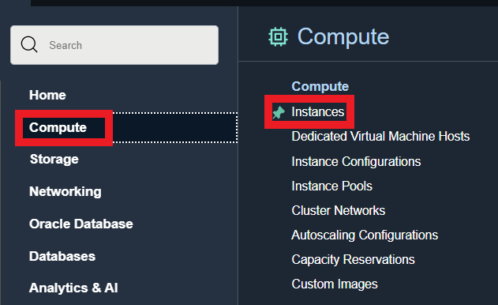

2. Make sure you are in the desired compartment (here _skillset_). Configure your instance by naming it, choosing your Availability Domain, Image and Shape. Chose the VCN in which the instance will reside, as well as the Subnet. To simplify everything, chose to assign a Public IP to the instance, in order to make it accessible from the Internet.

  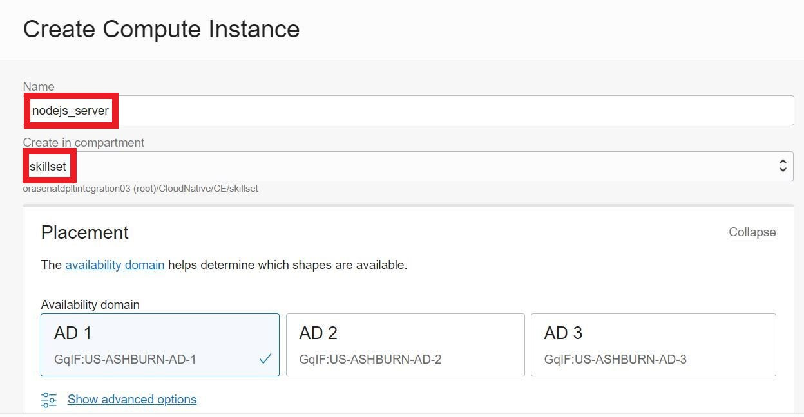

3. Since you will need to connect to the instance, you should also upload your SSH public key. Upload your public SSH key from your computer (.pub) so that you will be able to connect to the instance. If you need to generate an SSH key pair, follow instructions from **Lab 1: Generate SSH Keys**.

  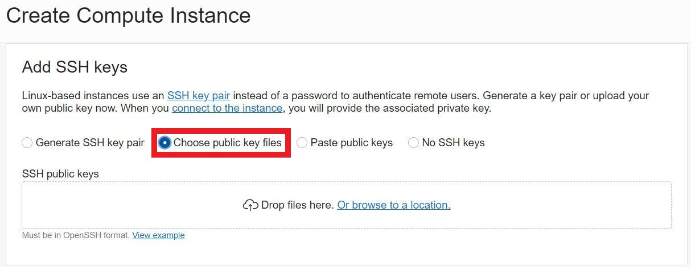

4. Click the **Create** button.

## Task 2: Connecting to the Instance and Installing the Needed Packages

1. From the OCI Console, copy the public IP address of your new created instance and open a terminal, CMD or Windows PowerShell screen.

  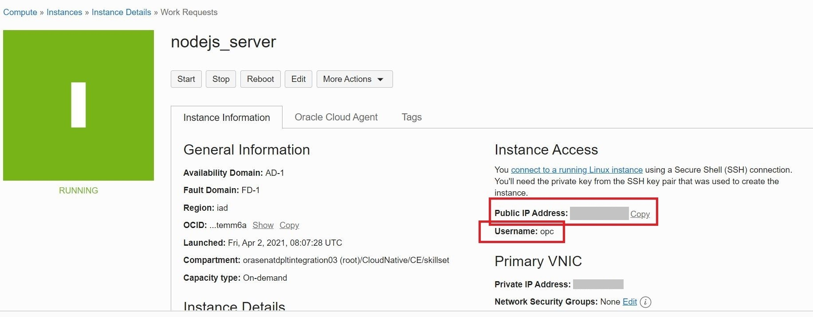

2. The next step for connecting to the instance is to run the following command in a terminal, CMD or Windows PowerShell.

    ```
    <copy>
    ssh opc@<your_public_ip>
    </copy>
    ```

  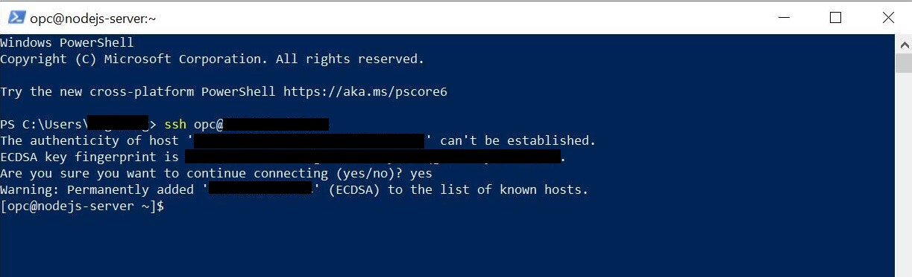

3. After the connection is successful you need to run some commands in order to complete the configuration.

    * Before beginning to install anything on the instance, run the following command.

        ```
        <copy>
        sudo yum update
        </copy>
        ```

    * Open the port needed for the application. In this case, 8000.

        ```
        <copy>
        sudo firewall-cmd --permanent --zone=public --add-port=8000/tcp
        sudo firewall-cmd --reload
        </copy>
        ```

    * Install **curl** package.

        ```
        <copy>
        sudo yum install curl
        sudo curl -sL https://rpm.nodesource.com/setup_14.x | sudo bash -
        </copy>
        ```

    * Install **NodeJS** package.

        ```
        <copy>
        sudo yum install -y nodejs
        </copy>
        ```

4. [Optional] If there are going to be more people that would need to connect to the instance, their SSH keys need to be added on the instance as well. In order to do this, connect to the instance using SSH and run the following commands.

    ```
    <copy>
    ssh opc@<instance_public_ip>
    cd ~/.ssh
    nano authorized_keys
    </copy>
    ```

  Paste the key that needs to be added at the end of the file on the instance and save the file (**Ctrl+O** then **Ctrl+X**).

## Task 3: Installing Oracle Instant Client

1. Before downloading **Instant Client**, create a new directory for it and navigate to that directory.

    ```
    <copy>
    sudo mkdir /opt/oracle
    cd /opt/oracle
    </copy>
    ```

2. Download Oracle Instant Client.

    ```
    <copy>
    sudo wget https://download.oracle.com/otn_software/linux/instantclient/instantclient-basic-linuxx64.zip
    </copy>
    ```

3. Unzip the archive downloaded at the previous step.

    ```
    <copy>
    sudo unzip instantclient-basic-linuxx64.zip
    </copy>
    ```

4. Install **libaio** package and add Instant Client to the environment variables using the following commands.

    ```
    <copy>
    sudo yum install libaio
    sudo sh -c "echo /opt/oracle/instantclient_21_1 > /etc/ld.so.conf.d/oracle-instantclient.conf"
    sudo ldconfig
    </copy>
    ```

    ```
    <copy>
    sudo su
    export LD_LIBRARY_PATH=/opt/oracle/instantclient_21_1:$LD_LIBRARY_PATH
    exit
    </copy>
    ```

5. Open OCI Console and navigate to the Autonomous Database created in **Lab 3: Autonomous JSON Database & SODA Collections**. Download the database wallet by choosing **DB Connection**, then select **Instance Wallet** for the **Wallet Type** field and click **Download Wallet**.

6. After downloading the wallet to your local machine, extract the archive. Now all its content can be copied to the instance using the following commands (these should be ran from your local machine).

    ```
    <copy>
    cd <path_to_the_wallet_folder>
    scp -r <wallet_folder_name>/ opc@<instance_public_ip>:/home/opc/
    </copy>
    ```

7. After all the files were uploaded to the instance you can connect to it using SSH, as done previously.

    ```
    <copy>
    ssh opc@<instance_public_ip>
    </copy>
    ```

8. Navigate to the Instant Client directory (**/opt/oracle/instantclient\_21\_1/**) and check if there is a directory **./network/admin**. If not, you will need to create these two directories so that you will be able to access the following path: **/opt/oracle/instantclient\_21\_1/network/admin/**. Use the following commands to do this (only if it is needed).

    ```
    <copy>
    cd /opt/oracle/instantclient_21_1/
    sudo mkdir network
    cd network
    sudo mkdir admin
    </copy>
    ```

9. Navigate to the wallet directory and copy all its content to **/opt/oracle/instantclient\_21\_1/network/admin/**

    ```
    <copy>
    cd /home/opc/<wallet_folder_name>
    sudo cp * /opt/oracle/instantclient_21_1/network/admin/
    </copy>
    ```

10. In the wallet folder, check the **sqlnet.ora** and update it, if necessary, so that it will have the correct path to **/network/admin** directory. The content of the file should look similar to this.

    ```
    WALLET_LOCATION = (SOURCE = (METHOD = file) (METHOD_DATA = (DIRECTORY="?/network/admin")))
    SSL_SERVER_DN_MATCH=yes
    ```

  **Note**: If you want to run the code developed in the next step on your local machine as well, consider the fact that you should have Instant Client installed and you should also copy the content of the wallet directory to **your\_path\_to\_instant\_client/network/admin** and check the **sqlnet.ora** file as mentioned at point 10.

## Task 4: Create a Simple NodeJS Application with APIs

You can either create and run the following application on your local machine, then copy the code and run it on the Linux Instance, or you can connect with SSH to the instance and write the code directly on the instance in any editor of your choice.

  **Note**: If you choose to develop the code on your local machine you need to have installed **NodeJS**, **Oracle Instant Client** and **Visual Studio Code** (or other code editor of your choice), as mentioned in **Lab 2: Install and prepare prerequisites**.

The structure of the project you are going to create will look like the following:

  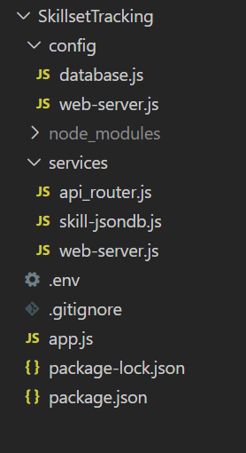

1. Create a new directory for your application. In our case, it is called _SkillsetTracking_.

2. Since it would be easier for the _npm_ command to install all the needed packages at the beginning, create a new file in the application folder: _package.json_ and paste the following content in it.

    ```
    <copy>
    {
      "name": "skillsettrackingapi",
      "version": "1.0.0",
      "description": "An Oracle application using SODA for NodeJS",
      "dependencies": {
        "cors": "^2.8.5",
        "dotenv": "^8.2.0",
        "express": "^4.17.1",
        "morgan": "^1.10.0",
        "oracledb": "^4.2.0"
      },
      "devDependencies": {},
      "engines": {
        "node": ">=0.10.0"
      },
      "scripts": {},
      "private": true,
      "main": "app.js",
      "author": "",
      "license": "ISC"
    }
    </copy>
    ```

3. In the same folder create a new file _app.js_ and add the following code in it.

    ```
    <copy>
    async function startup() {
      console.log('Starting application');
    }
    startup();

    async function shutdown(e) {
      let err = e;
      console.log('Shutting down application');
      console.log('Exiting process');
      if (err) {
        process.exit(1); // Non-zero failure code
      } else {
        process.exit(0);
      }
    }

    process.on('SIGTERM', () => {
      console.log('Received SIGTERM');
      shutdown();
    });

    process.on('SIGINT', () => {
      console.log('Received SIGINT');
      shutdown();
    });

    process.on('uncaughtException', err => {
      console.log('Uncaught exception');
      console.error(err);
      shutdown(err);
    });
    </copy>
    ```

4. Now that you have the basic content of the application, you can test it by running the following commands.

    * Open a terminal and navigate to your application folder.
    * Install _npm_ packages using ``npm install``
    * Run the application using ``node app.js``

5. In the application folder, create two new folders: _config_ and _services_.

6. Navigate to _config_ folder and create a new file _web-server.js_. Add the following content to it. This file sets up the default port on which the application will run. You can set up any port you want, but make sure that you have the rights to use it and it is not used by any other application.

    ```
    <copy>
    require('dotenv').config();
    module.exports = {
      port: process.env.HTTP_PORT || 8000
    };
    </copy>
    ```

7. Navigate to the _services_ folder and create a new file _web-server.js_. Paste the following content in this file. This is the actual code for running the web server.

    ```
    <copy>
    const http = require('http');
    const express = require('express');
    const morgan = require('morgan');
    const webServerConfig = require('../config/web-server.js');
    const cors = require('cors');
    let httpServer;

    function initialize() {
      return new Promise((resolve, reject) => {
        const app = express();
        httpServer = http.createServer(app);
        // Combines logging info from request and response
        app.use(morgan('combined'));
        // Parse incoming JSON requests and revive JSON.
        app.use(express.json({
          reviver: reviveJson
        }));
        //Accept calls from OJET instance
        app.use(cors());
        app.get('/', function (req, res) {
          res.send('...Skillset APIs are running...');
        });
        httpServer.listen(webServerConfig.port)
          .on('listening', () => {
            console.log(`Web server listening on localhost:${webServerConfig.port}`);
            resolve();
          })
          .on('error', err => {
            reject(err);
          });
      });
    }

    module.exports.initialize = initialize;

    function close() {
      return new Promise((resolve, reject) => {
        httpServer.close((err) => {
          if (err) {
            reject(err);
            return;
          }
          resolve();
        });
      });
    }

    const iso8601RegExp = /^\d{4}-\d{2}-\d{2}T\d{2}:\d{2}:\d{2}(\.\d{3})?Z$/;
    function reviveJson(key, value) {
      // revive ISO 8601 date strings to instances of Date
      if (typeof value === 'string' && iso8601RegExp.test(value)) {
        return new Date(value);
      } else {
        return value;
      }
    }

    module.exports.close = close;
    </copy>
    ```

8. Add the needed code to open the web server in _app.js_.

    * At the beginning of the file:

        ```
        <copy>
        const webServer = require('./services/web-server.js');
        </copy>
        ```

    * In the **startup()** function:

        ```
        <copy>
        async function startup() {
          console.log('Starting application');
          try {
            console.log('Initializing web server module');

            await webServer.initialize();
          } catch (err) {
            console.error(err);

            process.exit(1); // Non-zero failure code
          }
        }
        </copy>
        ```

    * In the **shutdown()** function:

        ```
        <copy>
        async function shutdown(e) {
          let err = e;
          console.log('Shutting down application');
          try {
            console.log('Closing web server module');
            await webServer.close();
          } catch (e) {
            console.error(e);
            err = err || e;
          }
          console.log('Exiting process');
          if (err) {
            process.exit(1); // Non-zero failure code
          } else {
            process.exit(0);
          }
        }
        </copy>
        ```

    At this point you are now able to run the application using the ``node app.js`` command and see the running application in browser.

    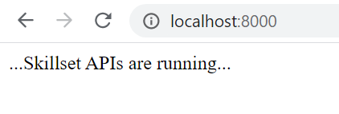

9. Let's connect the application to the database. In the project folder, create a new file _.env_ and add the connection details for your database. Here we are using the Autonomous JSON Database created in **Lab 3: Autonomous JSON Database & SODA Collections**.

    ```
    <copy>
    NODE_ORACLEDB_USER=SKILLSET
    NODE_ORACLEDB_PASSWORD=YourPassword
    NODE_ORACLEDB_CONNECTIONSTRING=skillsetdb_low
    </copy>
    ```

10. Navigate to the _config_ folder and create a new file _database.js_. Paste the following content in this file.

    ```
    <copy>
    const path = require('path');
    const dotenv = require('dotenv');
    dotenv.config({ path: __dirname + '/../.env' });
    module.exports = {
      dbPool: {
        user: process.env.NODE_ORACLEDB_USER,
        password: process.env.NODE_ORACLEDB_PASSWORD,
        connectString: process.env.NODE_ORACLEDB_CONNECTIONSTRING,
        poolMin: 10,
        poolMax: 30,
        poolIncrement: 1
      },
      dbtype: {
        dbname: process.env.SKILLSET_DB || "jsondb"
      }
    };
    </copy>
    ```

11. Navigate to the _services_ folder and create a new file _skill-jsondb.js_. Add the following code to this file. The code in this file is meant to open the connection to the database, open the SODA collection from the database and make the queries to get the data.

  **Note**: Read more about SODA for NodeJS [here](https://docs.oracle.com/en/database/oracle/simple-oracle-document-access/nodejs/).

    ```
    <copy>
    var oracledb = require('oracledb');
    var dbconfig = require('../config/database.js');

    async function initialize() {
      oracledb.autoCommit = true;
      await oracledb.createPool(dbconfig.dbPool);
      var conn = await oracledb.getConnection();
      var soda = conn.getSodaDatabase();
      //Creating the first collection - skillscollection
      var collection = await soda.createCollection('skillscollection');
    }
    async function close() {
      await oracledb.getPool().close();
    }
    async function get(qbe, coll_name) {
      var conn = await oracledb.getConnection();
      var collection = await getCollection(conn, coll_name);
      var builder = collection.find();
      if (qbe != null) {
        builder.filter(JSON.parse(qbe));
      }
      var docs = await builder.getDocuments();
      var res = toJSON(docs);
      conn.close(res);
      return res;
    }
    async function getCollection(conn, coll_name) {
      var soda = conn.getSodaDatabase();
      return await soda.openCollection(coll_name);
    }
    function toJSON(documents) {
      var result = [];
      for (let i = 0; i < documents.length; i++) {
        var doc = documents[i];  // the document (with key, metadata, etc)
        var key = doc.key;
        content = doc.getContent();
        content.id = key;        // inject key into content
        result.push(content);
      }
      return result;
    }
    module.exports.initialize = initialize;
    module.exports.close = close;
    module.exports.get = get;
    </copy>
    ```

12. Update the _app.js_ file as follows. Then try running the application again using ``node app.js`` to check if the connection to the database is made successfully.

    * At the beginning of the file:

        ```
        const webServer = require('./services/web-server.js');
        <copy>
        const database = require('./services/skill-jsondb.js');
        const dbConfig = require('./config/database.js');
        const defaultThreadPoolSize = 10;

        // Increase thread pool size by poolMax
        process.env.UV_THREADPOOL_SIZE = dbConfig.dbPool.poolMax + defaultThreadPoolSize;
        </copy>
        async function startup() {
        ```

    * In the **startup()** function:

        ```
        <copy>
        async function startup() {
          console.log('Starting application');
          try {
            console.log('Initializing database module');
            await database.initialize();
          } catch (err) {
            console.error(err);
            process.exit(1); // Non-zero failure code
          }
          try {
            console.log('Initializing web server module');
            await webServer.initialize();
          } catch (err) {
            console.error(err);
            process.exit(1); // Non-zero failure code
          }
        }
        </copy>
        ```

    * In the **shutdown()** function:

        ```
        <copy>
        async function shutdown(e) {
          let err = e;
          console.log('Shutting down application');
          try {
            console.log('Closing web server module');
            await webServer.close();
          } catch (e) {
            console.error(e);
            err = err || e;
          }
          try {
            console.log('Closing database module');
            await database.close();
          } catch (e) {
            console.error(e);
            err = err || e;
          }
          console.log('Exiting process');
          if (err) {
            process.exit(1); // Non-zero failure code
          } else {
            process.exit(0);
          }
        }
        </copy>
        ```

13. The next step would be to add some API routes to get the data from the database. In the _services_ folder, create a new file _api\_router.js_ and paste the following code in it.

    ```
    <copy>
    var express = require('express');
    var router = express.Router();
    var dbconfig = require('../config/database.js');
    var db = require('./skill-' + dbconfig.dbtype.dbname + '.js');

    /* GET home page */
    router.get('/', function (req, res, next) {
      response.render('index', { title: 'Express' });
    });

    /* Function to handle errors */
    function handle(err, response) {
      response.status(500).send('Error: ' + err);
    }

    /* GET route for all the data in skillscollection with no filter condition */
    router.get('/skillset', async function (request, response) {
      try {
        var result = await db.get(null, 'skillscollection');
        response.send(result);
      }
      catch (err) {
        handle(err, response);
      }
    });

    /* GET route for the data in skillscollection with a simple condition */
    router.get('/skillset/:email', async function (request, response) {
      try {
        let qbe = '{ "email": "' + request.params.email + '" }';
        var result = await db.get(qbe, 'skillscollection');
        response.send(result);
      }
      catch (err) {
        handle(err, response);
      }
    });
    module.exports = router;
    </copy>
    ```

  As you can see in the code above, there are two different GET routes available:
      * **router.get('/skillset'...** - route to get all the data from the _skillscollection_;
      * **router.get('/skillset/:email'...** - route to get the data from the _skillscollection_ with an equality condition for the _email_ field;

  You can customize the routes as you need and you can also add calls for other operations like POST, PUT or DELETE, depending on what you are looking for.

14. Now that the API routes are defined, they only need to be added in the web server. Open the _services/web-server.js_ file and add the following code.

    * Add the declaration for the API router:

        ```
        ...
        const cors = require('cors');
        <copy>const apiRouter = require('./api_router.js');</copy>
        ...
        ```

    * Mount the router at _/api_ path:

        ```
        ...
        app.get('/', function (req, res) {
          res.send('...Skillset APIs are running...');
        });

        <copy>
        // Mount the router at /api so all its routes start with /api
        app.use('/api', apiRouter);
        </copy>

        httpServer.listen(webServerConfig.port)
        ...
        ```

15. Now that everything is set up, you should be able to run the application using ``node app.js``. If you go into the  browser and browse to the URL of your APIs, you should be able to see the results returned from the database, as in the example below.

  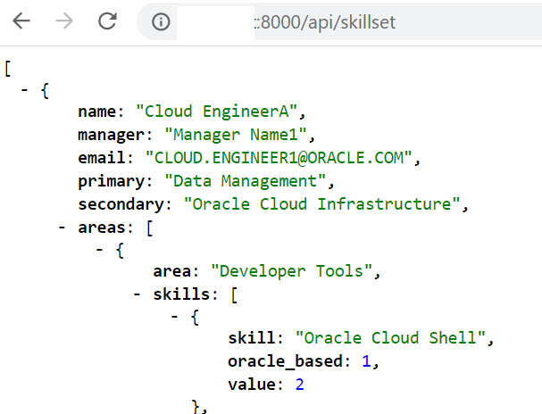

16. If you created the project on your local machine, you need to upload it to the instance. In order to do this, you can use the following commands (run in from you laptop, not on the instance).

  **Note**: Before copying the code from your local machine to the instance, delete the _node\_modules_ folder so that the process will take less time.

    * On the instance:

        ```
        <copy>
        cd /home/opc
        mkdir SkillsetTracking
        </copy>
        ```

    * On your local machine:

        ```
        <copy>
        cd <project_folder_path>
        rm node_modules
        scp -r * opc@<your_instance_public_ip>:/home/opc/SkillsetTracking/
        scp -r .env opc@<your_instance_public_ip>:/home/opc/SkillsetTracking/
        </copy>
        ```

17. After you uploaded the code on the instance, you need to run the ``npm install`` command in the application folder. Then you can either run it with ``node app.js``, but the application will stop running when you close the SSH connection, or you can add it as a **crontab job**.

    ```
    <copy>
    sudo crontab -e
    </copy>
    ```

    Press ***insert*** to enter the _edit_ mode and paste the following.

    ```
    <copy>
    @reboot node /home/opc/SkillsetTracking/app.js
    </copy>
    ```

    Press ***Esc***, then ***:wq***. After the crontab is saved, reboot the instance.

    ```
    <copy>
    sudo reboot
    </copy>
    ```

    You should now be able to see the application running in browser at **http://your\_instance\_public\_ip:8000/** or run an API at **http://your\_instance\_public\_ip:8000/api/skillset**.

## Task 5: Testing APIs Using Postman

In this step you are going to make two types of API calls: ***GET*** and ***POST***. Since in the previous steps of this lab you only created paths for the GET operation, you must first update the code of the application.

1. Update the application code as follows.

    * In the _services/skill-jsondb.js_ add the following function

        ```
        <copy>
        async function create(skillset, coll_name) {
          var conn = await oracledb.getConnection();
          var collection = await getCollection(conn, coll_name);
          var result = await collection.insertOneAndGet(skillset);
          var key = result.key;
          conn.close();
          return key;
        }
        </copy>
        ```

      and the following `export` statement at the end of the file

        ```
        <copy>
        module.exports.create = create;
        </copy>
        ```

    * In the _services/api\_router.js_ add the following route, at the end, before the `export` statement

        ```
        <copy>
        /* POST route for inserting a document in the collection */
        router.post('/skillset', async function (request, response) {
          var review = request.body;
          //force capital letters on the email field in the JSON
          review.email = review.email.toUpperCase();
          try {
            var key = await db.create(review, 'skillscollection');
            response.send({ 'generatedKey': key });
          } catch (err) {
            handle(err, response);
          }
        });
        </copy>
        ```

    Save the files, run the ``npm install`` command if needed and then run the application using ``node app.js`` as shown in the previous step of this lab.

2. Download and install Postman by going to [Postman Downloads](https://www.postman.com/downloads/) page and choosing the version suitable for your computer. After installing the application, login or create a new account.  

  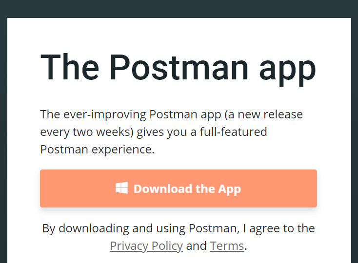

3. After connecting to your Postman account, navigate to **Workspaces** -> **My Workspace**.

  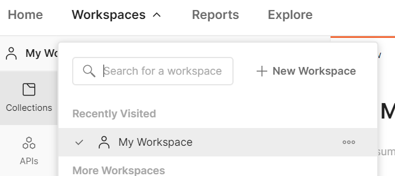

4. Create a new Postman collection to save all the requests (here _SkillsetAPIs_).

  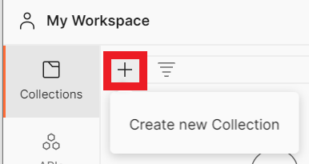

5. Add a new request in the collection previously created.

  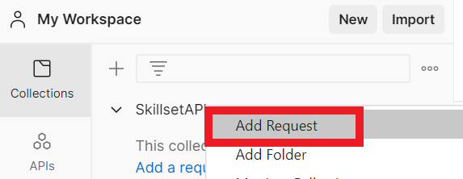

6. Give the new request a name, select the _GET_ type for the call and then paste the URL from your previously created application: **http://your\_public\_ip:8000/api/skillset**. Click **Send**. You should get a ***200 OK*** status message and the results in the body which indicates that your test has run successfully. Click the **Save** button to save the request created.

  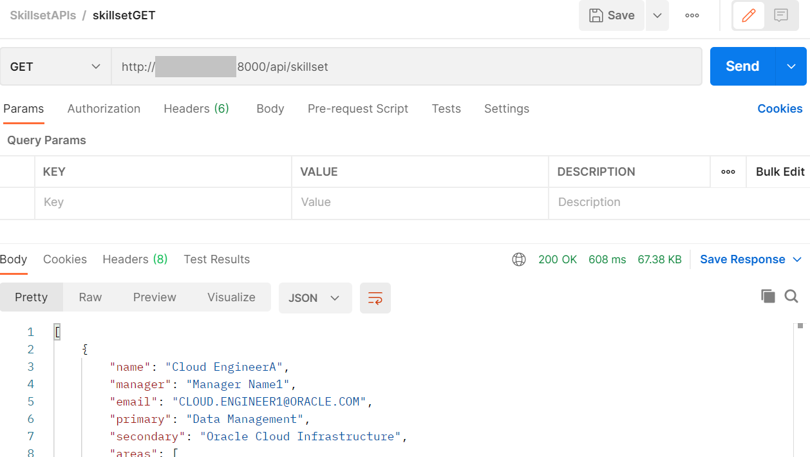

7. Create a new request for the _GET_ call that has a path parameter for filtering the data by _email_. Give the request a name, select the _GET_ type for the call and paste the URL: **http://your\_public\_ip:8000/api/skillset/:email**.

  In the **Params** section add a new path variable with the key **email** and the value **CLOUD.ENGINEER3@ORACLE.COM**. Click **Send**. You should get a ***200 OK*** status message and the results in the body which indicates that your test has run successfully. The result in the body should only show the employee that has the email address equal to **CLOUD.ENGINEER3@ORACLE.COM**. Click the **Save** button to save the request created.

  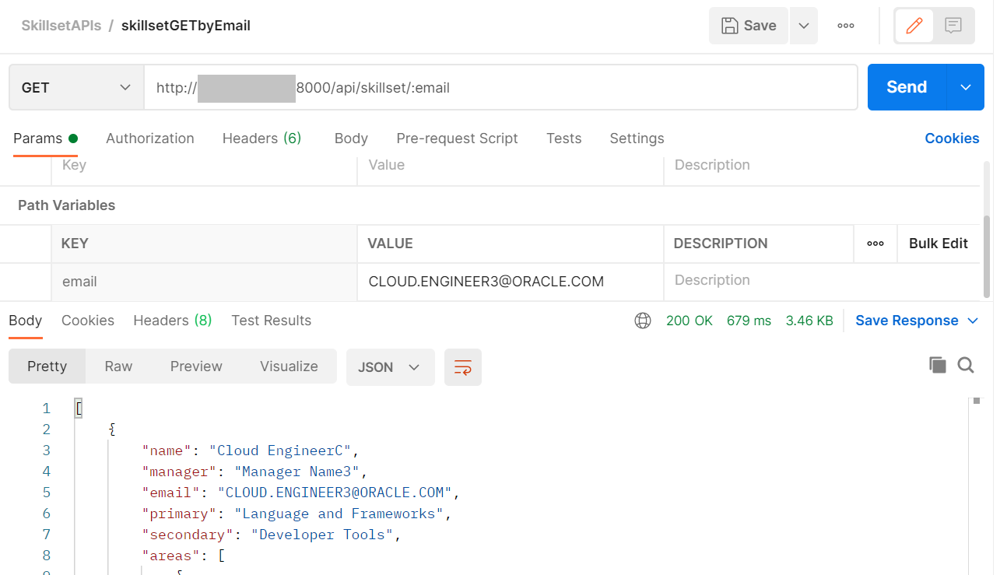

8. The POST request is a little bit different than the GET request. Create a new request and give it a name. Paste the URL for the call: **http://your\_public\_ip:8000/api/skillset**. Go to the **Body** section of the request and select the **raw** type and **JSON**. Paste the following JSON in the body, to add a new employee in the collection.

    ```
    <copy>
        {
            "name": "Cloud EngineerWXYZ",
            "manager": "Manager Name3",
            "email": "CLOUD.ENGINEERWXYZ@ORACLE.COM",
            "primary": "Developer Tools",
            "secondary": "Cloud Native",
            "areas": [
                {
                    "area": "Developer Tools",
                    "skills": [
                        {
                            "skill": "Oracle Cloud Shell",
                            "oracle_based": 1,
                            "value": 2
                        },
                        {
                            "skill": "Ansible",
                            "oracle_based": 0,
                            "value": 3
                        },
                        {
                            "skill": "Chef",
                            "oracle_based": 0,
                            "value": 0
                        },
                        {
                            "skill": "Terraform",
                            "oracle_based": 0,
                            "value": 4
                        }
                    ]
                },
                {
                    "area": "Language and Frameworks",
                    "skills": [
                        {
                            "skill": "JavaEE",
                            "oracle_based": 1,
                            "value": 1
                        },
                        {
                            "skill": "Helidon",
                            "oracle_based": 1,
                            "value": 0
                        },
                        {
                            "skill": "Ojet",
                            "oracle_based": 1,
                            "value": 0
                        },
                        {
                            "skill": "SpringBoot",
                            "oracle_based": 0,
                            "value": 0
                        },
                        {
                            "skill": "Python",
                            "oracle_based": 0,
                            "value": 3
                        },
                        {
                            "skill": "Django",
                            "oracle_based": 0,
                            "value": 0
                        },
                        {
                            "skill": "NodeJS",
                            "oracle_based": 0,
                            "value": 2
                        },
                        {
                            "skill": "GO",
                            "oracle_based": 0,
                            "value": 1
                        },
                        {
                            "skill": "React",
                            "oracle_based": 0,
                            "value": 2
                        },
                        {
                            "skill": "Angular",
                            "oracle_based": 0,
                            "value": 0
                        }
                    ]
                }
            ]
        }
    </copy>
    ```

  Click **Send**. You should get a ***200 OK*** status message and a request body similar with the one in the image below.

  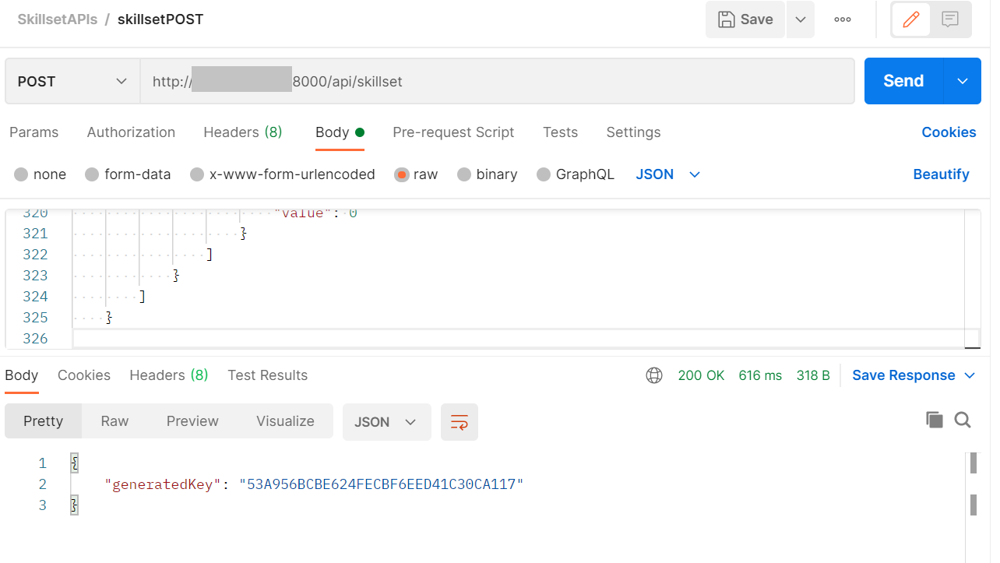

9. You can add some tests for the request you just created by clicking on a certain request, navigating to the **Tests** tab and writing some code or selecting a predefined template from the right side of the page. Here we selected ***Status code: Code is 200***. We did this for all three requests created previously.

  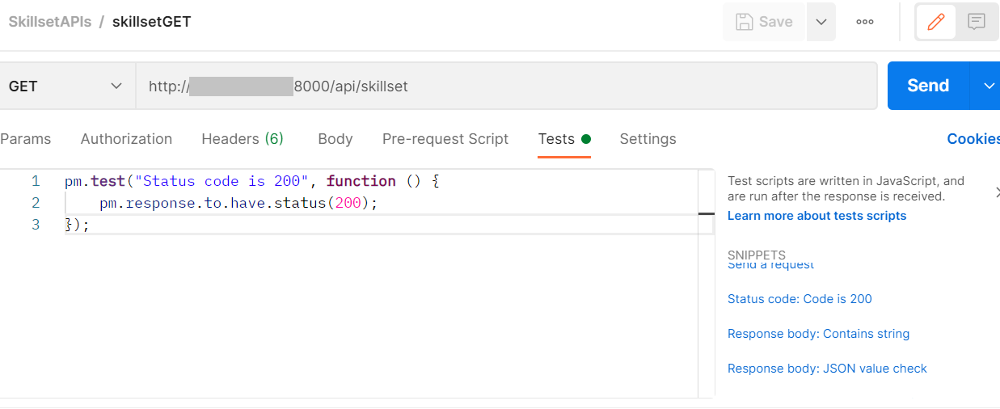

10. You can run the entire collection by navigating to your collection on the left side of the screen, then click the **Run** button.

  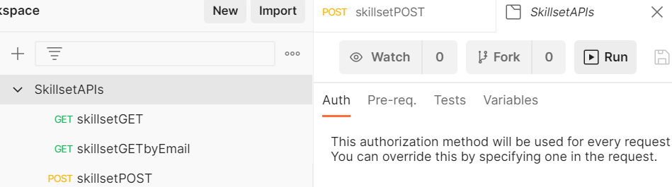

  Fill in the form and click **Run**.

  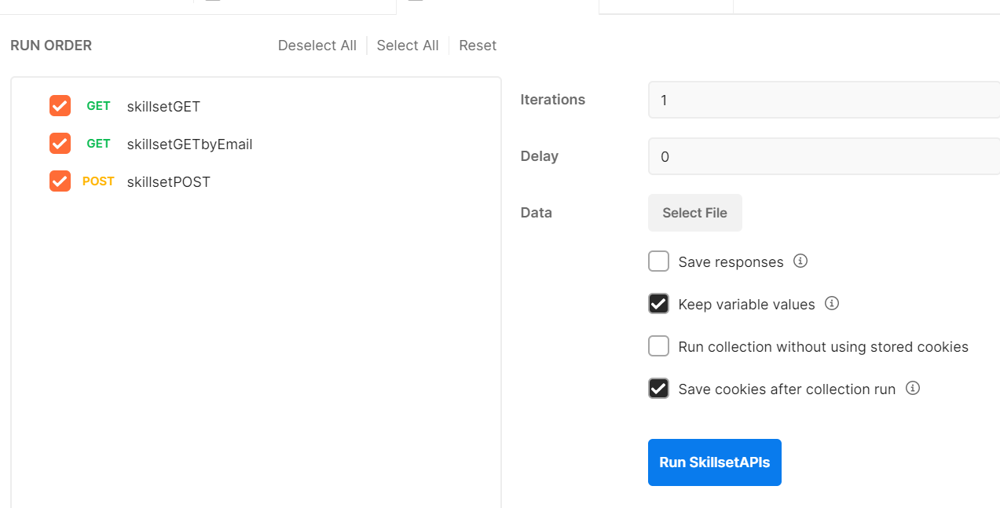

  Your results should look similar to the ones in the image below.

  Since we didn't update the JSON from the POST body request, the test for this one failed due to the fact that there is a unique constraint in the database for the _email_ field and this test is trying to add a new employee with the same email address. For this request to work you would need to edit the JSON in order to add a new employee with a different email address.

  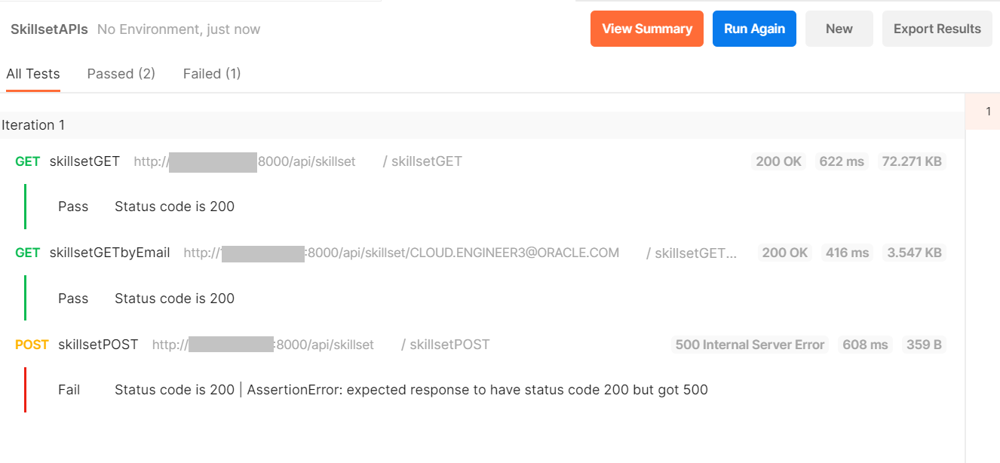

You may now [proceed to the next lab](#next).  

## Learn More?
* [SODA for NodeJS](https://docs.oracle.com/en/database/oracle/simple-oracle-document-access/nodejs/)
* [SODA Filter Specifications (QBEs)](https://docs.oracle.com/en/database/oracle/simple-oracle-document-access/adsdi/overview-soda-filter-specifications-qbes.html#GUID-CB09C4E3-BBB1-40DC-88A8-8417821B0FBE)
* [Postman](https://www.postman.com/)

## Acknowledgements

**Authors** - Giurgiteanu Maria Alexandra, Gheorghe Teodora Sabina
**Last Updated By** - Brianna Ambler, July 2021
