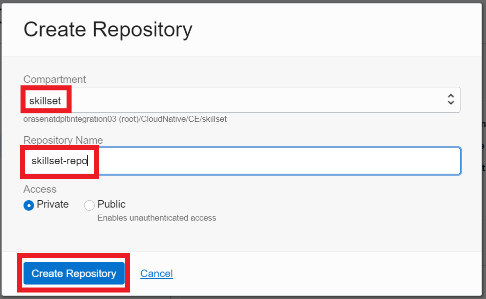
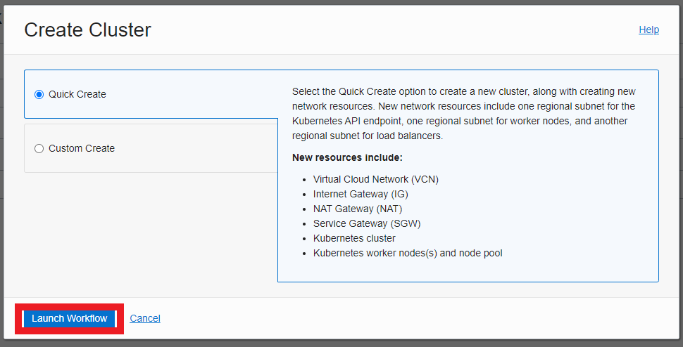
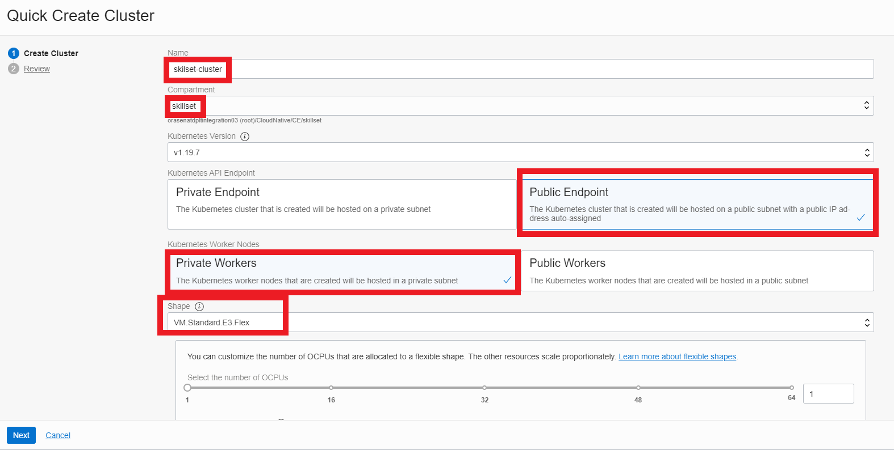
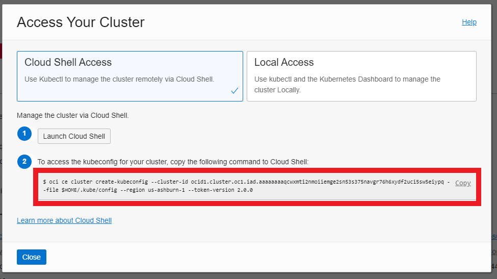
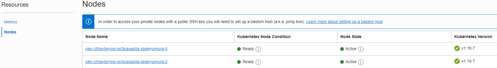

#  Deploy the Application on OKE

## Introduction

**Kubernetes** is an open-source container orchestration tool for automating the deployment and management of Cloud Native applications.

The goal of this Lab is to guide you through the steps that need to be followed in order to create a Docker file and deploy the code from **Lab 5: Build NodeJS APIs to make calls to the database** in **Container Engine for Kubernetes (OKE)**.

Estimated Lab Time: 2 hours

### Objectives
In this lab, you will:
* Create a Container Registry and a Kubernetes Cluster (OKE) in OCI.
* Deploy the application built in **Lab 5: Build NodeJS APIs to make calls to the database** in OKE.

### Prerequisites
To complete this lab, you must have:
* A tenancy where you have the resources available to provision a Container Registry and a Kubernetes Cluster (OKE).
* OCI CLI installed and configured to connect to OCI.
* Docker installed and configured.
* Kubectl installed.
* **Lab 3: Autonomous JSON Database & SODA Collections**.
* **Lab 5: Build NodeJS APIs to make calls to the database**.


## Task 1: Create a Docker file, Docker Image and Run a Docker Container

As a prerequisite for this step you should have available the code from **Lab 5: Build NodeJS APIs to make calls to the database**. In addition, you should download the Database Wallet as shown in **Lab 3: Autonomous JSON Database & SODA Collections**, extract the content of the archive and move the folder with the Wallet content into the project folder (in our example the Wallet folder is named _Wallet\_SkillsetDB_).

1. In the project folder create a new file _Dockerfile_ and paste the following content into it. This are all the commands needed to run in order to install the application on the container.

      ```
      <copy>
      FROM oraclelinux:7-slim
      WORKDIR /opt/oracle
      RUN yum install -y wget unzip libaio && \
          rm -rf /var/cache/yum
      RUN wget https://download.oracle.com/otn_software/linux/instantclient/instantclient-basiclite-linuxx64.zip && \
          unzip instantclient-basiclite-linuxx64.zip && \
          rm -f instantclient-basiclite-linuxx64.zip && \
          cd instantclient* && \
          rm -f *jdbc* *occi* *mysql* *jar uidrvci genezi adrci && \
          echo /opt/oracle/instantclient* > /etc/ld.so.conf.d/oracle-instantclient.conf && \
          ldconfig

      RUN  yum -y install oracle-nodejs-release-el7 && \
           yum-config-manager --disable ol7_developer_EPEL && \
           yum -y install nodejs && \
           rm -rf /var/cache/yum

      RUN npm install
      COPY . .

      EXPOSE 8000
      CMD [ "node", "app.js" ]
      </copy>
      ```

2. Now that you have the _Dockerfile_ prepared, you can create a **Docker image** by running the following command. In this case we named it _skillset/ojetoraclelinux_. You can give it your own name, this is just an example.

  **Note**: Before running the command, navigate to the directory containing the Docker file in the terminal.

      ```
      <copy>
      docker build -t skillset/ojetoraclelinux .
      </copy>
      ```

3. The next step would be to create a Docker container and mount the connection string and Database Wallet. Use the following command to do this, and add the correct path to your Database Wallet folder.

      ```
      <copy>
      docker run --env-file=.env  -p 8000:8000 -v <path_to_the_wallet_folder>:/opt/oracle/instantclient_21_6/network/admin  -d skillset/ojetoraclelinux
      </copy>
      ```

4. Test that the command executed successfully by opening a browser and accessing ``localhost:8000/api/skillset``. You should see the following message _...OJET Skillset APIs are running..._.

## Task 2: Create an Oracle Database Secret and a YAML file for the Project

1. In the project folder create a new folder _k8s-yaml_.

2. Navigate to _k8s-yaml_ and create a new file _oracledb-secret.sh_ and paste the following content into it. Make sure to replace the path with the correct one for the Wallet folder, if needed.

      ```
      <copy>
      #!/bin/bash
      # Copyright 2021, Oracle Corporation and/or its affiliates. All rights reserved.

      cat <<EOF | kubectl apply -f -
      apiVersion: v1
      kind: Secret
      metadata:
        name: oracledb-secret
        namespace: default
      type: Opaque
      data:
        ojdbc.properties: `cat ../Wallet_SkillsetDB/ojdbc.properties | base64 -w0`
        tnsnames.ora: `cat ../Wallet_SkillsetDB/tnsnames.ora | base64 -w0`
        sqlnet.ora: `cat ../Wallet_SkillsetDB/sqlnet.ora | base64 -w0`
        cwallet.sso: `cat ../Wallet_SkillsetDB/cwallet.sso | base64 -w0`
        ewallet.p12: `cat ../Wallet_SkillsetDB/ewallet.p12 | base64 -w0`
        keystore.jks: `cat ../Wallet_SkillsetDB/keystore.jks | base64 -w0`
        truststore.jks: `cat ../Wallet_SkillsetDB/truststore.jks | base64 -w0`
      EOF
      </copy>
      ```

3. In the same folder, create a new file _skillset-deployment.yml_ and paste the following content. Note that you would need to update this file later in order to replace **your\_docker\_image** with your own Docker Image name.

  **Note**: The **your\_oracle\_db\_user**, **your\_oracle\_db\_password**, and **your\_oracle\_db\_connection\_string** fields should be encoded for security reasons. In order to do this you can use the following command, or any other option you prefer: ``echo -n "your_text" | base64``

      ```
      <copy>
      apiVersion: apps/v1
      kind: Deployment
      metadata:
        name: skillset-deployment
        labels:
          app: skillset
      spec:
        replicas: 2
        selector:
          matchLabels:
            app: skillset
        template:
          metadata:
            labels:
              app: skillset
          spec:
            containers:
            - name: skillset
              image: <your_docker_image>
              volumeMounts:
              - name: oracledb-secret
                mountPath: /opt/oracle/instantclient_21_9/network/admin
                readOnly: true

              ports:
              - containerPort: 8000
              env:
              - name: NODE_ORACLEDB_USER
                valueFrom:
                  secretKeyRef:
                    name: oracle-db-connection
                    key: NODE_ORACLEDB_USER
              - name: NODE_ORACLEDB_PASSWORD
                valueFrom:
                  secretKeyRef:
                    name: oracle-db-connection
                    key: NODE_ORACLEDB_PASSWORD
              - name: NODE_ORACLEDB_CONNECTIONSTRING
                valueFrom:
                  secretKeyRef:
                    name: oracle-db-connection
                    key: NODE_ORACLEDB_CONNECTIONSTRING
            imagePullSecrets:
              - name: ocir
            volumes:
            - name: oracledb-secret
              secret:
                 defaultMode: 420
                 secretName: oracledb-secret

      ---

      apiVersion: v1
      kind: Secret
      metadata:
        name: oracle-db-connection
      type: Opaque
      data:
        NODE_ORACLEDB_USER: <your_oracle_db_user>
        NODE_ORACLEDB_PASSWORD: <your_oracle_db_password>
        NODE_ORACLEDB_CONNECTIONSTRING: <your_oracle_db_connection_string>

      ---
      apiVersion: v1
      kind: Service
      metadata:
        name: skillset-service
      spec:
        type: LoadBalancer
        ports:
        - port: 8000
          protocol: TCP
          targetPort: 8000
        selector:
          app: skillset          
      </copy>
      ```

## Task 3: Push the Image to OCI Container Registry (OCIR)

1. Open the OCI Console and from the top left hamburger menu navigate to **Developer Services** -> **Container Registry**.

2. Click **Create Repository** and fill in the form with the Compartment name (here _skillset_) and the Repository Name (here _skillset-repo_). For the Access field, choose Private.

  

3. From your project folder, run the following commands. Don't forget to replace the OCI region key and the tenancy name in the commands.

      ```
      <copy>
      docker tag skillset/ojetoraclelinux <oci_region_key>.ocir.io/<oci_tenancy_name>/skillset:latest
      docker push <oci_region_key>.ocir.io/<oci_tenancy_name>/skillset:latest
      </copy>
      ```

## Task 4: Migrate Docker Container App to OKE

1. Open the OCI Console and from the top left hamburger menu navigate to **Developer Services** -> **Kubernetes Clusters (OKE)** and click **Create Cluster**.

2. Choose _Quick Create_.

  

3. Pick a name, a compartment and a Public Endpoint and Private Workers. For the number of nodes, choose 2. Click _Next_ and _Submit_.

  

4. After the cluster has provisioned, navigate to its detail page and click on _Access Cluster_. Copy the command to access the cluster and run it.

  

5. To check if you accessed the correct cluster, run the following command and check that the resulted nodes are the same as the ones in the **OCI Console** -> **Kubernetes Clusters (OKE)** -> **Your cluster** -> **Node Pools** -> **Your node pool** -> **Nodes**.

      ```
      <copy>
      kubectl get nodes
      </copy>
      ```

  


6. Navigate to the _k8s-yaml_ folder and create an OCIR secret using the following commands. Edit the commands with your own OCI region, username, password and email.

      ```
      <copy>
      kubectl create secret docker-registry ocir --docker-server=<oci_region_key>.ocir.io --docker-username='' --docker-password='' --docker-email=''
      ./oracledb-secret.sh
      </copy>
      ```

7. Run the deployment yml file.

      ```
      <copy>
      kubectl apply -f skillset-deployment.yaml
      </copy>
      ```

8. Check that your service was deployed successfully.

      ```
      <copy>
      kubectl get svc
      </copy>
      ```

9. You should have a result similar to the following. You can test your deployment by accessing in the browser the following paths  ``EXTERNAL-IP:8000`` or ``EXTERNAL-IP:8000/api/skillset``.

  

You may now [proceed to the next lab](#next).  

## Learn More?

* [Overview of Container Engine for Kubernetes](https://docs.oracle.com/en-us/iaas/Content/ContEng/Concepts/contengoverview.htm)
* [Overview of Registry](https://docs.oracle.com/en-us/iaas/Content/Registry/Concepts/registryoverview.htm)

## Acknowledgements

**Authors** - Giurgiteanu Maria Alexandra, Gheorghe Teodora Sabina
**Contributors** - Grama Emanuel
**Last Updated By** - Brianna Ambler, July 2021
