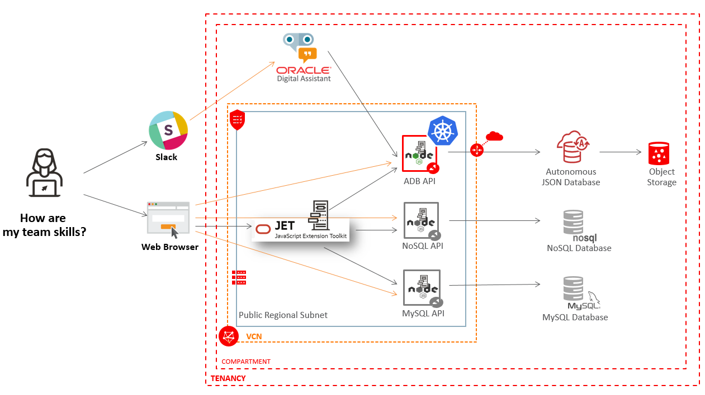
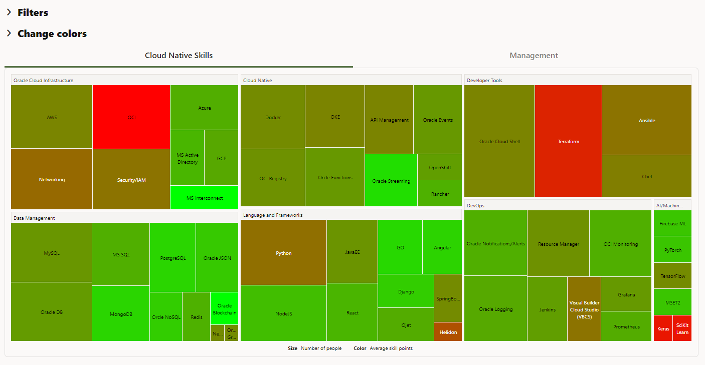
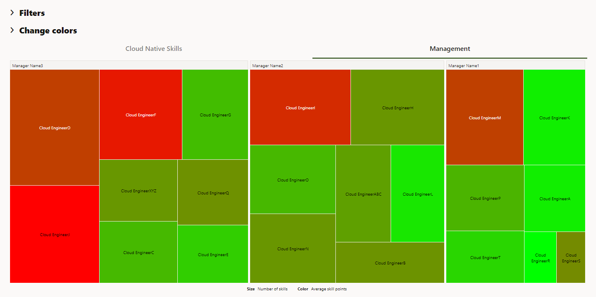
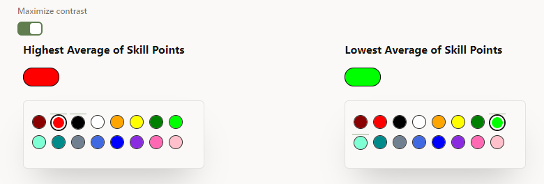
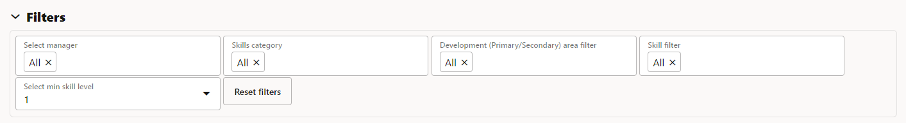
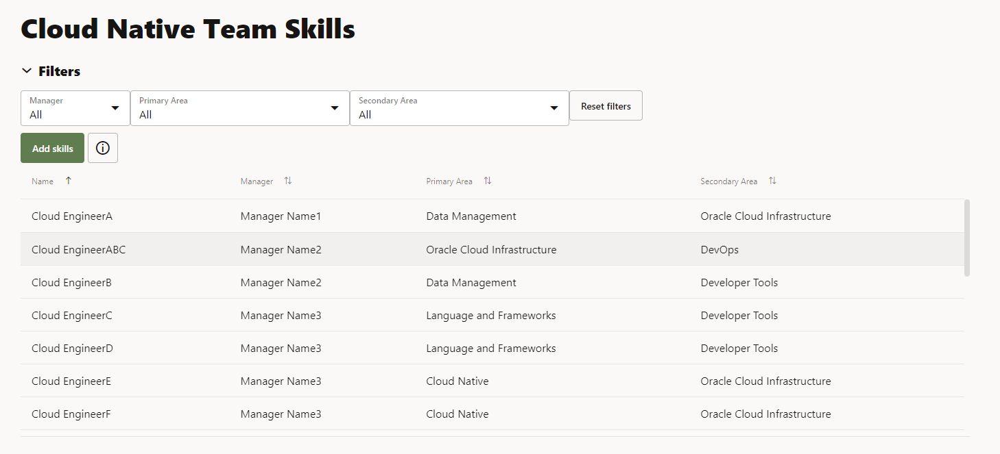
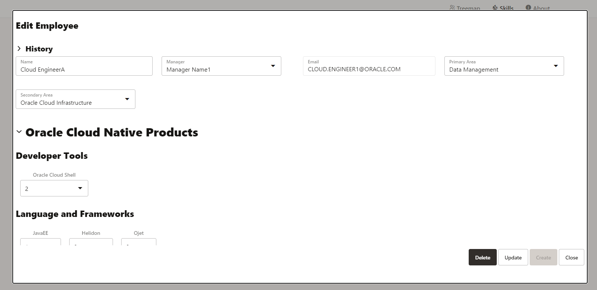

# Put it all together in one single application

## Introduction

The goal of this Lab is to guide you to connect all the components described in the previous Labs into one single application. So, as shown in the infrastructure diagram below, there will be an ***Oracle Autonomous JSON Database*** that will retrieve data from ***Object Storage*** and store it in ***SODA Document Collections***, a ***Kubernetes Cluster*** on which is deployed the API code that makes the calls to the database, an interface for the application built using ***OracleJET***, and an integration with ***Oracle Digital Assistant (ODA)*** and ***Slack***.

As shown in the diagram, there can be other databases as well (***NoSQL***, ***MySQL*** etc.) and the interface of the application can be easily customized to use any of these by simply changing the value of one parameter.



Estimated Lab Time: 6 hours

### Objectives
* Download the code of the full Skillset Tracking application.
* Provision all the needed OCI resources to run the code.
* Learn how to connect the modules into one single application.

### Prerequisites
* An OCI Account.
* A tenancy where you can provision all the resources in the architecture diagram above.
* **Lab 2: Install and prepare prerequisites**.
* **Lab 3: Autonomous JSON Database & SODA Collections**.


## Task 1: Download the full Skillset Tracking application code
Before proceeding, you must first download the zip file with the code that can be found [here](https://objectstorage.us-ashburn-1.oraclecloud.com/p/jyHA4nclWcTaekNIdpKPq3u2gsLb00v_1mmRKDIuOEsp--D6GJWS_tMrqGmb85R2/n/c4u04/b/livelabsfiles/o/labfiles/SkillsetTrackerApplicationCode.zip). After downloading, you can unzip the archive.

In the _SkillsetTrackerApplicationCode_ directory you can find two folders:

  * ***API*** - The code containing the APIs that make calls to the database for various operations. This is an extended version of the code you built in **Lab 5: Build NodeJS APIs to make calls to the database** and is needed for **STEP 2** in this Lab.

  * ***OJET*** - The code containing the interface of the Skillset Tracking application, built using OracleJET. This is an extended version of the application you built in **Lab 4: Build an OracleJET Web Application** and is needed for **STEP 3** in this Lab.


## Task 2: Create NodeJS API instance and run the code

1. The first thing that you need to do is to go through the first step in **Lab 4: Build an OracleJET Web Application**, **Creating a Virtual Cloud Network**.

2. After your VCN is properly set up, you can proceed creating and configuring a new Linux Instance as described in **Lab 5: Build NodeJS APIs to make calls to the database** -> **STEPS 1, 2, and 3**.

3. Now, before copying the code to the instance and running it, let's understand what all the files in this project are. Note that some of them were already explained in more detail in **Lab 5: Build NodeJS APIs to make calls to the database**.
    * **package.json** file - This file contains all the needed NodeJS packages that will be downloaded & installed by the ``npm install`` command.
    * **config** folder - The two files in the _config_ folder are meant to set up the default configuration for the entire application.
        * **database.js** - Sets up the configuration for making the connection to the database. Here the database user and password, as well as the connection string used, and the database name are all set. Notice that the values for these variables are not hardcoded and they are read from the _.env_ file.
        * **web-server.js** - sets up the port on which the web server would run on. In this case, 8000, but any other port can be used.
    * **services** folder - In the _services_ folder there are three files which will do most of the work in this project.
        * **web-server.js** - Has two main functions defined in it:
            - _initialize()_ – used to run the web server on the port that was set in the _config/web-server.js_ file. Here it’s also set up the path for the API calls to the database (_/api_), so that all the paths will look similar.
            - _close()_ – used to close the web server.
        * **skills-jsondb.js** - Has 7 main functions as described below. This code is mainly using ***SODA for NodeJS*** functionalities for opening the document collections and for manipulating the data existing in these collections.
            - _initialize()_ – this function opens the connection to the database, as well as the document collections that currently exist in the database and are going to be used in the application.
            - _close()_ – function used to close the connection to the database.
            - _get()_ – this is the most used function in the entire application and it’s making a call to the database to get the data from the document collection, based on the two parameters: _qbe_ (the query condition, which is written and formatted according to the documentation for SODA calls for NodeJS; if this parameter is _null_, the function will retrieve all the data in the collection) and _coll\_name_ (which represents the name of the collection for which the calls are made).
            - _getByQuery()_ – this function is making calls to get data from the database based on simple queries which are not using SODA calls (ex. simple ‘select’ statement queries).
            - _update()_ – this function is used to update (replace) an existing document in a collection with a new one by using SODA for NodeJS and based on an existing ID which is sent as a parameter of the function.
            - _create()_ – this function is used to create a new document in a collection.
            - _remove()_ – this function is used to remove an existing document from a collection, based on the unique ID sent as a parameter in the function.
        * **api_router.js** - Sets up the routes for making the calls to the database. Currently this project has 37 routes which are described in the table that can be found in the ***Annexes*** section of this Lab. In order to make it easier to build the query for making the SODA calls, there are several functions that will either dynamically build the query or filter the data further, according to the need for each call.
      * **app.js** file - All the code is tied up in _app.js_ which starts/stops the application. When starting the application, the first step is to open the connection to the database by calling the _database.initialize()_ function, then runs the web server by calling _webserver.initialize()_ function. When shutting down the application, the order is reversed: first the web server is closed and then the database connection.
      * **.env** file - Contains the details for connecting to the database: database user, password and connection string.

4. Now that you have a general idea about what the code does, you can run it. Open the _API_ project folder in _Visual Studio Code_ (or any other editor of your choice) and let's configure the code to run properly. Open the _.env_ file and replace _DB\_USER_, _DB\_PASSWORD_, and _DB\_CONNECTION\_STRING_ with your own connection details.

    ```
    NODE_ORACLEDB_USER=DB_USER
    NODE_ORACLEDB_PASSWORD=DB_PASSWORD
    NODE_ORACLEDB_CONNECTIONSTRING=DB_CONNECTION_STRING
    ```

5. In order to run the code, you need to upload it to the instance. You can use the following commands.

  **Note**: Before copying the code from your local machine to the instance, delete the _node\_modules_ folder so that the process will take less time.

  * On the instance:

    ```
    <copy>
    cd /home/opc
    mkdir SkillsetTracking
    </copy>
    ```

  To save output of the **npm** command into a _log_ file, you can create a new log folder.

    ```
    <copy>
    cd /home/opc/SkillsetTracking
    mkdir log
    </copy>
    ```

  * On your local machine:

    ```
    <copy>
    cd <project_folder_path>
    rm node_modules
    scp -r * opc@<your_instance_public_ip>:/home/opc/SkillsetTracking/
    scp -r .env opc@<your_instance_public_ip>:/home/opc/SkillsetTracking/
    </copy>
    ```

  After you uploaded the code on the instance, you need to run the ``npm install`` command in the application folder. Then you can either run it manually with ``node app.js``, but the application will stop running when you close the SSH connection, or you can add it as a **crontab job**. Use the following commands to add it as a **crontab job**.

    ```
    <copy>
    sudo crontab -e
    </copy>
    ```

  Press ***insert*** to enter the _edit_ mode and paste the following. In this way, you will save the output of the ``node app.js`` command into _skillset\_log.log_ file.

    ```
    <copy>
    @reboot node /home/opc/SkillsetTracker/app.js >> /home/opc/SkillsetTracker/log/skillset_log.log 2>&1
    </copy>
    ```

  Press ***Esc***, then ***:wq***. After the crontab is saved, reboot the instance.

    ```
    <copy>
    sudo reboot
    </copy>
    ```

You should now be able to see the application running in browser at **http://your\_instance\_public\_ip:8000/** or run an API at **http://your\_instance\_public\_ip:8000/api/skillset**.  

## Task 3: Create OracleJET instance and run the code

1. The first thing that you need to do is to go through the second step in **Lab 4: Build an OracleJET Web Application**, **Creating a Linux Instance in OCI**.

2. After you created the instance, it's time to configure it as described in **Lab 4: Build an OracleJET Web Application** -> **STEP 3**.

3. Now, before copying the code to the instance and running it, let's understand what all the files in this project are. Note that some of them were already explained earlier.
    * **package.json** file - This file contains all the needed NodeJS packages that will be downloaded & installed by the ``npm install`` command.
    * **config** folder - The two files in the _config_ folder are meant to set up the default configuration for the entire application.
        * **authentication.js** - Contains all the IDCS configuration using data stored in *.env* file, so that the user of the application can be successfully authenticated.
        * **web-server.js** - Sets up the port on which the web server would run on. In this case, 8000, but any other port can be used.
    * **scripts** folder is created automatically when you create a new OracleJET project.
    * **services** folder contains all the necessary authentication functions and also the initialization of the server, so that the application can run properly.
        * **authentication.js** - This file contains the _/user_, _/login_ and _/logout_ routes and several functions that make possible the authentication part:
            - *user()* - function to check if the user is authenticated.
            - *login()* - function that makes the login action.
            - *callback()* - function for storing *id_token* in the session (server side) for logout purposes and adding a request header that is required by the IDCS strategy.
            - *logout()* - function that makes the logout action.
            - *ensureAuthenticated()* - created as middleware to check if the user is authenticated.
        * **web-server.js** - The web-server.js file has two main functions defined in it:
            - *initialize()* – used to run the web server on the port that was set in the _config/web-server.js_ file. Here it’s also set up the path for the API calls to the database, so that all the paths will look similar.
            - *close()* – used to close the web server.
    * **staged-themes** and **web** folders are created automatically when you run ``ojet build`` command.
    * **src** - because Oracle JET applications are modular, it needs to be mentioned that a module consists of business logic defined in a JavaScript file and a view defined in an HTML file. By convention, the name of the JavaScript file is the same as the name of the HTML file. By default, the JavaScript side of a module is located in the *src/js/viewModels* folder, while its matching view is located in the *src/js/views* folder.

        Whenever you run ``ojet build`` or ``ojet serve``, the *src* folder is copied to the *web* folder mentioned earlier.

        If one developer wants to change something in the application, he should never change the files in the _web_ folder, because they will automatically be overwritten whenever ``ojet build`` or ``ojet serve`` is run. Only change the files in the _src_ folder.

        As mentioned before, all JavaScript files have the same name as their associated HTML files.

        * **js/viewModels** contains the JavaScript files (**about.js**, **skills.js**, **treemap.js**).

        * **js/views** contains the HTML files (**about.html**, **skills.html**, **treemap.html**).

        * **js/main.js** is the main entry point into the file, hooked into the index.html file via a script element.

        * **js/appController.js** represents the location for global variables, which is loaded into the application in the require block in the main.js file.

        * **index.html** is the main index file of the application, though note that ``ojet serve`` will load it from **web** folder, not the **src** folder.

        * **data** contains two JSON files, one for storing multiple databases with different parameters (**db.json**) and one with navigation information (**nav.json**).

    * **app.js** file - All the code is tied up in app.js which starts/stops the application. When starting the application, the first step is to open the connection to the database by calling the _database.initialize()_ function, then runs the web server by calling _webserver.initialize()_ function. When shutting down the application, the order is reversed: first the web server is closed and then the database connection.
    * **.env** file - Contains the details regarding IDCS tenant, id and secret.

4. Let's understand the sections of the application presented.

    * ***Treemap Section***

      This section contains two treemap structures that can be seen in the Treemap entry of the application:
          * **Cloud Native Skills Treemap** which shows all the skills grouped by categories according to existing JSON file in the database;

              

          * **Management Treemap** which shows all the people grouped by manager name.

              

      The *size* of the treemap boxes is represented by **number of people with that skill** and the *color* is represented by **the average skill points**.

      As you can see, the main two colors used for this treemap are *RED* (**highest average of skill points**) and *GREEN* (**lowest average of skill points**). But we took into consideration color blind people and also personal preferences, so the application has available a color palette from which the user can choose any combination he likes.

          

      This color palette is defined like this in the code:

          ```
          /* CODE FOR COLOR PALETTE */
          self.setPalette = (colors) => {
            self.highPalette = colors.map((o) => {
              let c = o.color;
              if (typeof c === "string") {
                o.color = new Color(c);
              }
              return o;
            });
            self.lowPalette = colors.map((o) => {
              let c = o.color;
              if (typeof c === "string") {
                o.color = new Color(c);
              }
              return o;
            });
            ...
          ```

      You can **FILTER** both treemaps by *manager*, *skills category*, *development area* (primary/secondary), *skill*, and *minimum skill level*.

          

      The filters are defined in the code like this:

          ```
          /* SKILL LEVELS LIST - FILTER */
           self.skillLevelSelectVal = ko.observable('1');
           var skillLevelList = rootModel.skillLevelList();
           self.skillLevelDP = new ArrayDataProvider(skillLevelList, { keyAttributes: 'value' });
          ```

      When you click on a box at your choice from one of the treemaps you will see details about the people that have a certain skill if you choose **Cloud Native Skills Treemap** or engineer details and Edit form if you choose the **Management Treemap**.

    * ***Skills Section***

        This entry in the application represents the page where the user can find all the engineers with their skill points taking into consideration their role.

          

        If the role was mentioned, a user can have three different roles:

        | User Role | Skills Treemap + Details Table from Treemap | Management Treemap + Edit Form     | Skills Entry                               | About Entry |
        |-----------|---------------------------------------------|------------------------------------|--------------------------------------------|-------------|
        | ADMIN     | View all                                    | View, Edit, Delete all             | View, Insert, Edit, Delete all             | View all    |
        | MANAGER   | View all                                    | View, Edit, Delete only his people | View, Insert, Edit, Delete only his people | View all    |
        | USER      | View all                                    | X                                  | View, Insert, Edit only its own skills     | View all    |


        In order to explain the code part for this entry, the ADMIN role will be taken into consideration.

        The **ADMIN** user can see and do everything (**use and apply all filters**, **add**, **edit**, **delete**, **view** engineers, **view table** and **click on specific engineer**).
        All these elements can be found in the *skills.js* file for the JavaScript part and also in the skills.html for the HTML part. For example, filters are defined like this in *skills.js* file:

          ```
          let mgrList = rootModel.managerListFilter();
          self.mgrSelected = ko.observable('All');
          self.mgrDP = new ArrayDataProvider(mgrList, { keyAttributes: 'value' });
          var managersList = rootModel.managerList();
          managerDP = new ArrayDataProvider(managersList, { keyAttributes: 'value' });
          ```

        And they are mentioned in the *skills.html* file using the [_oj-select-single_](https://www.oracle.com/webfolder/technetwork/jet/jetCookbook.html?component=selectSingle&demo=states) items from OJET.

        If you click on a specific engineer you can *VIEW* his details and you can *EDIT* or *DELETE* his data if you have **ADMIN** role.

          

        This window is done based on a popup mechanism defined like this in the code:

          ```
          /* CODE FOR POPUP WITH FORM */
              self.formAnimationListener = function (event) {
                 ...
              };
              self.formOpenListener = function () {
                if (self.selectedNodesEmployee().length != 0) {
                 ...
              };
              self.formCancelListener = function () {
                var popup = document.getElementById('form-popup');
                popup.close();
                 ...
              };
          /* END OF CODE FOR POPUP WITH FORM */
          ```

        The **CREATE**, **EDIT**, **DELETE** buttons call specific functions defined in code. *POST* method is called for both *create* and *update* and *DELETE* method is called for *delete* functionality. Here is an example:

          ```
          $.ajax({
              url: createURL,
              type: 'POST',
              contentType: 'application/json',
              data: JSON.stringify(json_var),
              success: function (data) {
                  window.location.reload();
                  },
              error: function (XMLHttpRequest, textStatus, errorThrown) {
              alert("Action failed! Please check that there isn't another person added with this EMAIL address. If you believe this is not the case, please contact the ADMIN of the application!");
                    }
            });
          ...
          ```

    * ***About Section***

        This section contains **about.js** and **about.html** files that contain all the elements that build the final result as a table which provides information about skill points and their meaning.


5. Open the _OJET_ project folder in _Visual Studio Code_ (or any other editor of your choice) and let's configure the code to run properly. Open the _.env_ file and replace _IDCS\_CLIENT\_TENANT_, _IDCS\_CLIENT\_ID_, and _IDCS\_CLIENT\_SECRET_ with your own IDCS details.

    ```
    IDCS_CLIENT_TENANT=IDCS_CLIENT_TENANT
    IDCS_CLIENT_ID=IDCS_CLIENT_ID
    IDCS_CLIENT_SECRET=IDCS_CLIENT_SECRET
    ```

6. In the same manner, complete the **src/data/db.json** file with your *NAME*, *DESCRIPTION*, *IP*, *PORT* for the database you previously created. This can be updated to use more different databases (OracleDB, NoSQL, MySQL and others) according to your needs, but keep in mind that the code for the APIs might need to be updated as well.

    ```
    [   {
        "name": "adb",
        "description": "Autonomous JSON Database",
        "ip": "your_ip",
        "port": "your_port"
        },
        {
        "name": "mysqldb",
        "description": "MySQL Database",
        "ip": "your_ip",
        "port": "your_port"
        }
    ]
    ```

7. In _appController.js_ the default value for the database to be chosen is **adb**. If you want to change this, you should update the following code in _appController.js_ and set the default value of _dbNameParam_ to your own database name (the same as in the _db.json_ file).

    ```
    ...
    self.dbIP = ko.observable();
    self.dbPort = ko.observable();
    let dbNameParam = 'adb';
    ...        
    ```

8. In order to run the code, you need to upload it to the instance. You can use the following commands.

    **Note**: Before copying the code from your local machine to the instance, delete the _node\_modules_ folder so that the process will take less time.

  * On the instance:

    ```
    <copy>
    cd /home/opc
    mkdir SkillsetTracking
    </copy>
    ```

  To save output of the **npm** command into a _log_ file, you can create a new log folder.

    ```
    <copy>
    cd /home/opc/SkillsetTracking
    mkdir log
    </copy>
    ```

  * On your local machine:

    ```
    <copy>
    cd <project_folder_path>
    rm node_modules
    scp -r * opc@<your_instance_public_ip>:/home/opc/SkillsetTracking/
    scp -r .env opc@<your_instance_public_ip>:/home/opc/SkillsetTracking/
    </copy>
    ```

    After you uploaded the code on the instance, you need to run the ``npm install`` command in the application folder. Then you can either run it manually with ``node app.js``, but the application will stop running when you close the SSH connection, or you can add it as a **crontab job**. Use the following commands to add it as a **crontab job**.

      ```
      <copy>
      sudo crontab -e
      </copy>
      ```

    Press ***insert*** to enter the _edit_ mode and paste the following. In this way, you will save the output of the ``node app.js`` command into _skillset\_log.log_ file.

      ```
      <copy>
      @reboot node /home/opc/SkillsetTracker/app.js >> /home/opc/SkillsetTracker/log/skillset_log.log 2>&1
      </copy>
      ```

    Press ***Esc***, then ***:wq***. After the crontab is saved, reboot the instance.

      ```
      <copy>
      sudo reboot
      </copy>
      ```

    You should now be able to see the application running in browser at **http://your\_instance\_public\_ip:8000/**.

## Task 4: Deploy the NodeJS API code in OKE

1. In order to deploy your API code in Kubernetes, you should follow all the steps described in **Lab 7: Deploy the application on OKE**, but instead of using the code you developed in **Lab 5**, you would use the code downloaded at the beginning of this Lab.

2. After going through all these steps, you can go to your OracleJET project and update the IP in the _src/js/data/db.json_ file.

    ```
    [   {
        "name": "adb",
        "description": "Autonomous JSON Database",
        "ip": "kubernetes_cluster_external_ip",
        "port": "your_port"
        },
        ...
    ]
    ```

## Task 5: Integrate your application with ODA

1. In order to integrate your application with **Oracle Digital Assistant**, you would need to follow all the steps described in **Lab 6: Integration with Oracle Digital Assistant and Slack**, considering the fact that at **STEP 4** -> **point 6** you would need to either use the _Public IP_ of the NodeJS Instance from **STEP 2** of this Lab, or the _External IP_ from **STEP 4** in this Lab.

## Annexes

***API route list***

| NO | TYPE   | PATH                                                                                                                      | PARAMETERS                                                                                                                                                                                                                                                                                                                                | DESCRIPTION                                                                                                                                                                                                                                |
| -- | ------ | ------------------------------------------------------------------------------------------------------------------------- | ----------------------------------------------------------------------------------------------------------------------------------------------------------------------------------------------------------------------------------------------------------------------------------------------------------------------------------------- | ------------------------------------------------------------------------------------------------------------------------------------------------------------------------------------------------------------------------------------------ |
| 1  | GET    | /                                                                                                                         | \-                                                                                                                                                                                                                                                                                                                                        | home page                                                                                                                                                                                                                                  |
| 2  | GET    | /skillset/                                                                                                                | \-                                                                                                                                                                                                                                                                                                                                        | retrieves all the data in skillscollection                                                                                                                                                                                                 |
| 3  | GET    | /skillsetarch/email/:email                                                                                                | email - the email address of the employee in skillscollection                                                                                                                                                                                                                                                                             | retrieves data in history collection skillsarch\_collection for a certain employee based on the email address                                                                                                                              |
| 4  | POST   | /skillset/:login                                                                                                          | login - the email address from the SSO login, used for authorization on the API side                                                                                                                                                                                                                                                      | inserts or updates the documents in skillscollection and skillsarch\_collection; If the JSON sent has an id key it updates, if not it inserts                                                                                              |
| 5  | DELETE | /skillset/:login/:id                                                                                                      | login - the email address from the SSO login, used for authorization on the API side<br>id - the unique id from skillscollection                                                                                                                                                                                                          |                                                                                                                                                                                                                                            |
| 6  | GET    | /managers                                                                                                                 | \-                                                                                                                                                                                                                                                                                                                                        | retrieves the list of all the managers in userscollection; used for forms                                                                                                                                                                  |
| 7  | GET    | /managersfilter                                                                                                           | \-                                                                                                                                                                                                                                                                                                                                        | retrieves the list of all the managers that have employees added in the skillscollection; used for filters                                                                                                                                 |
| 8  | GET    | /skills                                                                                                                   | \-                                                                                                                                                                                                                                                                                                                                        | retrieves the list of all skills in skillscollection                                                                                                                                                                                       |
| 9  | GET    | /areas                                                                                                                    | \-                                                                                                                                                                                                                                                                                                                                        | retrieves the list of all skill areas in skillscollection                                                                                                                                                                                  |
| 10 | GET    | /skillsview/:login                                                                                                        | login - the email address from the SSO login, used for authorization on the API side                                                                                                                                                                                                                                                      | retrieves data from skillsview for the table in Skills page                                                                                                                                                                                |
| 11 | GET    | /skillsview/:login/mgr/:manager                                                                                           | login - the email address from the SSO login, used for authorization on the API side<br>manager - manager name                                                                                                                                                                                                                            | retrieves data from skillsview for the table in Skills page, filtering for a certain manager                                                                                                                                               |
| 12 | GET    | /skillsview/:login/primary/:primary                                                                                       | login - the email address from the SSO login, used for authorization on the API side<br>primary - primary area of focus for an employee                                                                                                                                                                                                   | retrieves data from skillsview for the table in Skills page, filtering for a certain primary area of focus                                                                                                                                 |
| 13 | GET    | /skillsview/:login/secondary/:secondary                                                                                   | login - the email address from the SSO login, used for authorization on the API side<br>secondary - secondary area of focus for an employee                                                                                                                                                                                               | retrieves data from skillsview for the table in Skills page, filtering for a certain secondary area of focus                                                                                                                               |
| 14 | GET    | /skillsview/:login/mgr/:manager/primary/:primary                                                                          | login - the email address from the SSO login, used for authorization on the API side<br>manager - manager name<br>primary - primary area of focus for an employee                                                                                                                                                                         | retrieves data from skillsview for the table in Skills page, filtering for a certain manager and a certain primary area of focus                                                                                                           |
| 15 | GET    | /skillsview/:login/mgr/:manager/secondary/:secondary                                                                      | login - the email address from the SSO login, used for authorization on the API side<br>manager - manager name<br>secondary - secondary area of focus for an employee                                                                                                                                                                     | retrieves data from skillsview for the table in Skills page, filtering for a certain manager and a certain secondary area of focus                                                                                                         |
| 16 | GET    | /skillsview/:login/primary/:primary/secondary/:secondary                                                                  | login - the email address from the SSO login, used for authorization on the API side<br>primary \- primary area of focus for an employee<br>secondary - secondary area of focus for an employee                                                                                                                                           | retrieves data from skillsview for the table in Skills page, filtering for a certain primary and secondary area of focus                                                                                                                   |
| 17 | GET    | /skillsview/:login/mgr/:manager/primary/:primary/secondary/:secondary                                                     | login - the email address from the SSO login, used for authorization on the API side<br>manager \- manager name<br>primary \- primary area of focus for an employee<br>secondary - secondary area of focus for an employee                                                                                                                | retrieves data from skillsview for the table in Skills page, filtering for a certain manager, primary and secondary area of focus                                                                                                          |
| 18 | GET    | /skillsview/key/:key                                                                                                      | key - the unique id from skillscollection                                                                                                                                                                                                                                                                                                 | retrieves data from skillsview for the table in Skills page, filtering for a certain unique id                                                                                                                                             |
| 19 | GET    | /skillset/skilllevel/:skilllevel                                                                                          | skillLevel - takes values from 0 to 5; the value of a certain skill                                                                                                                                                                                                                                                                       | retrieves data from skillscollection filtering for people that have at least one skill with the value above skillLevel param                                                                                                               |
| 20 | GET    | /skillset/scopeList/:scopeList/skilllevel/:skilllevel/                                                                    | skillLevel - takes values from 0 to 5; the value of a certain skill<br>scopeList - list of managers separated by semicolon                                                                                                                                                                                                                | retrieves data from skillscollection filtering for people that have at least one skill with the value above skillLevel param, filtering by manager name                                                                                    |
| 21 | GET    | /skillset/scopeList/:scopeList/skilllevel/:skilllevel/domainSelect/:domainSelect/areaList/:areaList/skillList/:skillList/ | skillLevel - takes values from 0 to 5; the value of a certain skill<br>scopeList - list of managers separated by semicolon<br>domainSelect \- skill domain (Oracle or Non-Oracle)<br>areaList \- filter list for primary/secondary areas of development separated by semicolon<br>skillList \- list of skill names separated by semicolon | retrieves data from skillscollection filtering for people that have the skills selected with a value above skillLevel param, filtering by manager name, skill domain (Oracle / Non-Oracle), primary and secondary area of development      |
| 22 | GET    | /skillset/scopeList/:scopeList/skilllevel/:skilllevel/domainSelect/:domainSelect/areaList/:areaList/                      | skillLevel - takes values from 0 to 5; the value of a certain skill<br>scopeList - list of managers separated by semicolon<br>domainSelect \- skill domain (Oracle or Non-Oracle)<br>areaList \- filter list for primary/secondary areas of development separated by semicolon                                                            | retrieves data from skillscollection filtering for people that have at least one skill with the value above skillLevel param, filtering by manager name, skill domain (Oracle / Non-Oracle), primary and secondary area of development     |
| 23 | GET    | /skillset/scopeList/:scopeList/skilllevel/:skilllevel/domainSelect/:domainSelect/                                         | skillLevel - takes values from 0 to 5; the value of a certain skill<br>scopeList - list of managers separated by semicolon<br>domainSelect \- skill domain (Oracle or Non-Oracle)                                                                                                                                                         | retrieves data from skillscollection filtering for people that have at least one skill with the value above skillLevel param, filtering by manager name, skill domain (Oracle / Non-Oracle)                                                |
| 24 | GET    | /skillset/scopeList/:scopeList/skilllevel/:skilllevel/areaList/:areaList/                                                 | skillLevel - takes values from 0 to 5; the value of a certain skill<br>scopeList - list of managers separated by semicolon<br>areaList \- filter list for primary/secondary areas of development separated by semicolon                                                                                                                   | retrieves data from skillscollection filtering for people that have at least one skill with the value above skillLevel param, filtering by manager name, primary and secondary area of development                                         |
| 25 | GET    | /skillset/scopeList/:scopeList/skilllevel/:skilllevel/areaList/:areaList/skillList/:skillList/                            | skillLevel - takes values from 0 to 5; the value of a certain skill<br>scopeList - list of managers separated by semicolon<br>areaList \- filter list for primary/secondary areas of development separated by semicolon<br>skillList \- list of skill names separated by semicolon                                                        | retrieves data from skillscollection filtering for people that have the skills selected with a value above skillLevel param, filtering by manager name, primary and secondary area of development                                          |
| 26 | GET    | /skillset/scopeList/:scopeList/skilllevel/:skilllevel/skillList/:skillList/                                               | skillLevel - takes values from 0 to 5; the value of a certain skill<br>scopeList - list of managers separated by semicolon<br>skillList \- list of skill names separated by semicolon                                                                                                                                                     | retrieves data from skillscollection filtering for people that have the skills selected with a value above skillLevel param, filtering by manager name                                                                                     |
| 27 | GET    | /skillset/skilllevel/:skilllevel/domainSelect/:domainSelect/skillList/:skillList/                                         | skillLevel - takes values from 0 to 5; the value of a certain skill<br>domainSelect \- skill domain (Oracle or Non-Oracle)<br>skillList - list of skill names separated by semicolon                                                                                                                                                      | retrieves data from skillscollection filtering for people that have the skills selected with a value above skillLevel param, filtering by skill domain (Oracle / Non-Oracle)                                                               |
| 28 | GET    | /skillset/scopeList/:scopeList/skilllevel/:skilllevel/domainSelect/:domainSelect/skillList/:skillList/                    | skillLevel - takes values from 0 to 5; the value of a certain skill<br>scopeList - list of managers separated by semicolon<br>domainSelect \- skill domain (Oracle or Non-Oracle)<br>skillList - list of skill names separated by semicolon                                                                                               | retrieves data from skillscollection filtering for people that have the skills selected with a value above skillLevel param, filtering by manager name, skill domain (Oracle / Non-Oracle)                                                 |
| 29 | GET    | /skillset/skilllevel/:skilllevel/domainSelect/:domainSelect/areaList/:areaList/skillList/:skillList/                      | skillLevel - takes values from 0 to 5; the value of a certain skill<br>domainSelect \- skill domain (Oracle or Non-Oracle)<br>areaList - filter list for primary/secondary areas of development separated by semicolon<br>skillList - list of skill names separated by semicolon                                                          | retrieves data from skillscollection filtering for people that have the skills selected with a value above skillLevel param, filtering by skill domain (Oracle / Non-Oracle), primary and secondary area of development                    |
| 30 | GET    | /skillset/skilllevel/:skilllevel/domainSelect/:domainSelect/areaList/:areaList/                                           | skillLevel - takes values from 0 to 5; the value of a certain skill<br>domainSelect \- skill domain (Oracle or Non-Oracle)<br>areaList - filter list for primary/secondary areas of development separated by semicolon                                                                                                                    | retrieves data from skillscollection filtering for people that have at least one skill with the value above skillLevel param, filtering by skill domain (Oracle / Non-Oracle), primary and secondary area of development                   |
| 31 | GET    | /skillset/skilllevel/:skilllevel/domainSelect/:domainSelect/                                                              | skillLevel - takes values from 0 to 5; the value of a certain skill<br>domainSelect \- skill domain (Oracle or Non-Oracle)                                                                                                                                                                                                                | retrieves data from skillscollection filtering for people that have at least one skill with the value above skillLevel param, filtering by skill domain (Oracle / Non-Oracle)                                                              |
| 32 | GET    | /skillset/skilllevel/:skilllevel/areaList/:areaList/                                                                      | skillLevel - takes values from 0 to 5; the value of a certain skill<br>areaList - filter list for primary/secondary areas of development separated by semicolon                                                                                                                                                                           | retrieves data from skillscollection filtering for people that have at least one skill with the value above skillLevel param, filtering by primary and secondary area of development                                                       |
| 33 | GET    | /skillset/skilllevel/:skilllevel/areaList/:areaList/skillList/:skillList/                                                 | skillLevel - takes values from 0 to 5; the value of a certain skill<br>areaList - filter list for primary/secondary areas of development separated by semicolon<br>skillList - list of skill names separated by semicolon                                                                                                                 | retrieves data from skillscollection filtering for people that have the skills selected with a value above skillLevel param, filtering by primary and secondary area of development                                                        |
| 34 | GET    | /skillset/skilllevel/:skilllevel/skillList/:skillList/                                                                    | skillLevel - takes values from 0 to 5; the value of a certain skill<br>skillList - list of skill names separated by semicolon                                                                                                                                                                                                             | retrieves data from skillscollection filtering for people that have the skills selected with a value above skillLevel param                                                                                                                |
| 35 | GET    | /skillset/skilllevel/:skilllevel/areas/:areas/skillList/:skillList                                                        | skillLevel - takes values from 0 to 5; the value of a certain skill<br>areas \- list of areas of development separated by semicolon<br>skillList - list of skill names separated by semicolon                                                                                                                                             | retrieves data from skillscollection filtering for people that have at least one skill in the skillList with the value above skillLevel param, and at least one skill with the value above skillLevel for the areas in the areas parameter |
| 36 | GET    | /skillset/skilllevel/:skilllevel/areas/:areas/                                                                            | skillLevel - takes values from 0 to 5; the value of a certain skill<br>areas \- list of areas of development separated by semicolon                                                                                                                                                                                                       | retrieves data from skillscollection filtering for people that have at least one skill with the value above skillLevel param for the areas in the areas parameter                                                                          |
| 37 | GET    | /userRole/:login                                                                                                          | login - the email address from the SSO login, used for authorization on the API side                                                                                                                                                                                                                                                      | retrieves the user role                                                                                                                                                                                                                    |


## Acknowledgements
**Authors** - Giurgiteanu Maria Alexandra, Gheorghe Teodora Sabina

**Contributors** - Minoiu (Paraschiv) Laura Tatiana, Digori Gheorghe, Grama Emanuel
